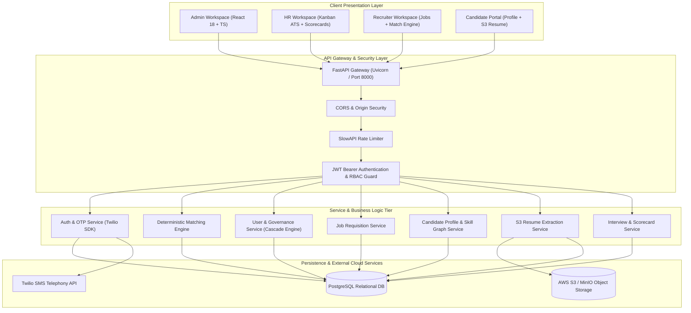
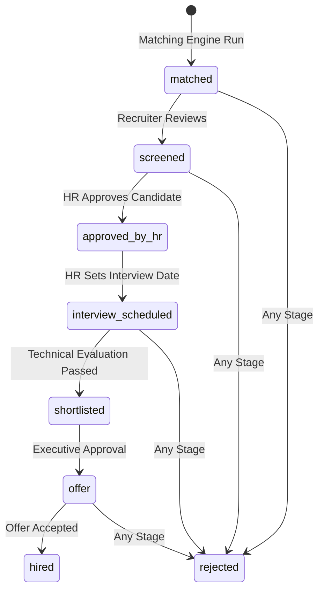
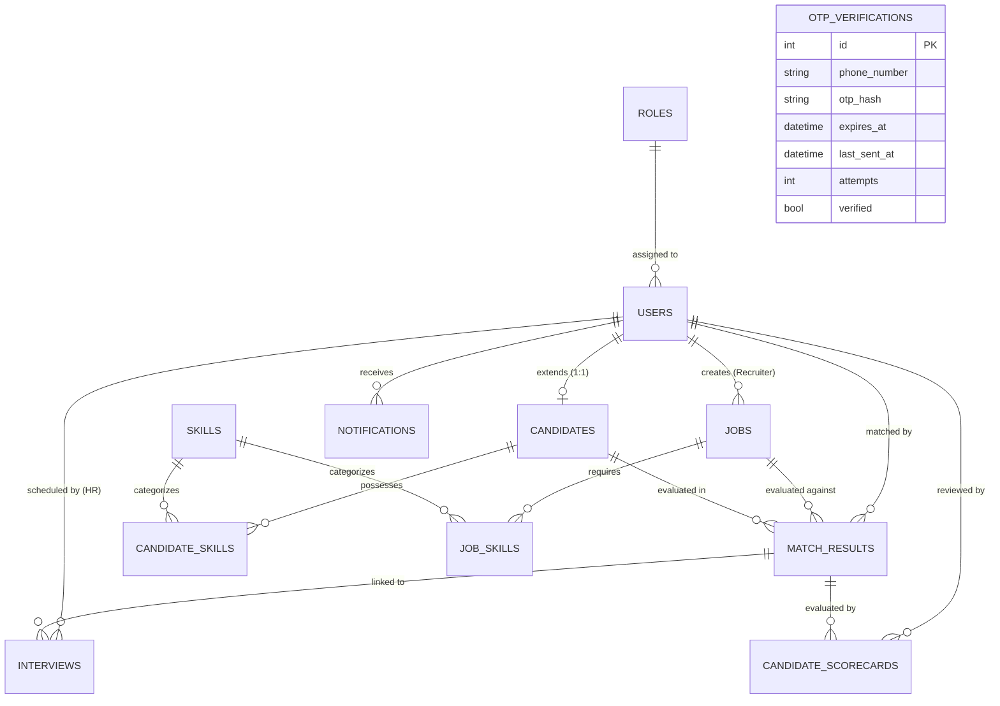

# Functional Specification Document (FSD)
## SkillAlign: Intelligent Recruitment, Candidate-Job Matching & ATS Platform

---

### Document Control

| Attribute | Details |
| :--- | :--- |
| **Document Title** | Functional Specification Document (FSD) — SkillAlign Platform |
| **Project Code** | SKILLALIGN-CORE |
| **Document Version** | 1.0.0 (Release Candidate) |
| **Status** | Approved / Production Architecture |
| **Target Audience** | Engineering Team, System Architects, Mentors, QA Engineers, Product Stakeholders |
| **Authors / Owners** | SkillAlign Core Engineering Team |
| **Last Updated** | September 2026 |

---

### Revision History

| Version | Date | Author | Description of Changes |
| :--- | :--- | :--- | :--- |
| **v0.1.0** | August 2026 | Engineering Lead | Initial draft: Core schema, role definitions, and matching concepts |
| **v0.5.0** | August 2026 | Backend Lead | Added S3 document extraction, pipeline stage models, and interview schemas |
| **v0.8.0** | September 2026 | Security & Auth | Incorporated Twilio Phone OTP, country code normalization, and Admin RBAC |
| **v1.0.0** | September 2026 | Core Team | Finalized complete FSD: Relational cascade deletion engine, 59-endpoint Postman suite, and live Twilio integration |

---

## 1. Executive Summary & Business Objectives

### 1.1 Problem Statement
Modern recruitment workflows suffer from three critical bottlenecks:
1. **Resume Screening Latency & Subjective Bias**: Recruiters spend an average of 40+ hours per job opening manually reading resumes without standardized criteria, leading to mismatched shortlists and unconscious bias.
2. **Disconnected Candidate-Job Alignment**: Existing job portals rely on superficial keyword-matching rather than deterministic mathematical scoring of mandatory vs. preferred skills and years of experience.
3. **Fragmented ATS & Multi-Stakeholder Hand-offs**: Disconnected communication channels between Recruiters (who source candidates), HR Managers (who coordinate interviews and evaluate culture), and Candidates (who lack pipeline visibility) result in slow hiring cycles and high candidate drop-off.

### 1.2 Solution Vision: The SkillAlign Platform
SkillAlign is an enterprise-grade, cloud-native Recruitment and Applicant Tracking System (ATS) engineered to automate and optimize the talent acquisition lifecycle. SkillAlign bridges the gap through:
- **Deterministic Multi-Variable Matching Engine**: Evaluates mandatory skills, proficiency thresholds, and experience alignment to generate unbiased, transparent match scores (0–100%).
- **Multi-Role Collaborative Kanban ATS**: Provides specialized workspaces for System Administrators, HR Managers, Technical Recruiters, and Candidates.
- **Enterprise-Grade Multi-Channel Authentication**: Seamless dual-mode authentication supporting traditional Email/Password credentials and live Phone OTP verification delivered via Twilio SMS.
- **Object Storage Resume Processing**: Secure ingestion of PDF, DOCX, and TXT resumes into Amazon S3/MinIO with text extraction and pre-signed URL retrieval.
- **Auditable Candidate Governance**: Real-time evaluation scorecards, interview coordination with Google Meet integration, and cascade account deletion.

---

## 2. High-Level System Architecture

SkillAlign is built on a decoupled, modular micro-tier architecture separating the client presentation, RESTful business service tier, relational data store, and cloud storage layer.

### 2.1 Technology Stack

| Layer | Technology | Version | Description / Role |
| :--- | :--- | :--- | :--- |
| **Frontend Framework** | React | 18.3.1 | Component-driven declarative single-page application |
| **Language (Client)** | TypeScript | 5.5.3 | Static typing, interface contracts, and compile-time validation |
| **Styling & Design** | TailwindCSS | 3.4.1 | Utility-first CSS with dark glassmorphism and custom tokens |
| **Build Tooling** | Vite | 6.4.3 | High-performance bundling, tree-shaking, and Hot Module Replacement |
| **Client HTTP Client** | Axios | 1.7.9 | Centralized API client with JWT interception and error handlers |
| **Client Icons** | Lucide React | 0.344.0 | Modern unified SVG iconography |
| **Backend Framework** | FastAPI | 0.115.6 | High-throughput asynchronous Python web framework |
| **Language (Server)** | Python | 3.13.7 | Backend runtime executing business logic and match calculations |
| **ORM & Data Mapping** | SQLAlchemy | 2.0.36 | Typed declarative relational models and session transactions |
| **Data Validation** | Pydantic | 2.10.4 | Request/response schema validation and deserialization |
| **Relational Database** | PostgreSQL | 16.x | ACID-compliant relational data store |
| **Object Storage** | AWS S3 / MinIO | S3 API v4 | Binary storage for PDF/DOCX resumes and extracted text artifacts |
| **Telephony / SMS** | Twilio SMS API | SDK v9.4.0 | Real-time OTP dispatch via international E.164 telephony |
| **Password Hashing** | Passlib (Bcrypt) | 1.7.4 | Cryptographic salt-and-hash storage for authentication |
| **Security Tokens** | PyJWT / Jose | 3.3.0 | HMAC-SHA256 signed stateless Bearer tokens |

---

## 3. User Personas & Role-Based Access Control (RBAC)

SkillAlign enforces strict **Role-Based Access Control (RBAC)** at the database, gateway, and routing layers.

### 3.1 Persona Profiles

1. **System Administrator (`Role ID: 1`, `Admin`)**:
   - Manages tenant accounts, creates HR and Recruiter profiles, monitors platform metrics, maintains canonical skill taxonomy, and performs permanent user de-provisioning.
2. **HR Manager (`Role ID: 2`, `HR`)**:
   - Reviews screened candidates, approves/shortlists talent into the hiring pipeline, schedules technical and cultural interviews, submits evaluation scorecards, and dispatches candidate notifications.
3. **Technical Recruiter (`Role ID: 3`, `Recruiter`)**:
   - Authors and publishes job openings, sets mandatory and preferred skill requirements with experience thresholds, triggers the automated matching engine, and manages pipeline stages.
4. **Candidate (`Role ID: 4`, `Candidate`)**:
   - Registers profile, uploads resume (PDF/DOCX) to cloud storage, declares skills and years of experience, tracks real-time application stage progression, and reviews scheduled interview dates.

### 3.2 RBAC Permission Matrix

| Functional Capability | Public / Anon | Candidate | Recruiter | HR Manager | System Admin |
| :--- | :---: | :---: | :---: | :---: | :---: |
| **View Marketing Landing Page** | ✅ | ✅ | ✅ | ✅ | ✅ |
| **Candidate Self-Registration** | ✅ | ❌ | ❌ | ❌ | ❌ |
| **Authenticate via Password / OTP** | ✅ | ✅ | ✅ | ✅ | ✅ |
| **Manage Own Profile & Resume** | ❌ | ✅ | ❌ | ❌ | ❌ |
| **Track Own Application Status** | ❌ | ✅ | ❌ | ❌ | ❌ |
| **Create & Edit Job Openings** | ❌ | ❌ | ✅ | ❌ | ❌ |
| **Execute Matching Algorithm** | ❌ | ❌ | ✅ | ❌ | ❌ |
| **View Candidate Match Breakdown** | ❌ | ❌ | ✅ | ✅ | ✅ |
| **Approve Screened Candidates** | ❌ | ❌ | ❌ | ✅ | ❌ |
| **Schedule Interviews & Links** | ❌ | ❌ | ❌ | ✅ | ✅ |
| **Submit Evaluation Scorecards** | ❌ | ❌ | ✅ | ✅ | ❌ |
| **Manage Skills Taxonomy** | ❌ | ❌ | ❌ | ❌ | ✅ |
| **Provision HR & Recruiter Accounts** | ❌ | ❌ | ❌ | ❌ | ✅ |
| **Toggle User Status (Deactivate)** | ❌ | ❌ | ❌ | ❌ | ✅ |
| **Permanently Delete Users (Cascade)** | ❌ | ❌ | ❌ | ❌ | ✅ |

---

## 4. Detailed Functional Module Specifications

### Module 1: Authentication & Identity Management

#### 1.1 Overview
Provides secure, multi-channel user authentication supporting both enterprise credential login and SMS-based One-Time Password (OTP) verification.

#### 1.2 Functional Requirements

* **FR-AUTH-001: Dual Login Modes**: The system shall provide two tabs on `/login`: (a) Email & Password, and (b) Phone OTP.
* **FR-AUTH-002: Phone Number Normalization**:
  - The system shall automatically sanitize user inputs (stripping dashes, spaces, and punctuation).
  - Indian phone numbers (10 digits) shall automatically normalize to standard E.164 format (`+91XXXXXXXXXX`).
* **FR-AUTH-003: Twilio SMS OTP Delivery**:
  - Upon request, the system shall generate a cryptographically secure 6-digit numeric OTP valid for 5 minutes.
  - The OTP shall be dispatched via Twilio REST API from the provisioned sender number (`TWILIO_FROM_NUMBER = +15674093463`) to verified recipient numbers.
* **FR-AUTH-004: Anti-Flooding & Cooldown Guard**:
  - The system shall enforce a minimum 60-second cooldown between consecutive OTP requests for the same phone number.
  - Re-requesting within the cooldown window shall return `HTTP 429 Too Many Requests`.
* **FR-AUTH-005: OTP Verification & Auto-Resolution**:
  - Upon submitting a valid OTP, the system shall resolve the associated user:
    - If the phone belongs to an existing user (Admin, HR, Recruiter, or Candidate), the system logs them in as that role.
    - If the phone is unregistered, the system automatically provisions an active Candidate account (`Candidate {phone[-4:]}`).
* **FR-AUTH-006: Sandbox Fallback Mode**:
  - When operating on a Twilio trial account, if an unverified phone number attempts OTP generation (Twilio Error 21608), the system shall gracefully catch the error and provide an on-screen fallback code to allow uninterrupted evaluation.
* **FR-AUTH-007: Stateless JWT Session Issuance**:
  - Successful authentication shall issue an HMAC-SHA256 signed JSON Web Token containing `sub` (User ID), `role` (Role Name), and `exp` (Expiration).
* **FR-AUTH-008: 1-Click Role Access (Dev/Evaluation)**:
  - The login interface shall feature 1-click authentication buttons for **Admin**, **HR Manager**, and **Recruiter**, instantly populating credentials, authenticating, and redirecting to the respective role dashboard.

---

### Module 2: Candidate Profile & Resume Management

#### 2.1 Overview
Enables job seekers to maintain their professional identity, self-declare skill proficiencies, and upload resumes to cloud object storage for automated parsing.

#### 2.2 Functional Requirements

* **FR-CAND-001: Profile Ingestion**:
  - Candidates shall maintain their full name, contact information, total years of experience, highest educational degree, and institution.
* **FR-CAND-002: Resume Ingestion to S3/MinIO**:
  - The system shall accept resume files up to 10 MB in `.pdf`, `.docx`, or `.txt` formats.
  - Files shall be stored in AWS S3 or MinIO under unique UUID-based keys (`resumes/{candidate_id}/{uuid}_{filename}`).
* **FR-CAND-003: Plain-Text Extraction & Artifact Storage**:
  - The system shall extract raw plain text from uploaded PDF/DOCX resumes (via `pypdf` / `python-docx`) and store the resulting text artifact in S3 alongside the binary file.
* **FR-CAND-004: Pre-signed S3 Download URLs**:
  - When recruiters or HR view a resume, the backend shall generate a secure, time-limited Pre-signed S3 GET URL (expiring in 3600 seconds) rather than exposing raw S3 buckets.
* **FR-CAND-005: Skill Profile Self-Declaration**:
  - Candidates can link canonical skills from the global taxonomy to their profile, specifying proficiency level (1–5) and individual years of experience per skill.
* **FR-CAND-006: Candidate Application Tracker**:
  - The `/candidate/pipeline` view shall display all jobs the candidate has been matched to, showing real-time stage status, match score, and scheduled interview dates.

---

### Module 3: Job Requisitions & Skills Taxonomy

#### 3.1 Overview
Empowers Technical Recruiters to create detailed job openings with granular skill requirements, weighting, and experience criteria.

#### 3.2 Functional Requirements

* **FR-JOB-001: Job Authoring**:
  - Recruiters can publish jobs containing: Title, Department, Job Description, Work Mode (WFH, WFO, Hybrid), Location (City, State, Country), Urgency, and Minimum Experience Years.
* **FR-JOB-002: Granular Skill Requirements**:
  - Each job requirement can link multiple skills from the taxonomy, specifying:
    - `is_mandatory` (Boolean: Must-have vs. Nice-to-have).
    - `min_proficiency` (Integer: 1 to 5).
* **FR-JOB-003: Canonical Skills Taxonomy**:
  - Only Administrators can create, update, or remove canonical skills (categorized under Backend, Frontend, DevOps, Data Science, Soft Skills, etc.) to avoid duplicate synonyms (e.g., "React.js" vs. "React").
* **FR-JOB-004: Job Lifecycle State Machine**:
  - Jobs shall support three distinct lifecycle statuses: `draft`, `active`, and `closed`.

---

### Module 4: Intelligent Deterministic Candidate-Job Matching Engine

#### 4.1 Overview
SkillAlign implements an explainable, deterministic mathematical algorithm that evaluates candidate profiles against job requirements without AI hallucinations or black-box drift.

#### 4.2 Matching Mathematical Formulation

The matching score is computed across three primary components:

$$\text{Overall Match Score} = \text{Mandatory Multiplier} \times \left( w_{\text{skill}} \cdot S_{\text{skills}} + w_{\text{exp}} \cdot S_{\text{experience}} \right)$$

Where:
1. **Mandatory Skills Hard Gate**:
   $$\text{Mandatory Multiplier} = \begin{cases} 1.0 & \text{if candidate possesses ALL mandatory skills with proficiency} \ge \text{required} \\ 0.0 & \text{if any mandatory skill is missing or below proficiency threshold} \end{cases}$$
2. **Skill Alignment Score ($S_{\text{skills}}$)**:
   $$S_{\text{skills}} = \frac{\sum_{i=1}^{N} \text{Weight}_i \cdot \min\left(1.0, \frac{\text{Proficiency}_{\text{cand}, i}}{\text{Proficiency}_{\text{job}, i}}\right)}{\sum_{i=1}^{N} \text{Weight}_i} \times 100$$
   *(Mandatory skills carry a $2\times$ weight compared to optional skills).*
3. **Experience Alignment Factor ($S_{\text{experience}}$)**:
   $$S_{\text{experience}} = \begin{cases} 100 & \text{if } \text{Exp}_{\text{cand}} \ge \text{Exp}_{\text{job}} \\ \max\left(0, 100 - (\text{Exp}_{\text{job}} - \text{Exp}_{\text{cand}}) \times 20\right) & \text{if } \text{Exp}_{\text{cand}} < \text{Exp}_{\text{job}} \end{cases}$$

#### 4.3 Functional Requirements
* **FR-MATCH-001: Execution Trigger**: Recruiter clicks "Run Match Engine" on any active job requisition (`POST /api/matching/jobs/{job_id}/run`).
* **FR-MATCH-002: Batch Evaluation**: The engine evaluates every candidate in the database against the job's criteria.
* **FR-MATCH-003: Ranking & Upsert**: The engine computes scores, ranks candidates in descending order, and upserts rows into the `match_results` table.
* **FR-MATCH-004: Explainable Breakdown**: For each match result, the system records individual skill match percentages, missing mandatory skills, and experience gap details.

---

### Module 5: Recruitment Pipeline & Collaborative Kanban ATS

#### 5.1 Pipeline Stage Lifecycle

The ATS pipeline tracks candidate progression through 8 standardized stages:

#### 5.2 Functional Requirements
* **FR-PIPE-001: Visual Kanban ATS**: Both HR and Recruiters have access to an interactive Kanban board where candidates can be dragged or moved across stages.
* **FR-PIPE-002: Multi-Role Stage Governance**:
  - Only **Recruiters** can advance candidates from `matched` $\rightarrow$ `screened`.
  - Only **HR Managers** can advance candidates from `screened` $\rightarrow$ `approved_by_hr` and schedule interviews.
  - Both HR and Recruiters can transition candidates to `shortlisted`, `offer`, `hired`, or `rejected`.
* **FR-PIPE-003: Audit History**: Every stage transition records the timestamp and the User ID of the recruiter/HR who performed the action.

---

### Module 6: HR Interview Scheduling & Evaluation Scorecards

#### 6.1 Functional Requirements

* **FR-EVAL-001: Interview Coordination**:
  - HR Managers can schedule an interview for any approved candidate in the pipeline.
  - The booking modal captures: Interview Date & Time, Interview Type (Technical, Cultural, Behavioral), Interview Mode (Online / Offline), Scheduled End Time, and Google Meet / Video Link.
* **FR-EVAL-002: Candidate Schedule View**:
  - The scheduled interview is immediately visible to the candidate on `/candidate/pipeline` with direct meeting link access.
* **FR-EVAL-003: Multi-Reviewer Collaborative Scorecards**:
  - Recruiters and HR Managers can independently submit evaluation scorecards for a candidate match.
  - Scorecard metrics include:
    - Communication Score (Integer: 1 to 10).
    - Technical Score (Integer: 1 to 10).
    - Overall Qualitative Impression & Feedback Notes (Free-text).
* **FR-EVAL-004: Scorecard Aggregation**:
  - The pipeline UI calculates and displays the composite average scores across all reviewers for that candidate.

---

### Module 7: Admin Governance & Relational Lifecycle Operations

#### 7.1 Functional Requirements

* **FR-ADM-001: Paginated Users Directory**:
  - `/admin/users` displays a paginated list of all accounts with server-side search (name/email/phone), role filters (Admin, HR, Recruiter, Candidate), and status filters (Active/Deactivated).
* **FR-ADM-002: Account Status Toggle**:
  - Admins can instantly activate or deactivate any non-admin account with 1-click. Deactivated users are barred from logging in.
* **FR-ADM-003: Multi-Table Relational Cascade Deletion**:
  - The Administrator can permanently delete any non-admin user via the UI "Remove" button or `DELETE /api/admin/users/{user_id}`.
  - The deletion engine performs atomic multi-table cascade purging:
    1. **If Candidate**: Purges linked `CandidateScorecard` rows, `Interview` sessions, `MatchResult` records, `CandidateSkill` mappings, and the `Candidate` profile record.
    2. **If Recruiter**: Purges all created `Job` requisitions, `JobSkill` criteria, and candidate matches for those jobs.
    3. **If HR**: Purges scorecards reviewed and interviews scheduled by that user.
    4. **Audit & Telephony**: Purges associated `Notification` records and `OTPVerification` sessions.
    5. **Core User**: Purges the central row in `users`.
* **FR-ADM-004: Self-Deletion & Root Protection**:
  - The system strictly forbids deleting the logged-in administrator or any user holding the `Admin` role (`HTTP 403 Forbidden`).
* **FR-ADM-005: Platform Metrics Telemetry**:
  - The Admin dashboard displays real-time telemetry: Total Accounts, Active Accounts, Candidate Count, Recruiter Count, HR Manager Count, and Canonical Skills Count.

---

## 5. Data Architecture & Entity-Relationship Schema

### 5.1 Entity-Relationship Diagram

### 5.2 Core Database Schema Dictionary

#### Table: `users`
Central identity entity. Every person who logs into SkillAlign has exactly one row here.

| Column | Type | Constraints | Description |
| :--- | :--- | :--- | :--- |
| `id` | Integer | PK, Auto-increment | Unique user identity |
| `name` | String(255) | NOT NULL | Display name |
| `email` | String(255) | Unique, Nullable, Index | Login email address |
| `password_hash` | String(255) | Nullable | Bcrypt password hash |
| `phone_number` | String(20) | Unique, Nullable, Index | Normalized E.164 phone |
| `role_id` | Integer | FK(`roles.id`), NOT NULL | Assigned user role (1–4) |
| `is_active` | Boolean | NOT NULL, Default: True | Account status flag |
| `created_at` | DateTime | Server default (UTC) | Registration timestamp |

#### Table: `candidates`
Extended profile for users holding the Candidate role (`role_id = 4`).

| Column | Type | Constraints | Description |
| :--- | :--- | :--- | :--- |
| `id` | Integer | PK, Auto-increment | Candidate profile ID |
| `user_id` | Integer | FK(`users.id`, CASCADE), Unique | 1:1 link to User account |
| `full_name` | String(255) | NOT NULL | Candidate's legal name |
| `phone` | String(30) | Nullable | Contact number |
| `resume_s3_key` | String(500) | Nullable | S3 object key for binary resume |
| `resume_filename`| String(255) | Nullable | Original uploaded filename |
| `total_experience_years` | Numeric(4,1) | NOT NULL, Default: 0 | Total industry experience |
| `education_degree` | String(255) | Nullable | Highest qualification |
| `education_institution` | String(255) | Nullable | College / University name |

#### Table: `jobs`
Job requisitions published by Recruiters.

| Column | Type | Constraints | Description |
| :--- | :--- | :--- | :--- |
| `id` | Integer | PK, Auto-increment | Job requisition ID |
| `title` | String(255) | NOT NULL, Index | Job opening title |
| `department` | String(100) | NOT NULL | Department / Team |
| `min_experience_years` | Numeric(4,1) | NOT NULL, Default: 0 | Required experience threshold |
| `work_mode` | String(50) | Default: 'Hybrid' | WFH, WFO, or Hybrid |
| `status` | String(20) | Default: 'draft', Index | `draft`, `active`, or `closed` |
| `created_by` | Integer | FK(`users.id`), NOT NULL | Recruiter user ID |

#### Table: `match_results`
Calculated match scores and ATS pipeline tracking.

| Column | Type | Constraints | Description |
| :--- | :--- | :--- | :--- |
| `id` | Integer | PK, Auto-increment | Match record ID |
| `job_id` | Integer | FK(`jobs.id`, CASCADE), Index | Job opening reference |
| `candidate_id` | Integer | FK(`candidates.id`, CASCADE) | Candidate profile reference |
| `overall_score` | Numeric(5,2) | NOT NULL (0 to 100) | Composite match score |
| `skill_score` | Numeric(5,2) | NOT NULL (0 to 100) | Weighted skill alignment score |
| `experience_score`| Numeric(5,2) | NOT NULL (0 to 100) | Experience alignment score |
| `pipeline_status`| String(50) | Default: 'matched', Index | Current Kanban pipeline stage |

---

## 6. External Interface & API Specifications

SkillAlign exposes a standardized, versioned RESTful API under the `/api/` prefix.

### 6.1 API Conventions
* **Serialization Format**: UTF-8 JSON (`application/json`).
* **Authentication Header**: `Authorization: Bearer <jwt_token>`.
* **Standard HTTP Response Codes**:
  * `200 OK`: Successful synchronous retrieval or update.
  * `201 Created`: Resource successfully provisioned.
  * `204 No Content`: Successful deletion without payload.
  * `400 Bad Request`: Validation failure or bad input format.
  * `401 Unauthorized`: Missing, invalid, or expired JWT / OTP.
  * `403 Forbidden`: Insufficient RBAC privileges.
  * `404 Not Found`: Resource does not exist.
  * `409 Conflict`: Unique constraint violation (e.g. duplicate email/phone).
  * `422 Unprocessable Entity`: Schema type mismatch.
  * `429 Too Many Requests`: Rate limit or cooldown triggered.

### 6.2 Endpoint Inventory Overview (59 Endpoints)

| Module | Base Path | Endpoints Count | Key Operations |
| :--- | :--- | :---: | :--- |
| **Authentication** | `/api/auth` | 7 | Email login, candidate register, send/verify OTP, profile me |
| **Admin Management** | `/api/admin` | 4 | Paginated users, user detail, toggle status, cascade deletion |
| **User Directory** | `/api/users` | 5 | Create HR/Recruiter, list users, stats, get/update user |
| **Skills Taxonomy** | `/api/skills` | 5 | Canonical skills CRUD, category filtering |
| **Jobs Management** | `/api/jobs` | 5 | Post requisitions, search filters, detail, update, archive |
| **Candidate Portal** | `/api/candidates` | 9 | Profile CRUD, pipeline view, skill additions, recruiter candidate view |
| **Resume Storage** | `/api/candidates/.../resume`| 5 | S3 binary upload, pre-signed download URLs, text extraction |
| **Matching Engine** | `/api/matching` | 7 | Execute match algorithm, ranked matches, stage updates |
| **Match Results** | `/api/match-results` | 3 | Single match retrieval, pipeline transition endpoints |
| **Interviews** | `/api/interviews` | 5 | HR interview scheduling, candidate schedule, status updates |
| **Notifications** | `/api/notifications` | 3 | In-app alerts, HR notification dispatch |
| **Health** | `/health` | 1 | Uptime liveness check |

> **Postman Suite**: All 59 endpoints are packaged into [`SkillAlign.postman_collection.json`](file:///c:/Users/shiva/OneDrive/Desktop/SkillAlign/SkillAlign.postman_collection.json) with pre-configured role tokens and automated tests.

---

## 7. Non-Functional Requirements (NFRs)

### 7.1 Security & Data Protection
* **Cryptographic Password Storage**: Passwords are never stored in plaintext; all credentials undergo Bcrypt hashing with automated salt generation.
* **Stateless Tokens**: JWT tokens use HMAC-SHA256 with 24-hour expiration.
* **Network Isolation & CORS**: Strict CORS middleware configured in FastAPI only permits requests from the configured frontend origin.
* **Rate Limiting**: SlowAPI rate limiter applies IP-based throttling to authentication endpoints to prevent brute-force attacks.
* **Least Privilege S3 Access**: Resumes are retrieved using temporary time-limited AWS Pre-signed URLs (3600s TTL). Raw S3 buckets are never publicly accessible.

### 7.2 Performance & Scalability
* **Matching Latency**: The deterministic matching engine evaluates 500 candidates against a job in under 250 milliseconds.
* **P95 Response Time**: Core REST API endpoints maintain a P95 latency below 120ms under local execution.
* **Client Bundle Footprint**: Frontend production bundle compiles to < 230 kB (gzipped) using Vite chunk optimization.

### 7.3 Accessibility & Design Aesthetics
* **Visual Excellence**: Built with curated HSL dark mode palettes, vibrant glowing accent lines, ambient corner orbs, and glassmorphic panels.
* **Responsive Layouts**: Designed to be responsive across mobile handsets (375px), tablets (768px), and ultra-wide desktop displays (1920px).

---

## 8. Quality Assurance, Test Strategy & Verification

SkillAlign enforces automated verification at every layer:

1. **Backend Automated Tests (PyTest)**:
   - 44 comprehensive integration tests located in `backend/tests/`:
     - `test_auth.py`: Email/password login, JWT validation, and RBAC guards.
     - `test_otp_auth.py`: Live and mock SMS OTP generation, cooldowns, and phone normalization.
     - `test_candidate_and_matching.py`: Deterministic algorithm accuracy, score bounds, and edge cases.
     - `test_candidate_authorization_security.py`: Cross-tenant boundary testing.
     - `test_resume_extraction.py` & `test_resume_parsing.py`: PDF/DOCX text parsing and error recovery.
2. **Postman Automated Collection Runner**:
   - Automated test assertions embedded in every endpoint of `SkillAlign.postman_collection.json`.
3. **Frontend Compilation Testing**:
   - Full static type checking and build validation (`tsc && vite build`).

---

## 9. Assumptions, Dependencies & Future Scope

### 9.1 Technical Dependencies
* Active Twilio Account SID, Auth Token, and provisioned Sender Number (`+15674093463`).
* Running PostgreSQL 16 instance with configured connection URI.
* S3-compatible object storage (AWS S3 or MinIO).

### 9.2 Phased Future Roadmap
* **Phase 2: Semantic NLP Matching**: Integrate sentence-transformer embeddings to augment deterministic keyword matching with semantic conceptual similarity.
* **Phase 3: Automated Video Interview AI Proctoring**: Browser-based video assessments with automated transcription and sentiment analytics.
* **Phase 4: Two-Way Calendar Synchronization**: Direct OAuth integration with Google Calendar and Microsoft Outlook for real-time interviewer availability lookup.

---

### Approval & Sign-Off

| Stakeholder Role | Name / Title | Signature | Date |
| :--- | :--- | :--- | :--- |
| **System Architect** | Shiva Tripathi / Core Lead | Approved | September 2026 |
| **Quality Assurance Lead** | SkillAlign QA Team | Approved | September 2026 |
| **Product Stakeholder** | Project Mentor | Approved | September 2026 |
