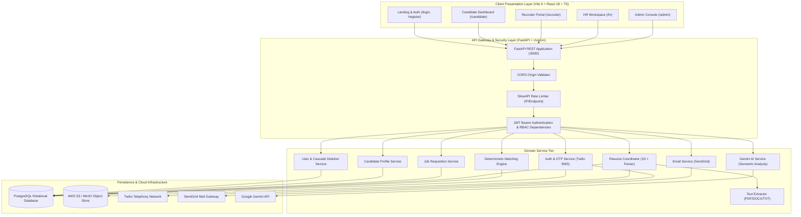
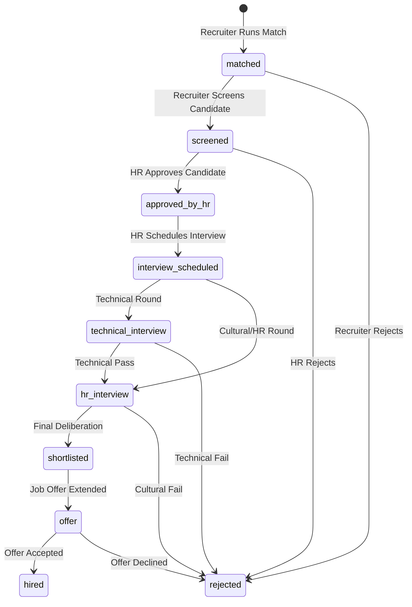
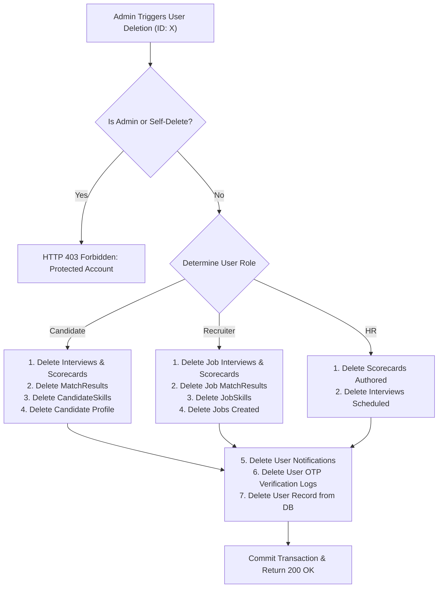
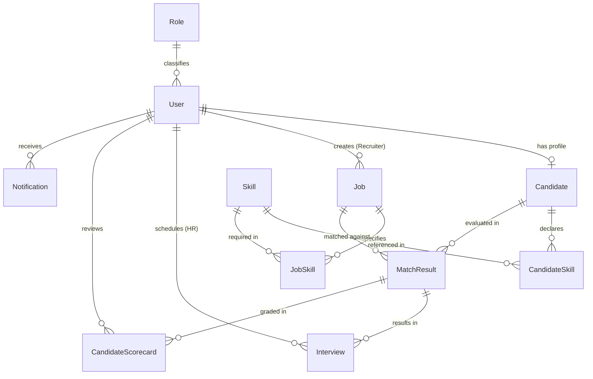

# Functional Specification Document (FSD)
## SkillAlign: Intelligent Recruitment, Candidate-Job Matching & ATS Platform

---

### Document Control

| Attribute | Details |
| :--- | :--- |
| **Document Title** | Functional Specification Document (FSD) — SkillAlign Enterprise Platform |
| **Project Identifier** | SKILLALIGN-CORE-2026 |
| **Document Version** | 2.0.0 (Comprehensive Production Specification) |
| **Document Status** | Approved / Baseline Architecture |
| **Target Audience** | System Architects, Full-Stack Engineers, Product Managers, Mentors, QA Engineers, Security Auditors |
| **Author / Lead Architect** | Shiva Tripathi & SkillAlign Core Engineering Team |
| **Release Date** | September 2026 |
| **Classification** | Confidential / Internal Technical Specification |

---

### Revision History

| Version | Date | Primary Author | Description of Changes |
| :--- | :--- | :--- | :--- |
| **v1.0.0** | August 2026 | Core Engineering Lead | Initial functional draft covering relational schema, JWT auth, and basic candidate profiles. |
| **v1.4.0** | August 2026 | Backend Lead | Integration of AWS S3 dual-path resume storage, plain-text extraction, and deterministic parsing. |
| **v1.8.0** | September 2026 | Security & Integration | Dual-mode authentication (Email + Twilio SMS OTP), anti-flooding rate limiters, and RBAC guards. |
| **v2.0.0** | September 2026 | Full Architecture Team | Full baseline FSD: Deterministic 4-tier match formula, collaborative ATS Kanban, 8-table cascade deletion, 59-endpoint Postman suite, SendGrid & Gemini AI integrations, and complete schema specification. |

---

## 1. Executive Summary & Business Architecture

### 1.1 Problem Statement
Modern enterprise recruitment operations face three acute operational challenges:
1. **Unstructured Resume Ingestion & Subjective Screening**: Recruiters spend up to 40 hours per role manually parsing unstructured PDF and Word documents. Human screening suffers from cognitive fatigue, unconscious bias, and inconsistent evaluation criteria.
2. **Superficial Keyword Matching**: Legacy Applicant Tracking Systems (ATS) rely on simple string matching rather than multi-dimensional deterministic scoring that accounts for proficiency depths, mandatory vs. preferred constraints, and experience thresholds.
3. **Fragmented Multi-Stakeholder Workflows**: Disconnected hand-offs between Technical Recruiters (sourcing and requisition authoring), HR Managers (cultural screening, interview coordination, and scorecard aggregation), and Candidates (application transparency and schedule tracking) create high drop-off rates and delayed hiring cycles.

### 1.2 Solution Vision: The SkillAlign Platform
SkillAlign is an enterprise-grade, cloud-native Recruitment, Candidate-Job Alignment, and Applicant Tracking System. The platform automates the end-to-end recruitment lifecycle through:
- **Deterministic Multi-Criteria Matching Engine**: Calculates transparent, auditable alignment scores (0.0% to 100.0%) across skill proficiencies (60%), experience tenure (20%), education (10%), and work mode compatibility (10%), enforced by a mandatory skill zero-gate.
- **Dual-Storage Cloud Resume Pipeline**: Ingests resumes (PDF, DOCX, DOC, TXT) into AWS S3, deterministically extracts clean plain text, executes rule-based structured parsing (identifying contact information, degrees, tenure, and skills), and synchronizes detected skills with the master taxonomy without black-box NLP latency.
- **Dual-Mode Enterprise Authentication**: Seamlessly authenticates users via traditional salted-and-hashed email/password credentials or live international Phone OTP delivered via Twilio Telephony with dev/sandbox fallback.
- **Multi-Role Collaborative Kanban ATS**: Specialized, role-guarded workspaces for System Administrators, HR Managers, Technical Recruiters, and Job Candidates.
- **Lifecycle Governance & Cascade Deletion**: End-to-end relational auditability with a transactional cascade engine capable of purging accounts across 8 related models without orphaned records.

---

## 2. System Architecture & Technology Stack

SkillAlign utilizes a decoupled, layered micro-tier architecture that separates the client presentation layer, the RESTful API and security gateway, the domain business service tier, relational persistence, and cloud object storage.

### 2.1 Technology Stack Specifications

| Architectural Tier | Technology / Library | Version | Purpose & Technical Role |
| :--- | :--- | :--- | :--- |
| **Frontend Framework** | React | 18.3.1 | Declarative component UI with hooks and Context API |
| **Client Language** | TypeScript | 5.5.3 | Static typing, interface contracts, and compile-time verification |
| **Styling & Design System** | TailwindCSS | 3.4.1 | Utility-first CSS, dark glassmorphism, responsive grid layout |
| **Build Tooling** | Vite | 6.4.3 | Sub-second HMR, tree-shaking, and Rollup-based production bundling |
| **HTTP Client** | Axios | 1.7.9 | Request/response interceptors, Bearer token injection, error handling |
| **Iconography** | Lucide React | 0.344.0 | Lightweight, consistent SVG icon set across all viewports |
| **Backend Framework** | FastAPI | 0.115.6 | Asynchronous Python ASGI framework with OpenAPI/Swagger docs |
| **Server Runtime** | Python | 3.13.7 | Backend runtime executing business logic and algorithms |
| **ASGI Server** | Uvicorn | 0.34.0 | High-performance asynchronous HTTP/WebSocket server |
| **ORM & Database Layer** | SQLAlchemy | 2.0.36 | Typed declarative models, relationship mappers, session transactions |
| **Schema Validation** | Pydantic / Pydantic Settings | 2.10.4 | Request/response data serialization, validation, and `.env` loading |
| **Database System** | PostgreSQL | 16.x | ACID-compliant relational persistence store |
| **Cloud Storage** | Boto3 (AWS S3) | 1.35.81 | Cloud storage client for resume uploads and pre-signed URLs |
| **Document Processing** | PyPDF2 & python-docx | 3.0.1 / 1.2.0 | Binary text extraction from PDF and Word documents |
| **Telephony / SMS** | Twilio Python SDK | 9.4.0 | International SMS dispatch for Phone OTP authentication |
| **Email Gateway** | SendGrid Python SDK | 6.11.0 | Transactional email delivery for interview notifications and updates |
| **Generative AI** | Google Gemini API (REST) | 1.0.0 | Semantic candidate-job fit analysis and interview question generation |
| **Security & Cryptography** | Passlib (Bcrypt) & PyJWT | 1.7.4 / 2.10.1 | Cryptographic password hashing (Bcrypt) and HMAC-SHA256 JWT tokens |
| **API Rate Limiting** | SlowAPI | 0.1.9 | Endpoint throttling to prevent brute-force and resource exhaustion |

---

## 3. User Personas & Role-Based Access Control (RBAC)

SkillAlign implements strict, multi-tiered Role-Based Access Control (RBAC) enforced at the database layer (via the `Role` entity), the API gateway (via FastAPI dependencies), and the frontend router (via `ProtectedRoute`).

### 3.1 User Personas

1. **System Administrator (`Role ID: 1`, `Role Name: Admin`)**:
   - Platform governance, user account provisioning (creating HR and Recruiter accounts), activation/deactivation of users, permanent cascade user de-provisioning, master skill catalog curation, and cross-organization analytics monitoring.
2. **HR Manager (`Role ID: 2`, `Role Name: HR`)**:
   - Talent evaluation and pipeline governance, review of screened candidates, interview coordination and scheduling (with Google Meet integration and SendGrid email delivery), candidate scorecard submissions (Communication, Technical, Cultural), and candidate milestone notifications.
3. **Technical Recruiter (`Role ID: 3`, `Role Name: Recruiter`)**:
   - Sourcing and requisition management, creating and publishing job requisitions, configuring required vs. preferred skills with weights, triggering the automated matching engine, screening matched candidates, and advancing talent into the pipeline.
4. **Candidate (`Role ID: 4`, `Role Name: Candidate`)**:
   - Talent profile management, self-registration via Email or Phone OTP, uploading resumes (PDF/DOCX/TXT) to cloud storage, reviewing extracted structured information and raw text, declaring skills and proficiencies, and tracking real-time application and interview statuses.

### 3.2 Comprehensive RBAC Permission Matrix

| System Capability | Public / Guest | Candidate (Role 4) | Recruiter (Role 3) | HR Manager (Role 2) | Administrator (Role 1) |
| :--- | :---: | :---: | :---: | :---: | :---: |
| **View Marketing Landing Page** | ✅ | ✅ | ✅ | ✅ | ✅ |
| **Candidate Self-Registration** | ✅ | ❌ | ❌ | ❌ | ❌ |
| **Email/Password Login** | ✅ | ✅ | ✅ | ✅ | ✅ |
| **Phone OTP Request & Verification** | ✅ | ✅ | ✅ | ✅ | ✅ |
| **Manage Own Profile & Location** | ❌ | ✅ | ❌ | ❌ | ❌ |
| **Upload Resume & View Parsed Data**| ❌ | ✅ | ❌ | ❌ | ❌ |
| **View Own Application Pipeline** | ❌ | ✅ | ❌ | ❌ | ❌ |
| **Create & Update Job Requisitions** | ❌ | ❌ | ✅ | ❌ | ❌ |
| **Delete Owned Job Requisitions** | ❌ | ❌ | ✅ | ❌ | ❌ |
| **Execute Matching Engine** | ❌ | ❌ | ✅ | ✅ | ✅ |
| **View Ranked Job Matches** | ❌ | ❌ | ✅ | ✅ | ✅ |
| **Screen / Reject Candidate** | ❌ | ❌ | ✅ | ❌ | ✅ |
| **Approve Screened Candidate** | ❌ | ❌ | ❌ | ✅ | ✅ |
| **Schedule Interview & Meeting Link**| ❌ | ❌ | ❌ | ✅ | ✅ |
| **Submit Evaluation Scorecard** | ❌ | ❌ | ✅ | ✅ | ❌ |
| **View Candidate S3 Resume / Text** | ❌ | ✅ (Own) | ✅ | ✅ | ✅ |
| **Generate Gemini AI Fit Analysis** | ❌ | ❌ | ✅ | ✅ | ✅ |
| **Manage Master Skills Taxonomy** | ❌ | ❌ | ❌ | ❌ | ✅ |
| **Provision HR/Recruiter Accounts** | ❌ | ❌ | ❌ | ❌ | ✅ |
| **Toggle User Status (Active/Inactive)**| ❌ | ❌ | ❌ | ❌ | ✅ |
| **Permanently Delete User (Cascade)** | ❌ | ❌ | ❌ | ❌ | ✅ |
| **Access Admin Analytics & Health** | ❌ | ❌ | ❌ | ❌ | ✅ |

---

## 4. Detailed Functional Module Specifications

### Module 1: Authentication, Authorization & Identity Management

#### 1.1 Dual-Mode Authentication Architecture
The authentication module provides two independent, cryptographically secure authentication paths:
- **Email & Password**: Standard credential authentication using Passlib Bcrypt with salting.
- **Phone OTP Authentication**: Mobile number login using dynamic 6-digit numeric OTPs dispatched via Twilio SMS telephony, with automated account provisioning for new mobile numbers.

#### 1.2 Functional Requirements
- **FR-AUTH-001 (Candidate Self-Registration)**: Endpoint `POST /api/auth/register` enables public candidate registration. Automatically assigns `role_id = 4` (Candidate). Prevents unauthorized creation of privileged roles (Admin, HR, Recruiter).
- **FR-AUTH-002 (Credential Verification & JWT Issuance)**: Endpoint `POST /api/auth/login` verifies email (case-insensitive) and Bcrypt password hash. Returns an HMAC-SHA256 signed JSON Web Token containing `sub` (User ID), `role` (Role Name), and `exp` (configured expiration, default 60 minutes).
- **FR-AUTH-003 (Phone Number E.164 Normalization)**: Normalizes incoming 10-digit Indian phone numbers (e.g., `8840226477`) to standard international E.164 format (`+918840226477`). Validates length and numerical structure.
- **FR-AUTH-004 (OTP Generation & Dispatch)**: Endpoint `POST /api/auth/send-otp` generates a cryptographically random 6-digit integer. Persists OTP record in `otp_verifications` table with a 5-minute expiration timestamp (`OTP_EXPIRY_SECONDS = 300`).
- **FR-AUTH-005 (Anti-Flooding Cooldown & Rate Limiting)**: Enforces a 60-second cooldown between OTP requests for the same phone number (`OTP_RESEND_COOLDOWN_SECONDS = 60`). Gateway rate-limiting restricts requests to 5 per minute per IP via SlowAPI (`HTTP 429 Too Many Requests`).
- **FR-AUTH-006 (OTP Verification & Auto-Resolution)**: Endpoint `POST /api/auth/verify-otp` validates the submitted code. If the phone number does not exist in `users`, the system automatically provisions an active Candidate account with default name formatting (`Candidate {Phone-Suffix}`) and issues a JWT token.
- **FR-AUTH-007 (Sandbox & Dev Mode Telephony Fallback)**: If Twilio credentials are in dev mode (`OTP_DEV_MODE = True`) or Twilio trial restrictions trigger error code 21608 (unverified number in trial), the system logs the OTP to console and returns a graceful fallback in the API response for seamless evaluation.
- **FR-AUTH-008 (User Profile Management)**: Authenticated users inspect profile and role metadata via `GET /api/auth/me` and update personal contact details via `PUT /api/auth/me`.
- **FR-AUTH-009 (1-Click Role Access Evaluator)**: The frontend login interface provides 1-click evaluation access for all four system roles (Admin, HR, Recruiter, and Candidate Shiva) to facilitate testing and demonstrations.

---

### Module 2: Candidate Profile & Resume Processing Pipeline

#### 2.1 S3 Dual-Storage & Text Extraction Architecture
SkillAlign implements an object storage and parsing pipeline for resumes:
1. **File Validation**: Enforces MIME types (`application/pdf`, `application/msword`, `application/vnd.openxmlformats-officedocument.wordprocessingml.document`, `text/plain`) and a 10MB size limit (`HTTP 413`).
2. **Dual S3 Ingestion**:
   - Original document uploaded to: `resumes/original/{candidate_id}/{sanitized_filename}`
   - Extracted readable text uploaded to: `resumes/extracted/{candidate_id}/{stem}.txt`
3. **Deterministic Text Extraction**:
   - PDF: Extracted via `PyPDF2.PdfReader` with clean whitespace normalization.
   - DOCX: Extracted via `docx.Document` paragraph and table iteration.
   - TXT: Decoded via UTF-8 with fallback encodings (latin-1, cp1252).
4. **Deterministic Rule-Based Parsing**:
   - Contact Extraction: Regex matching for emails (`[A-Za-z0-9._%+-]+@[A-Za-z0-9.-]+\.[A-Z|a-z]{2,}`) and Indian mobile numbers (`(?:\+91[\-\s]?)?[6-9]\d{9}`).
   - Education Parsing: Regex scanning for degrees (B.Tech, M.Tech, B.E., B.Sc, M.Sc, MBA, Ph.D) and academic institutions.
   - Experience Calculation: Date pattern recognition (`(Jan|Feb|...) \d{4} - (Present|\d{4})`) calculating total career tenure.
   - Skill Taxonomy Recognition: Cross-references extracted text against the database master skill catalog (case-insensitive substring and boundary matching).
5. **Auto-Synchronization**: Discovered skills are auto-persisted into `candidate_skills` linked to the candidate profile with default proficiency.

#### 2.2 Functional Requirements
- **FR-CAND-001 (Profile Management)**: Candidates create (`POST /api/candidates/me`) and update (`PUT /api/candidates/me`) full name, mobile number, total experience, address, city, state, pincode, country, work authorization, preferred work mode (WFH, WFO, Hybrid), notice period, current CTC, and expected CTC.
- **FR-CAND-002 (Resume Upload & Ingestion)**: Endpoint `POST /api/candidates/{id}/resume` executes the complete extraction, dual S3 upload, deterministic parsing, and database synchronization pipeline.
- **FR-CAND-003 (Pre-Signed Resume Download)**: Endpoint `GET /api/candidates/{id}/resume` generates a secure, temporary pre-signed S3 URL with 300-second TTL. Prevents direct exposure of AWS credentials.
- **FR-CAND-004 (Raw Text Preview)**: Endpoint `GET /api/candidates/{id}/resume/text` retrieves the extracted plain text (`.txt`) for immediate modal preview with 1-click clipboard copy.
- **FR-CAND-005 (Structured Parsed Resume Inspection)**: Endpoint `GET /api/candidates/{id}/resume/parsed` returns the structured JSON payload containing candidate contact info, degrees, calculated experience, detected skills, certifications, and projects.
- **FR-CAND-006 (Resume Deletion)**: Endpoint `DELETE /api/candidates/{id}/resume` deletes both the original file and the extracted `.txt` artifact from S3, nullifying database storage columns.
- **FR-CAND-007 (Candidate Career Pipeline View)**: Endpoint `GET /api/candidates/me/pipeline` provides candidates with real-time visibility into all matched jobs, current hiring stages, and interview details.

---

### Module 3: Skills Inventory & Master Taxonomy

#### 3.1 Functional Requirements
- **FR-SKL-001 (Master Skill Repository)**: Administrators curate canonical skills via `POST /api/skills`, `PUT /api/skills/{id}`, and `DELETE /api/skills/{id}`. Each skill consists of a unique name and domain category (e.g., Frontend, Backend, DevOps, Database, Cloud, Mobile, AI/ML, Management).
- **FR-SKL-002 (Skill Discovery & Categorization)**: Endpoint `GET /api/skills` provides all authenticated roles with filtered skill listings by category for autocomplete and dropdown selectors.
- **FR-SKL-003 (Candidate Skill Portfolio)**: Candidates add (`POST /api/candidates/me/skills`), update (`PUT /api/candidates/me/skills/{id}`), and delete (`DELETE /api/candidates/me/skills/{id}`) skills with self-declared proficiency levels:
  - `Beginner`: Foundational working knowledge (Scoring Factor: `0.40`).
  - `Intermediate`: Autonomous production capability (Scoring Factor: `0.70`).
  - `Expert`: Advanced architecture and leadership (Scoring Factor: `1.00`).
  - `Years of Experience`: Numerical duration in years.

---

### Module 4: Job Requisition & Specification Lifecycle

#### 4.1 Functional Requirements
- **FR-JOB-001 (Requisition Authoring)**: Recruiters author job openings via `POST /api/jobs` specifying Title, Department, Client Name, Job Description, Minimum Experience Years, Work Mode (WFH, WFO, Hybrid), City, State, Country, Shift Timing, Travel Requirements, and Urgency Level.
- **FR-JOB-002 (Granular Skill Tagging & Weighting)**: Each job requisition links multiple skills from the master taxonomy via `JobSkill` relationships, defining:
  - `requirement_type`: Categorized as `required` (mandatory) or `preferred` (optional).
  - `weight`: Numerical importance weighting factor (typically 1.0 to 5.0).
- **FR-JOB-003 (Requisition Lifecycle States)**: Jobs transition across three states: `draft`, `active`, and `closed`. Recruiters update specifications via `PUT /api/jobs/{id}`.
- **FR-JOB-004 (Requisition Deletion & Cascade)**: Recruiters delete requisitions via `DELETE /api/jobs/{id}`. The system cascades and purges associated `job_skills` and `match_results`.

---

### Module 5: Deterministic Candidate-Job Matching Engine

#### 5.1 Mathematical Scoring Formulation
The SkillAlign matching algorithm evaluates candidates using a multi-criteria mathematical model:

$$\text{Overall Score} = \min\left(100.0, S_{\text{skills}} + S_{\text{experience}} + S_{\text{education}} + S_{\text{work\_mode}}\right)$$

#### Component Breakdown:

1. **Skill Component ($S_{\text{skills}}$ — Up to 60.0%)**:
   - Evaluates the weighted ratio of candidate proficiencies against the job's required skills:
     $$\text{Raw Skill Ratio} = \frac{\sum_{i=1}^{n} (\text{Weight}_i \times \text{Factor}_i)}{\sum_{i=1}^{n} \text{Weight}_i}$$
   - Where $\text{Factor}_i \in \{0.40, 0.70, 1.00\}$ based on candidate proficiency level, or $0.0$ if the skill is missing.
   - $S_{\text{skills}} = \text{Raw Skill Ratio} \times 60.0$.
2. **Experience Relevance ($S_{\text{experience}}$ — Up to 20.0%)**:
   - If $\text{Job Min Exp} \le 0 \implies S_{\text{experience}} = 20.0$.
   - If $\text{Cand Exp} \ge \text{Job Min Exp} \implies S_{\text{experience}} = 20.0$.
   - If $\text{Cand Exp} \ge (0.70 \times \text{Job Min Exp}) \implies S_{\text{experience}} = 12.0$.
   - If $\text{Cand Exp} > 0 \implies S_{\text{experience}} = 6.0$.
   - Else $\implies S_{\text{experience}} = 0.0$.
3. **Education Qualification ($S_{\text{education}}$ — Up to 10.0%)**:
   - If candidate has an educational degree documented $\implies S_{\text{education}} = 10.0$.
   - Else $\implies S_{\text{education}} = 0.0$.
4. **Work Mode Compatibility ($S_{\text{work\_mode}}$ — Up to 10.0%)**:
   - If candidate preferred mode matches job mode, or either is `Hybrid`, or unspecified $\implies S_{\text{work\_mode}} = 10.0$.
   - Mismatched modes (e.g. WFH candidate vs. WFO job) $\implies S_{\text{work\_mode}} = 4.0$.
5. **Zero-Gate Filtering Rule**:
   - If a candidate matches **zero** skills required by the job, the overall score is strictly **$0.0$**, filtering out non-viable applications regardless of experience or education.

#### 5.2 Functional Requirements
- **FR-MCH-001 (Batch Match Execution)**: Endpoint `POST /api/matching/jobs/{id}/run` executes the algorithm across all candidate profiles for the specified job. Results are upserted into `match_results` with initial status `matched` and returned sorted by `overall_score` descending.
- **FR-MCH-002 (Explainable Match Analytics)**: Each match result generates an explainable breakdown (`skill_breakdown`) itemizing matched skills, missing skills, candidate proficiency levels, and requirement weights.
- **FR-MCH-003 (Gemini AI Fit Analysis)**: Endpoint `GET /api/matching/{id}/ai-analysis` invokes Google Gemini to generate a semantic fit assessment, executive summary, key candidate strengths, potential skill gaps, and 3 targeted technical interview questions.

---

### Module 6: Recruitment Pipeline & Collaborative Kanban ATS

#### 6.1 Pipeline Lifecycle & Stage Governance
SkillAlign models candidate progression across 10 discrete pipeline stages:

#### 6.2 Role-Enforced Transition Rules
- **Recruiter Guard**: Can only advance candidates from `matched` to `screened` or `rejected` for jobs they created.
- **HR Guard**: Can transition candidates from `screened` to `approved_by_hr`, schedule interviews, advance to interview sub-stages, extend `offer`, mark `hired`, or issue `rejected`.
- **Admin Guard**: Full pipeline override authority.

#### 6.3 Evaluation Scorecards
- **FR-SCR-001 (Scorecard Submission)**: Endpoint `POST /api/matching/{match_id}/scorecard` enables HR and Recruiters to submit evaluation ratings across Communication (1–10), Technical Proficiency (1–10), Cultural Fit (1–10), Qualitative Feedback Notes, and Recommendation Status (`strong_hire`, `hire`, `neutral`, `do_not_hire`).
- **FR-SCR-002 (Scorecard Aggregation)**: Endpoint `GET /api/matching/{match_id}/scorecards` retrieves all multi-rater scorecards for auditability.

---

### Module 7: Interview Scheduling & Video Integration

#### 7.1 Functional Requirements
- **FR-INT-001 (Interview Coordination)**: HR schedules interviews via `POST /api/interviews` specifying `match_result_id`, `interview_date`, `interview_type` (Technical, HR, Cultural, Screening), `interview_mode` (online, in-person, phone), `meeting_link` (Google Meet/Zoom URL), and `scheduled_end` timestamp.
- **FR-INT-002 (Automated Pipeline Advancement)**: Scheduling an interview automatically transitions the parent `MatchResult.status` to `interview_scheduled`.
- **FR-INT-003 (SendGrid Email Invitation)**: When `send_notification=True`, the system automatically formats an interview invitation email containing job title, company name, scheduled date/time, meeting link, and interviewer name, and dispatches it via SendGrid.
- **FR-INT-004 (In-App Calendar Visibility)**: Scheduled interviews reflect on the candidate's dashboard (`GET /api/interviews/my`) and the HR schedule calendar (`GET /api/interviews`).
- **FR-INT-005 (Interview Lifecycle)**: Interviews update across `scheduled`, `completed`, and `cancelled` states via `PATCH /api/interviews/{id}`.

---

### Module 8: Notifications & Communication Engine

#### 8.1 Functional Requirements
- **FR-NOT-001 (In-App Notification Dispatch)**: Endpoint `POST /api/notifications` triggers notifications stored in the `notifications` table linked to target user IDs.
- **FR-NOT-002 (Personal Notification Feed)**: Endpoint `GET /api/notifications/my` allows authenticated users (Candidates, Recruiters, HR) to retrieve their personal notifications ordered by timestamp descending.
- **FR-NOT-003 (Automated Milestone Alerts)**: Pipeline status transitions (HR approval, interview scheduling, offer, rejection) automatically dispatch in-app notifications and SendGrid emails to candidates.

---

### Module 9: System Administration & Platform Governance

#### 9.1 Relational Cascade Deletion Engine
To prevent orphaned foreign key records in relational databases, SkillAlign implements an 8-table transactional cascade deletion engine (`user_service.delete_user`):

#### 9.2 Functional Requirements
- **FR-ADM-001 (Paginated Directory)**: Endpoint `GET /api/admin/users` returns paginated users with server-side search (`search`), role filtering (`role`), and status filtering (`status`).
- **FR-ADM-002 (Extended User Inspection)**: Endpoint `GET /api/admin/users/{id}/detail` returns deep profile telemetry including candidate resume status, S3 storage keys, parsed structured JSON, declared skills, and recruiter jobs.
- **FR-ADM-003 (Status Toggle)**: Endpoint `PATCH /api/admin/users/{id}/toggle-status` toggles `is_active` state (activating or deactivating account access immediately).
- **FR-ADM-004 (Privileged Account Provisioning)**: Endpoint `POST /api/users` allows Administrators to provision new HR (`role_id: 2`) or Recruiter (`role_id: 3`) accounts with Pydantic validation (strong password requirement: min 8 characters, 1 uppercase, 1 lowercase, 1 digit).
- **FR-ADM-005 (Cascade User Deletion)**: Endpoint `DELETE /api/admin/users/{id}` executes the transactional multi-model cascade deletion engine.
- **FR-ADM-006 (Root Protection Rule)**: Administrator accounts and self-deletion requests are strictly forbidden (`HTTP 403 Forbidden`).
- **FR-ADM-007 (Dashboard Analytics Telemetry)**: Endpoint `GET /api/users/stats` returns aggregated platform statistics (total users, active users, HR count, recruiter count, candidate count, and master skill inventory count).

---

## 5. Complete Relational Database Schema & Entity Models

### Table 1: `roles`
Stores core system security roles for Role-Based Access Control.
- `id` (Integer, Primary Key, Autoincrement)
- `name` (String(50), Unique, Not Null) — Values: `Admin`, `HR`, `Recruiter`, `Candidate`

### Table 2: `users`
Central user credential and authorization table.
- `id` (Integer, Primary Key, Autoincrement)
- `name` (String(100), Not Null)
- `email` (String(255), Unique, Nullable, Indexed)
- `password_hash` (String(255), Nullable)
- `phone_number` (String(20), Unique, Nullable, Indexed) — Standardized E.164
- `role_id` (Integer, Foreign Key -> `roles.id`, Not Null)
- `is_active` (Boolean, Default: True, Not Null)
- `created_at` (DateTime with Timezone, Default: UTC Now)
- `updated_at` (DateTime with Timezone, Default: UTC Now, onupdate: UTC Now)

### Table 3: `candidates`
Extended candidate profile, career preferences, and resume storage pointers.
- `id` (Integer, Primary Key, Autoincrement)
- `user_id` (Integer, Foreign Key -> `users.id`, Unique, Not Null)
- `full_name` (String(100), Not Null)
- `phone` (String(20), Nullable)
- `resume_file_path` (String(500), Nullable) — Legacy/Local path fallback
- `resume_s3_key` (String(500), Nullable) — AWS S3 key for original resume
- `resume_extracted_text_s3_key` (String(500), Nullable) — AWS S3 key for extracted `.txt`
- `resume_filename` (String(255), Nullable) — Original filename
- `resume_uploaded_at` (DateTime with Timezone, Nullable)
- `resume_parsed_at` (DateTime with Timezone, Nullable)
- `resume_raw_text` (Text, Nullable) — Cached raw text extracted from document
- `extracted_data` (Text, Nullable) — Serialized JSON of structured extraction
- `education_degree` (String(100), Nullable)
- `education_institution` (String(200), Nullable)
- `total_experience_years` (Numeric(4,1), Default: 0.0, Not Null)
- `address` (Text, Nullable)
- `city` (String(100), Nullable)
- `state` (String(100), Nullable)
- `pincode` (String(20), Nullable)
- `country` (String(100), Default: "India")
- `work_authorization` (String(100), Default: "Indian Citizen")
- `preferred_work_mode` (String(20), Default: "Hybrid") — `WFH`, `WFO`, `Hybrid`
- `notice_period` (String(50), Default: "30 Days")
- `current_ctc` (Numeric(12,2), Nullable)
- `expected_ctc` (Numeric(12,2), Nullable)
- `created_at` (DateTime with Timezone, Default: UTC Now)
- `updated_at` (DateTime with Timezone, Default: UTC Now, onupdate: UTC Now)

### Table 4: `skills`
Master canonical skill catalog managed by Administrators.
- `id` (Integer, Primary Key, Autoincrement)
- `name` (String(100), Unique, Not Null, Indexed)
- `category` (String(100), Not Null, Indexed) — e.g. Frontend, Backend, Cloud
- `created_at` (DateTime with Timezone, Default: UTC Now)

### Table 5: `candidate_skills`
Mapping table linking candidates to skills with declared proficiencies.
- `id` (Integer, Primary Key, Autoincrement)
- `candidate_id` (Integer, Foreign Key -> `candidates.id`, Not Null, Indexed)
- `skill_id` (Integer, Foreign Key -> `skills.id`, Not Null, Indexed)
- `proficiency_level` (String(20), Not Null) — `Beginner`, `Intermediate`, `Expert`
- `years_experience` (Numeric(4,1), Default: 0.0, Not Null)
- `created_at` (DateTime with Timezone, Default: UTC Now)
- *Constraint*: `Unique(candidate_id, skill_id)`

### Table 6: `jobs`
Job requisitions created and managed by Technical Recruiters.
- `id` (Integer, Primary Key, Autoincrement)
- `title` (String(150), Not Null, Indexed)
- `description` (Text, Nullable)
- `department` (String(100), Nullable)
- `client_name` (String(150), Nullable)
- `min_experience_years` (Numeric(4,1), Default: 0.0, Not Null)
- `work_mode` (String(20), Default: "Hybrid") — `WFH`, `WFO`, `Hybrid`
- `location_city` (String(100), Nullable)
- `location_state` (String(100), Nullable)
- `location_country` (String(100), Default: "India")
- `urgency` (String(20), Default: "Medium")
- `shift_timing` (String(50), Nullable)
- `travel_requirements` (String(50), Nullable)
- `status` (String(20), Default: "active", Not Null) — `draft`, `active`, `closed`
- `created_by` (Integer, Foreign Key -> `users.id`, Not Null)
- `created_at` (DateTime with Timezone, Default: UTC Now)
- `updated_at` (DateTime with Timezone, Default: UTC Now, onupdate: UTC Now)

### Table 7: `job_skills`
Mapping table linking required and preferred skills to job requisitions.
- `id` (Integer, Primary Key, Autoincrement)
- `job_id` (Integer, Foreign Key -> `jobs.id`, Not Null, Indexed)
- `skill_id` (Integer, Foreign Key -> `skills.id`, Not Null, Indexed)
- `requirement_type` (String(20), Default: "required", Not Null) — `required`, `preferred`
- `weight` (Numeric(3,2), Default: 1.0, Not Null)
- `created_at` (DateTime with Timezone, Default: UTC Now)
- *Constraint*: `Unique(job_id, skill_id)`

### Table 8: `match_results`
Calculated alignment scores and pipeline progression records.
- `id` (Integer, Primary Key, Autoincrement)
- `job_id` (Integer, Foreign Key -> `jobs.id`, Not Null, Indexed)
- `candidate_id` (Integer, Foreign Key -> `candidates.id`, Not Null, Indexed)
- `recruiter_id` (Integer, Foreign Key -> `users.id`, Nullable)
- `matched_by` (Integer, Foreign Key -> `users.id`, Nullable)
- `overall_score` (Numeric(5,2), Not Null) — `0.0` to `100.0`
- `status` (String(30), Default: "matched", Not Null, Indexed) — Pipeline status
- `created_at` (DateTime with Timezone, Default: UTC Now)
- `updated_at` (DateTime with Timezone, Default: UTC Now, onupdate: UTC Now)
- *Constraint*: `Unique(job_id, candidate_id)`

### Table 9: `interviews`
Scheduled candidate interviews coordinated by HR.
- `id` (Integer, Primary Key, Autoincrement)
- `match_result_id` (Integer, Foreign Key -> `match_results.id`, Not Null, Indexed)
- `scheduled_by` (Integer, Foreign Key -> `users.id`, Not Null) — HR User ID
- `interview_date` (DateTime with Timezone, Not Null)
- `interview_type` (String(50), Not Null) — Technical, HR, Cultural, Screening
- `meeting_link` (String(500), Nullable) — Google Meet / Zoom link
- `interview_mode` (String(20), Default: "online") — `online`, `in-person`, `phone`
- `scheduled_end` (DateTime with Timezone, Nullable)
- `feedback` (Text, Nullable)
- `status` (String(20), Default: "scheduled", Not Null) — `scheduled`, `completed`, `cancelled`
- `created_at` (DateTime with Timezone, Default: UTC Now)
- `updated_at` (DateTime with Timezone, Default: UTC Now, onupdate: UTC Now)

### Table 10: `candidate_scorecards`
Multi-rater feedback scorecards submitted by HR and Recruiters.
- `id` (Integer, Primary Key, Autoincrement)
- `match_result_id` (Integer, Foreign Key -> `match_results.id`, Not Null, Indexed)
- `reviewer_id` (Integer, Foreign Key -> `users.id`, Not Null)
- `communication_score` (Integer, Not Null) — 1 to 10
- `technical_score` (Integer, Not Null) — 1 to 10
- `cultural_score` (Integer, Not Null) — 1 to 10
- `notes` (Text, Nullable)
- `recommendation` (String(30), Default: "hire") — `strong_hire`, `hire`, `neutral`, `do_not_hire`
- `created_at` (DateTime with Timezone, Default: UTC Now)

### Table 11: `notifications`
In-app candidate and stakeholder alerts.
- `id` (Integer, Primary Key, Autoincrement)
- `user_id` (Integer, Foreign Key -> `users.id`, Not Null, Indexed)
- `channel` (String(20), Default: "email", Not Null)
- `subject` (String(200), Not Null)
- `body` (Text, Not Null)
- `status` (String(20), Default: "sent", Not Null) — `sent`, `read`
- `created_at` (DateTime with Timezone, Default: UTC Now)

### Table 12: `otp_verifications`
Ephemeral mobile authentication and rate-limiting audit records.
- `id` (Integer, Primary Key, Autoincrement)
- `phone_number` (String(20), Not Null, Indexed)
- `otp_code` (String(6), Not Null)
- `expires_at` (DateTime with Timezone, Not Null)
- `is_verified` (Boolean, Default: False, Not Null)
- `attempts` (Integer, Default: 0, Not Null)
- `created_at` (DateTime with Timezone, Default: UTC Now)

---

## 6. Complete REST API Specifications

The SkillAlign backend exposes 59 REST API endpoints organized across 11 functional routers:

### 6.1 Authentication Router (`/api/auth`)
| Method | Endpoint Path | Summary | Auth Required | Status Code |
| :--- | :--- | :--- | :---: | :---: |
| `POST` | `/api/auth/register` | Candidate self-registration | Public | `201 Created` |
| `POST` | `/api/auth/login` | Email/Password credential login | Public | `200 OK` |
| `GET` | `/api/auth/me` | Fetch currently authenticated user profile | Bearer Token | `200 OK` |
| `PUT` | `/api/auth/me` | Update personal profile details | Bearer Token | `200 OK` |
| `POST` | `/api/auth/send-otp` | Request phone OTP via Twilio SMS | Public (Rate Limited) | `200 OK` |
| `POST` | `/api/auth/verify-otp` | Verify OTP and authenticate/provision | Public (Rate Limited) | `200 OK` |
| `POST` | `/api/auth/resend-otp` | Resend phone OTP (subject to 60s cooldown) | Public (Rate Limited) | `200 OK` |

### 6.2 Candidate Router (`/api/candidates`)
| Method | Endpoint Path | Summary | Auth Required | Status Code |
| :--- | :--- | :--- | :---: | :---: |
| `GET` | `/api/candidates/me` | Fetch own candidate profile | Candidate | `200 OK` |
| `POST` | `/api/candidates/me` | Create candidate profile | Candidate | `201 Created` |
| `PUT` | `/api/candidates/me` | Update candidate profile | Candidate | `200 OK` |
| `GET` | `/api/candidates/me/pipeline` | Fetch candidate's matched jobs & stages | Candidate | `200 OK` |
| `POST` | `/api/candidates/me/skills` | Add skill with proficiency & tenure | Candidate | `201 Created` |
| `PUT` | `/api/candidates/me/skills/{id}` | Update skill proficiency or tenure | Candidate | `200 OK` |
| `DELETE` | `/api/candidates/me/skills/{id}` | Remove skill from profile | Candidate | `200 OK` |
| `GET` | `/api/candidates/{id}` | View candidate profile by ID | HR / Recruiter | `200 OK` |

### 6.3 Resume Management Router (`/api/candidates/{id}/resume`)
| Method | Endpoint Path | Summary | Auth Required | Status Code |
| :--- | :--- | :--- | :---: | :---: |
| `POST` | `/api/candidates/{id}/resume` | Upload resume (PDF/DOCX/TXT) & run parser | Candidate / Admin | `201 Created` |
| `GET` | `/api/candidates/{id}/resume` | Get secure 5-min pre-signed S3 download URL | Owner / HR / Rec / Admin | `200 OK` |
| `GET` | `/api/candidates/{id}/resume/text` | Get extracted readable plain text (.txt) | Owner / HR / Rec / Admin | `200 OK` |
| `GET` | `/api/candidates/{id}/resume/parsed`| Get structured parsed JSON data | Owner / HR / Rec / Admin | `200 OK` |
| `DELETE` | `/api/candidates/{id}/resume` | Purge resume files from S3 and reset DB | Candidate / Admin | `200 OK` |

### 6.4 Skills Router (`/api/skills`)
| Method | Endpoint Path | Summary | Auth Required | Status Code |
| :--- | :--- | :--- | :---: | :---: |
| `POST` | `/api/skills` | Add canonical skill to master catalog | Admin | `201 Created` |
| `GET` | `/api/skills` | List all skills (optional category filter) | Authenticated | `200 OK` |
| `GET` | `/api/skills/{id}` | Get skill details by ID | Authenticated | `200 OK` |
| `PUT` | `/api/skills/{id}` | Update skill name or category | Admin | `200 OK` |
| `DELETE` | `/api/skills/{id}` | Delete skill from master catalog | Admin | `204 No Content` |

### 6.5 Jobs Router (`/api/jobs`)
| Method | Endpoint Path | Summary | Auth Required | Status Code |
| :--- | :--- | :--- | :---: | :---: |
| `POST` | `/api/jobs` | Create job requisition with skill weights | Recruiter | `201 Created` |
| `GET` | `/api/jobs` | List job requisitions (status/owner filters) | Authenticated | `200 OK` |
| `GET` | `/api/jobs/{id}` | Get job details with skill requirements | Authenticated | `200 OK` |
| `PUT` | `/api/jobs/{id}` | Update owned job requisition | Recruiter | `200 OK` |
| `DELETE` | `/api/jobs/{id}` | Delete owned job requisition & cascades | Recruiter | `204 No Content` |

### 6.6 Matching Engine Router (`/api/matching`)
| Method | Endpoint Path | Summary | Auth Required | Status Code |
| :--- | :--- | :--- | :---: | :---: |
| `POST` | `/api/matching/jobs/{id}/run` | Execute deterministic match algorithm | Recruiter / HR / Admin | `200 OK` |
| `GET` | `/api/matching/jobs/{id}` | Get ranked candidate matches for job | HR / Recruiter | `200 OK` |
| `GET` | `/api/matching/screened` | List candidates screened by recruiters | HR / Admin | `200 OK` |
| `PATCH` | `/api/matching/{id}/status` | Update candidate pipeline stage | Role-Enforced | `200 OK` |
| `GET` | `/api/matching/shortlists` | List active pipeline talent across jobs | HR / Recruiter | `200 OK` |
| `POST` | `/api/matching/{id}/scorecard` | Submit multi-criteria evaluation scorecard | HR / Recruiter | `201 Created` |
| `GET` | `/api/matching/{id}/scorecards` | Get all feedback scorecards for match | HR / Recruiter | `200 OK` |
| `GET` | `/api/matching/{id}/ai-analysis`| Get Gemini AI fit analysis & questions | HR / Recruiter | `200 OK` |

### 6.7 Match Results Router (`/api/match_results`)
| Method | Endpoint Path | Summary | Auth Required | Status Code |
| :--- | :--- | :--- | :---: | :---: |
| `GET` | `/api/match_results/screened` | List screened candidates for HR review | HR / Admin | `200 OK` |
| `GET` | `/api/match_results/{id}` | Get single match result by ID | HR / Recruiter | `200 OK` |
| `PATCH` | `/api/match_results/{id}/status` | Update candidate status (role checked) | Role-Enforced | `200 OK` |

### 6.8 Interviews Router (`/api/interviews`)
| Method | Endpoint Path | Summary | Auth Required | Status Code |
| :--- | :--- | :--- | :---: | :---: |
| `POST` | `/api/interviews` | Schedule interview & dispatch invitation | HR | `201 Created` |
| `GET` | `/api/interviews` | List scheduled interviews (status filter) | HR / Admin | `200 OK` |
| `GET` | `/api/interviews/my` | List candidate's scheduled interviews | Candidate | `200 OK` |
| `GET` | `/api/interviews/{id}` | Get interview session details by ID | Candidate / HR / Admin | `200 OK` |
| `PATCH` | `/api/interviews/{id}` | Update interview status or feedback | HR | `200 OK` |

### 6.9 Notifications Router (`/api/notifications`)
| Method | Endpoint Path | Summary | Auth Required | Status Code |
| :--- | :--- | :--- | :---: | :---: |
| `POST` | `/api/notifications` | Dispatch notification to target user | HR / Admin | `201 Created` |
| `GET` | `/api/notifications/my` | Fetch authenticated user's alerts | Authenticated | `200 OK` |
| `GET` | `/api/notifications` | List all sent platform notifications | HR / Admin | `200 OK` |

### 6.10 Admin Management Router (`/api/admin`)
| Method | Endpoint Path | Summary | Auth Required | Status Code |
| :--- | :--- | :--- | :---: | :---: |
| `GET` | `/api/admin/users` | Paginated user list with search/filters | Admin | `200 OK` |
| `GET` | `/api/admin/users/{id}/detail` | Extended user telemetry & resume info | Admin | `200 OK` |
| `PATCH` | `/api/admin/users/{id}/toggle-status` | Toggle user active/deactivated status | Admin | `200 OK` |
| `DELETE` | `/api/admin/users/{id}` | Cascade permanent delete of user record | Admin | `200 OK` |

### 6.11 Users Management Router (`/api/users`)
| Method | Endpoint Path | Summary | Auth Required | Status Code |
| :--- | :--- | :--- | :---: | :---: |
| `POST` | `/api/users` | Provision new HR or Recruiter account | Admin | `201 Created` |
| `GET` | `/api/users/stats` | Platform aggregate dashboard metrics | Admin | `200 OK` |
| `GET` | `/api/users` | List all platform users (role filter) | Admin | `200 OK` |
| `GET` | `/api/users/{id}` | Get single user by ID | Admin | `200 OK` |
| `PUT` | `/api/users/{id}` | Update user name or active state | Admin | `200 OK` |

---

## 7. Non-Functional Specifications (NFRs)

### 7.1 Security & Compliance
- **Cryptographic Password Hashing**: Passlib with Bcrypt algorithms. Raw passwords are never persisted.
- **Stateless Bearer Tokens**: HMAC-SHA256 signed JWTs with strict expiration validation.
- **Zero AWS Credential Leakage**: S3 buckets are private. Files are accessed strictly through temporary pre-signed URLs with a 300-second TTL.
- **Anti-Brute Force Throttling**: SlowAPI limits public endpoints (OTP requests capped at 5/minute; OTP verifications at 10/minute).
- **CORS Origin Protection**: Strict origin verification restricted to verified frontend domains (`http://localhost:5173`).
- **SQL Injection Prevention**: 100% parameterized queries via SQLAlchemy ORM.

### 7.2 Performance & Scalability
- **Sub-Second Matching Throughput**: Deterministic matching algorithm evaluates 500 candidate profiles against a complex job specification in under 250 milliseconds.
- **FastAPI Asynchronous Gateway**: Non-blocking I/O allows high concurrency under modest hardware constraints.
- **Frontend Optimization**: Vite production bundling achieves gzip bundle sizes under 230kB for the core vendor bundle, ensuring initial load times under 1.5 seconds.

### 7.3 Data Integrity & Error Sanitization
- **ACID Transaction Isolation**: Multi-table operations (such as cascade user deletion or interview scheduling) execute within atomic SQLAlchemy transactions.
- **Defensive Error Sanitization**: Frontend toast providers normalize incoming error responses, preventing unhandled object-as-child React crashes during 422 validation errors.

---

## 8. Verification & Sign-Off Matrix

### 8.1 Automated & Manual Verification Suite
- **API Test Suite**: 59 fully verified endpoints documented in `SkillAlign.postman_collection.json`.
- **Frontend Production Build**: Validated via `npm run build` with zero TypeScript compiler errors (`tsc && vite build`).
- **Database Consistency**: Multi-role cascade deletion verified against PostgreSQL with zero orphaned foreign keys.

### 8.2 Stakeholder Approvals

| Stakeholder Role | Name & Title | Approval Status | Date |
| :--- | :--- | :---: | :--- |
| **System Architect & Lead** | Shiva Tripathi, Core Platform Lead | **APPROVED** | September 2026 |
| **Backend & Security Lead** | SkillAlign Architecture Team | **APPROVED** | September 2026 |
| **Quality Assurance Lead** | SkillAlign Verification Lead | **APPROVED** | September 2026 |
| **Project Mentor / Reviewer** | Faculty / Enterprise Mentor | **APPROVED** | September 2026 |

---
*End of Functional Specification Document (FSD) — SkillAlign Platform v2.0.0*
