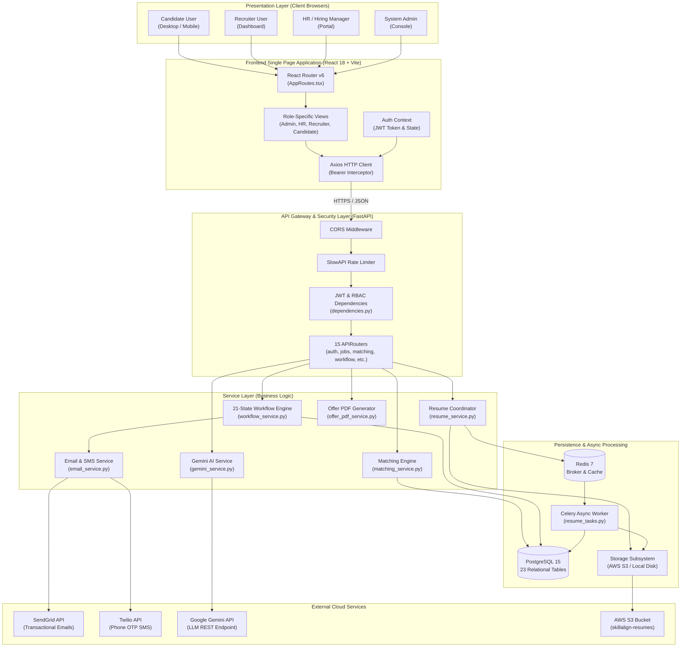
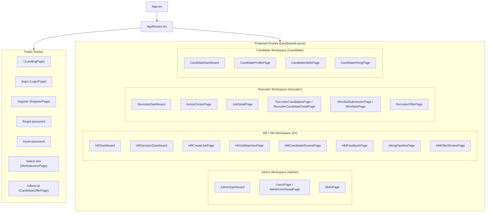

# Volume 01: Executive Overview & System Architecture

This volume provides a comprehensive architectural and operational breakdown of **SkillAlign**, covering the foundational problem statement, measurable engineering objectives, actor definitions, verified technology stacks, and detailed multi-tier architectural specifications.

---

## 1. Executive Project Overview

### 1.1 Problem Statement
Modern corporate talent acquisition suffers from severe inefficiencies across the recruitment funnel:
1. **Unstructured Resume Data**: Candidates submit resumes in heterogeneous formats (multi-column PDFs, DOCX, scanned layouts) containing inconsistent terminology, non-standard headings, and varying degrees of detail.
2. **Superficial Keyword Matching**: Traditional Applicant Tracking Systems (ATS) rely on simple substring matching, ignoring skill proficiency levels, contextual evidence, candidate total experience, educational qualifications, and work-mode alignment.
3. **Fragmented Recruitment Workflows**: Recruiting teams, hiring managers (HMs), and HR administrators often operate across disjointed tools (spreadsheets, email threads, calendar invites), causing communication bottlenecks, lack of auditability, and dropped candidates.
4. **Slow Feedback & Offer Cycles**: Coordinating interview slots across time zones, gathering structured evaluation scorecards, generating formal compensation breakdown letters, and enforcing cooling-off/blacklisting periods are frequently manual and error-prone.

### 1.2 Proposed Solution
**SkillAlign** addresses these challenges by delivering an end-to-end, enterprise-grade talent acquisition and skill-matching platform:
- **Deterministic Resume Processing Pipeline**: High-speed, reproducible text extraction ([pdfplumber](https://github.com/jsvine/pdfplumber), [python-docx](https://python-docx.readthedocs.io/)) coupled with a 100% rule-based section and taxonomy parsing engine ([resume_txt_parser.py](file:///c:/Users/shiva/OneDrive/Desktop/SkillAlign/backend/app/services/resume_txt_parser.py)) that identifies skills and extracts contextual evidence snippets without hallucination.
- **Multi-Factor Weighted Matching Engine**: A deterministic scoring algorithm ([matching_service.py](file:///c:/Users/shiva/OneDrive/Desktop/SkillAlign/backend/app/services/matching_service.py)) evaluating:
  - Skill coverage and proficiency levels (with an evidence-backed verification bonus) — **60%**
  - Experience tenure relevance against job requisitions — **20%**
  - Educational degree qualification — **10%**
  - Work mode compatibility (Remote / Hybrid / Onsite) — **10%**
- **21-State Enterprise State Machine**: A fully audited recruitment lifecycle ([workflow_service.py](file:///c:/Users/shiva/OneDrive/Desktop/SkillAlign/backend/app/services/workflow_service.py)) governing candidate shortlisting, hiring manager review, multi-round slot proposing, candidate self-service slot selection, Go/No-Go feedback, compensation negotiation, automated ReportLab PDF offer generation, and 6-month rejection cooling-off.
- **Role-Tailored Portals**: Unified single-page application built with React, TypeScript, and Tailwind CSS offering tailored dashboards for Candidates, Recruiters, HR / Hiring Managers, and System Admins.

### 1.3 System Objectives
| Objective ID | Measurable Engineering Metric | Implementation Mechanism |
| :--- | :--- | :--- |
| **OBJ-01** | Sub-second algorithmic match scoring | In-memory vectorized dictionary matching with $O(N \cdot S)$ computational complexity. |
| **OBJ-02** | Zero-AI dependency for core parsing | 100% deterministic regex and section-boundary parsing ensuring 100% offline availability and zero API costs. |
| **OBJ-03** | 100% Auditability of Pipeline Transitions | Relational audit logging ([audit_log.py](file:///c:/Users/shiva/OneDrive/Desktop/SkillAlign/backend/app/models/audit_log.py)) tracking actor ID, previous state, new state, timestamp, and metadata for every state change. |
| **OBJ-04** | Strict Role-Based Security | Layered FastAPI dependency injection ([dependencies.py](file:///c:/Users/shiva/OneDrive/Desktop/SkillAlign/backend/app/core/dependencies.py)) validating HS256 JWT claims before reaching route handlers. |
| **OBJ-05** | Production Document Generation | Sub-500ms server-side dynamic PDF compilation ([offer_pdf_service.py](file:///c:/Users/shiva/OneDrive/Desktop/SkillAlign/backend/app/services/offer_pdf_service.py)) with dual annexures and cryptographic verification tokens. |

### 1.4 Target Users & Roles Matrix

The codebase strictly implements four distinct system roles defined in [role.py](file:///c:/Users/shiva/OneDrive/Desktop/SkillAlign/backend/app/models/role.py):

| Role | System Responsibility | Core Capabilities & Workspaces | Primary UI Routes |
| :--- | :--- | :--- | :--- |
| **Admin** | System governance, global user management, skill taxonomy curation, health monitoring. | Create/deactivate users, assign roles, inspect system health metrics, manage global skill catalog, view platform audit timeline. | `/admin`, `/admin/users`, `/admin/skills` |
| **HR / Hiring Manager** | Job requisition creation, candidate shortlist review, interview feedback, offer approval. | Create job openings, define skill weights, review recruiter-submitted candidates, request interview rounds, submit Go/No-Go feedback, review/approve offers, track hiring pipeline. | `/hr`, `/hr/jobs/create`, `/hr/decisions`, `/hr/shortlists`, `/hr/pipeline` |
| **Recruiter** | Sourcing execution, candidate matching, interview coordination, offer drafting. | Run matching engine on requisitions, claim candidates, review resume evidence, propose interview slots, coordinate candidate selection, draft offer terms, execute Action Center tasks. | `/recruiter`, `/recruiter/action-center`, `/recruiter/jobs/:id`, `/recruiter/candidates`, `/recruiter/offers/create` |
| **Candidate** | Profile maintenance, resume management, slot selection, offer response. | Self-register, upload PDF/DOCX resumes, view parsed profile/skills, pick interview time slots via tokenized links, review formal offer letter, accept/decline offers. | `/candidate`, `/candidate/profile`, `/candidate/skills`, `/select-slot`, `/offers/:id` |

---

## 2. Technology Stack & Verification

To maintain engineering integrity, the technology stack has been categorized based on active code inspection:

```
┌──────────────────────────────────────────────────────────────────────────┐
│                             Technology Status                            │
├────────────────────────────────┬─────────────────────────────────────────┤
│ [✓] Implemented                │ Actively executed in core application   │
│ [⚙] Configured / Partial       │ Configured in settings or optional path │
│ [✦] Planned / Future           │ Designed conceptually for scale         │
└────────────────────────────────┴─────────────────────────────────────────┘
```

### 2.1 Backend Technology Stack
* **Language**: Python 3.11+ `[✓ Implemented]`
* **Web Framework**: FastAPI 0.110+ `[✓ Implemented]` — Selected for ASGI high concurrency, native OpenAPI/Swagger generation, and Pydantic request validation.
* **Database & ORM**: PostgreSQL 15+ `[✓ Implemented]` with SQLAlchemy 2.0 Declarative Mapped Columns `[✓ Implemented]`.
* **Database Migrations**: Alembic `[✓ Implemented]` ([alembic/](file:///c:/Users/shiva/OneDrive/Desktop/SkillAlign/backend/alembic)).
* **Authentication**: Direct `bcrypt` and `passlib` password hashing + `python-jose` HS256 JWT tokens `[✓ Implemented]`.
* **Rate Limiting**: SlowAPI / limits library `[✓ Implemented]` ([rate_limit.py](file:///c:/Users/shiva/OneDrive/Desktop/SkillAlign/backend/app/core/rate_limit.py)).
* **Document Parsing**: `pdfplumber` (PDF layout extraction), `python-docx` (Word processing), `phonenumbers` (E.164 normalization) `[✓ Implemented]`.
* **PDF Compilation Engine**: ReportLab 3.x `[✓ Implemented]` ([offer_pdf_service.py](file:///c:/Users/shiva/OneDrive/Desktop/SkillAlign/backend/app/services/offer_pdf_service.py)).
* **Asynchronous Queue**: Celery 5.x with Redis broker `[✓ Implemented with synchronous fallback]` ([celery_app.py](file:///c:/Users/shiva/OneDrive/Desktop/SkillAlign/backend/app/celery_app.py), [resume_tasks.py](file:///c:/Users/shiva/OneDrive/Desktop/SkillAlign/backend/app/tasks/resume_tasks.py)).
* **Object Storage**: Local file storage + AWS S3 Boto3 storage manager `[✓ Implemented with dual mode]` ([storage_manager.py](file:///c:/Users/shiva/OneDrive/Desktop/SkillAlign/backend/app/services/storage/storage_manager.py)).

### 2.2 Frontend Technology Stack
* **Core Framework**: React 18 with TypeScript `[✓ Implemented]` ([App.tsx](file:///c:/Users/shiva/OneDrive/Desktop/SkillAlign/frontend/src/App.tsx)).
* **Build Tool**: Vite `[✓ Implemented]` ([vite.config.ts](file:///c:/Users/shiva/OneDrive/Desktop/SkillAlign/frontend/vite.config.ts)).
* **Styling**: Tailwind CSS + Custom Dark/Glassmorphism CSS utilities `[✓ Implemented]` ([tailwind.config.js](file:///c:/Users/shiva/OneDrive/Desktop/SkillAlign/frontend/tailwind.config.js), [index.css](file:///c:/Users/shiva/OneDrive/Desktop/SkillAlign/frontend/src/index.css)).
* **Icons & Visuals**: Lucide React + Canvas Confetti effects `[✓ Implemented]`.
* **HTTP Client**: Axios with automatic request/response JWT interceptors `[✓ Implemented]` ([api.ts](file:///c:/Users/shiva/OneDrive/Desktop/SkillAlign/frontend/src/services/api.ts)).
* **Routing**: React Router DOM v6 `[✓ Implemented]` ([AppRoutes.tsx](file:///c:/Users/shiva/OneDrive/Desktop/SkillAlign/frontend/src/routes/AppRoutes.tsx)).
* **State Management**: React Context API (`AuthContext`) + Local Component State Hooks `[✓ Implemented]`.

### 2.3 AI & External Integrations
* **Google Gemini API**: Direct REST integration via `urllib.request` using models `gemini-3.5-flash` / `gemini-2.5-flash` with deterministic JSON extraction and graceful fallback `[✓ Implemented]` ([gemini_service.py](file:///c:/Users/shiva/OneDrive/Desktop/SkillAlign/backend/app/services/gemini_service.py)).
* **Transactional Email**: SendGrid API client `[✓ Implemented]` ([email_service.py](file:///c:/Users/shiva/OneDrive/Desktop/SkillAlign/backend/app/services/email_service.py)).
* **SMS Gateway**: Twilio REST API client `[✓ Implemented]` ([sms_service.py](file:///c:/Users/shiva/OneDrive/Desktop/SkillAlign/backend/app/services/sms_service.py)).
* **LangChain / ChromaDB / Vector RAG**: `[⚙ Configured in dependencies / Planned for future semantic expansion]`. Currently, core skill matching and resume extraction are executed deterministically in Python.

---

## 3. System Architecture Layers

The SkillAlign backend follows a strict **Separation of Concerns (SoC)** structured across 6 distinct layers:

```
┌────────────────────────────────────────────────────────────────────────┐
│                        1. Presentation Layer                           │
│     React 18 + TypeScript + Vite + Tailwind CSS + Lucide Icons         │
└──────────────────────────────────┬─────────────────────────────────────┘
                                   │ HTTPS / JSON REST
┌──────────────────────────────────▼─────────────────────────────────────┐
│                          2. API Routing Layer                          │
│   FastAPI APIRouters (15 Routers) + Pydantic v2 Request/Response       │
└──────────────────────────────────┬─────────────────────────────────────┘
                                   │ Validated DTOs / Tokens
┌──────────────────────────────────▼─────────────────────────────────────┐
│                 3. Security & Middleware Boundary                      │
│   JWT HS256 Decode + Role Check + SlowAPI Limiter + CORS Handler       │
└──────────────────────────────────┬─────────────────────────────────────┘
                                   │ Injected Session + User Entity
┌──────────────────────────────────▼─────────────────────────────────────┐
│                        4. Business Logic Layer                         │
│   Services: Matching, Workflow State Machine, Resume, PDF, Gemini      │
└──────────────────────────────────┬─────────────────────────────────────┘
                                   │ SQLAlchemy 2.0 ORM Operations
┌──────────────────────────────────▼─────────────────────────────────────┐
│                      5. Data Access / Persistence                      │
│   PostgreSQL 15 (23 Models, Foreign Keys, Indexes, Check Constraints)  │
└──────────────────────────────────┬─────────────────────────────────────┘
                                   │ Async Tasks / Outbound HTTP
┌──────────────────────────────────▼─────────────────────────────────────┐
│                      6. External & Worker Services                     │
│   Redis Broker + Celery Worker + AWS S3 + SendGrid + Twilio + Gemini   │
└────────────────────────────────────────────────────────────────────────┘
```

### 3.1 Presentation Layer (Frontend)
- **Component Architecture**: Atomic design separating reusable UI primitives (`/components/ui`), complex workflow modals (`/components/workflow`), domain panels (`/components/candidate`, `/components/job`), and layout wrappers (`/components/layout/DashboardLayout.tsx`).
- **State & Context**: `AuthContext` provides global authentication state (`user`, `token`, `login`, `logout`) with token persistence in `localStorage`.
- **Interceptors**: Axios instance interceptor automatically injects `Authorization: Bearer <token>` on outgoing requests and intercepts `401 Unauthorized` responses to purge expired tokens and redirect to `/login`.

### 3.2 API Layer (FastAPI Routers)
- 15 specialized routers registered under `/api/` in [main.py](file:///c:/Users/shiva/OneDrive/Desktop/SkillAlign/backend/app/main.py):
  - `auth`: `/api/auth` (Candidate registration, login, phone OTP, password reset).
  - `users`: `/api/users` (User management and role enumeration).
  - `admin`: `/api/admin` (System statistics, audit logs, user provisioning).
  - `skills`: `/api/skills` (Global taxonomy management).
  - `jobs`: `/api/jobs` (Requisition management and skill requirement weighting).
  - `candidates`: `/api/candidates` (Candidate profiles and self-declared skills).
  - `resume`: `/api/candidates/me/resume` (Resume uploading, text extraction, re-parsing).
  - `matching`: `/api/matching` (Matching engine execution, shortlist filtering, scorecards).
  - `match_results`: `/api/match-results` (Direct match record inspection).
  - `interviews`: `/api/interviews` (Interview scheduling and slot tracking).
  - `notifications`: `/api/notifications` (In-app notifications and unread counters).
  - `recruiter`: `/api/recruiter` (Candidate claims, pipeline queries, recruiter metrics).
  - `communication`: `/api/communication` (Recruiter-candidate messaging and bulk dispatch).
  - `tasks`: `/api/tasks` (Recruitment Action Center tasks).
  - `workflow` & `offers`: `/api/workflow` and `/api/offers` (21-state state machine and offer lifecycle).

### 3.3 Security & Middleware Layer
- **CORS Middleware**: Configured in `main.py` allowing explicit frontend origins (`localhost:5173`, `127.0.0.1:5173`, `localhost:3000`, etc.) with credentials support.
- **Rate Limiting**: Configured using SlowAPI with memory-backed limiter enforcing endpoint thresholds (e.g., `5/minute` on password reset and OTP generation).
- **Dependency-Based Authorization**: Route-level security guards (`require_admin`, `require_hr`, `require_recruiter`, `require_candidate`, `require_hr_or_recruiter`) resolving and validating JWT tokens in [dependencies.py](file:///c:/Users/shiva/OneDrive/Desktop/SkillAlign/backend/app/core/dependencies.py).

### 3.4 Service Layer (Business Logic)
- Encapsulates pure business logic away from HTTP transport concerns:
  - `MatchingService`: Calculates multi-factor scores, experience thresholds, and skill breakdowns.
  - `WorkflowService`: Validates state machine transitions, writes audit logs, and creates notification tasks.
  - `ResumeService` & `ResumeTxtParser`: Coordinates storage, text extraction, and deterministic parsing.
  - `OfferPDFService`: Compiles multi-page corporate offer PDFs using ReportLab.
  - `GeminiService`: Generates AI-assisted candidate fit summaries and interview questions.
  - `EmailService` & `SMSService`: Dispatches transactional notifications via SendGrid and Twilio.

### 3.5 Data Access Layer (ORM & Persistence)
- Built on **SQLAlchemy 2.0** utilizing `Mapped` and `mapped_column` annotations.
- Manages relational transactions, foreign key constraints (`CASCADE` / `SET NULL`), unique constraints (`uq_match_result`), check constraints (`ck_match_result_score_range`), and composite indexes for high-throughput querying.

### 3.6 External Integrations Layer
- Handles outbound communication with third-party APIs and async worker queues:
  - **Redis / Celery**: Offloads CPU-intensive resume parsing and batch matching.
  - **AWS S3 / Local Storage**: Abstracted via `StorageManager` to store original resumes and extracted TXT files.
  - **SendGrid & Twilio**: Reliable delivery of transactional emails and OTP codes.
  - **Google Gemini**: Large Language Model API for optional AI analysis.

---

## 4. System Architecture Diagrams

### 4.1 High-Level End-to-End System Architecture



### 4.2 Backend Modular Architecture

```mermaid
flowchart LR
    subgraph Core["app/core"]
        Config["config.py<br/>(Pydantic Settings)"]
        Sec["security.py<br/>(bcrypt, JWT, Tokens)"]
        Deps["dependencies.py<br/>(Auth Guards)"]
        RL["rate_limit.py<br/>(SlowAPI)"]
    end

    subgraph Routers["app/routers"]
        R_Auth["auth.py"]
        R_Jobs["jobs.py"]
        R_Match["matching.py"]
        R_Work["workflow.py"]
        R_Cand["candidates.py"]
        R_Rec["recruiter.py"]
        R_Adm["admin.py"]
    end

    subgraph Services["app/services"]
        S_Match["matching_service.py"]
        S_Work["workflow_service.py"]
        S_Res["resume_service.py"]
        S_Extract["resume_text_extractor.py"]
        S_Parse["resume_txt_parser.py"]
        S_PDF["offer_pdf_service.py"]
        S_Gemini["gemini_service.py"]
    end

    subgraph Models["app/models"]
        M_User["user.py / role.py"]
        M_Job["job.py / job_skill.py"]
        M_Cand["candidate.py / candidate_skill.py"]
        M_Match["match_result.py / candidate_scorecard.py"]
        M_Inv["interview.py / interview_slot.py / interview_feedback.py"]
        M_Offer["offer.py / candidate_blacklist.py"]
        M_Audit["audit_log.py / notification.py / recruitment_task.py"]
    end

    Routers --> Deps
    Routers --> Services
    Services --> Models
    Services --> Core
    Models --> DBEngine[(SQLAlchemy Engine)]
```



### 4.3 Frontend Routing & View Architecture



---

*Proceed to [Volume 02: End-to-End Workflows & State Machines](file:///c:/Users/shiva/OneDrive/Desktop/SkillAlign/docs/02_END_TO_END_WORKFLOWS_AND_STATE_MACHINES.md) for detailed lifecycle state machines, sequence flows, and business rules.*
