# Volume 02: End-to-End Workflows & State Machines

This volume details the complete end-to-end recruitment lifecycle implemented in SkillAlign, providing role-specific workflow flowcharts, the formal mathematical transition matrix for the 21-state enterprise state machine, business rules, and multi-tier Data Flow Diagrams (DFDs).

---

## 1. Complete End-to-End Recruitment Workflow

SkillAlign orchestrates a collaborative, multi-stakeholder recruitment lifecycle connecting Candidates, Recruiters, HR / Hiring Managers, and System Admins.

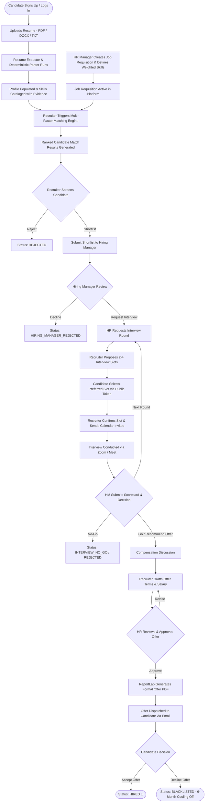

---

## 2. Role-Specific Workflows

### 2.1 Candidate Workflow
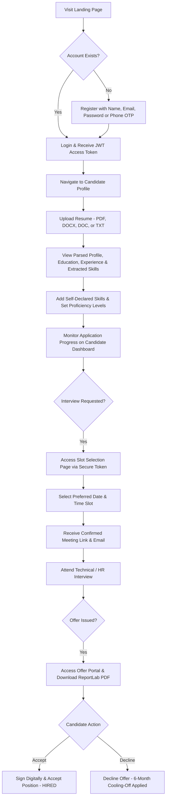

### 2.2 HR / Hiring Manager Workflow
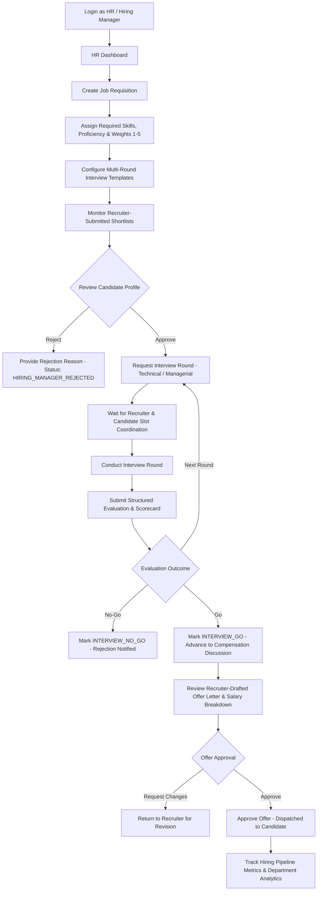

### 2.3 Recruiter Workflow
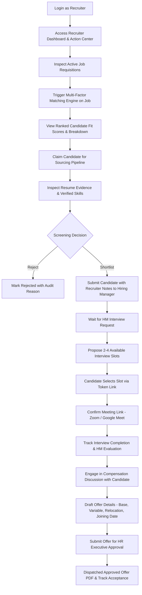

### 2.4 Admin Workflow
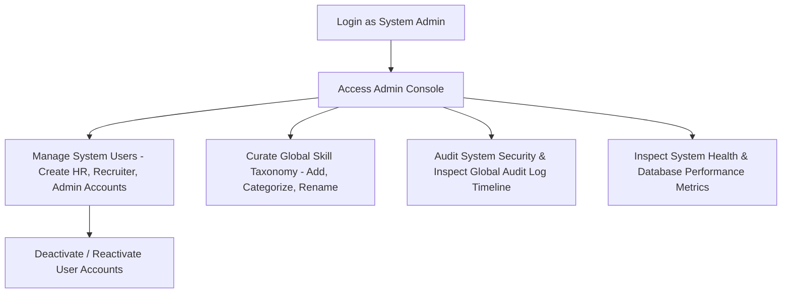

---

## 3. Enterprise Status & State Machines

### 3.1 21-State Recruitment Workflow State Machine
The core candidate-job relationship is governed by the `pipeline_state` column on [MatchResult](file:///c:/Users/shiva/OneDrive/Desktop/SkillAlign/backend/app/models/match_result.py). Every transition is verified against the `VALID_TRANSITIONS` dictionary in [workflow_service.py](file:///c:/Users/shiva/OneDrive/Desktop/SkillAlign/backend/app/services/workflow_service.py):

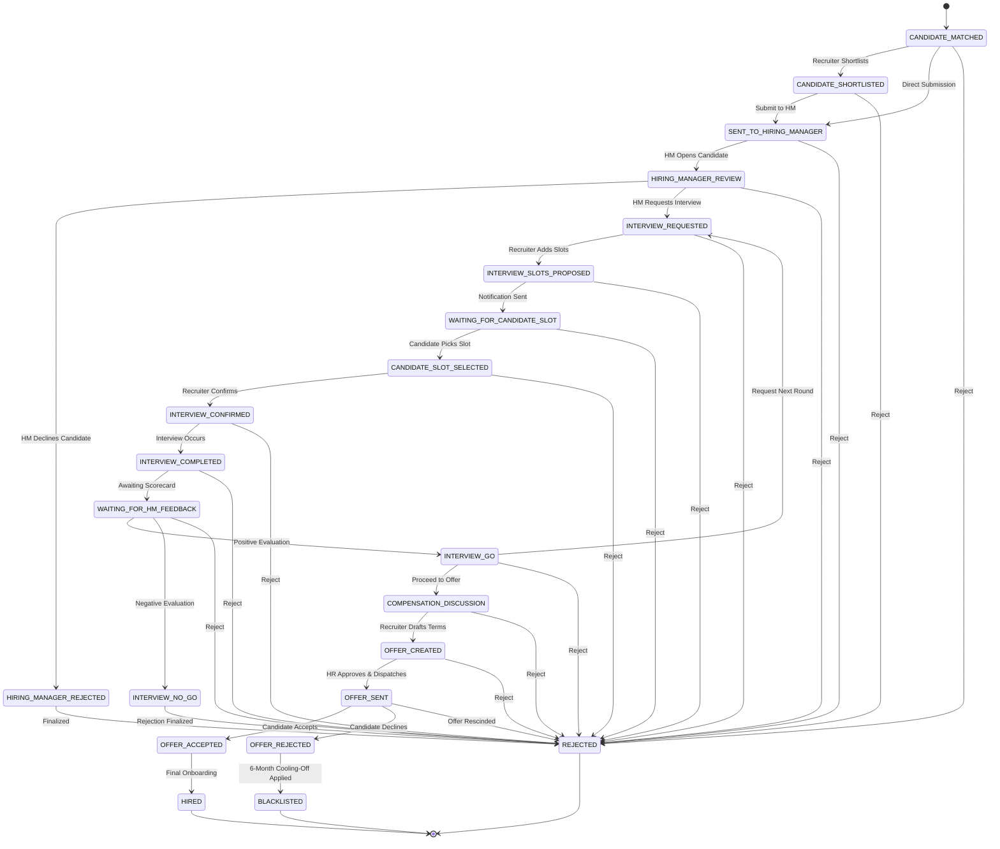

### 3.2 Formal State Transition Matrix
| Source State (`from_state`) | Permitted Target States (`to_state`) | Required User Role | Triggering API Endpoint |
| :--- | :--- | :--- | :--- |
| `CANDIDATE_MATCHED` | `CANDIDATE_SHORTLISTED`, `SENT_TO_HIRING_MANAGER`, `HIRING_MANAGER_REVIEW`, `INTERVIEW_REQUESTED`, `INTERVIEW_SLOTS_PROPOSED`, `REJECTED` | Recruiter, HR, Admin | `POST /api/workflow/shortlist` |
| `CANDIDATE_SHORTLISTED` | `SENT_TO_HIRING_MANAGER`, `HIRING_MANAGER_REVIEW`, `INTERVIEW_REQUESTED`, `INTERVIEW_SLOTS_PROPOSED`, `REJECTED` | Recruiter, HR, Admin | `POST /api/workflow/submit-to-hm` |
| `SENT_TO_HIRING_MANAGER` | `HIRING_MANAGER_REVIEW`, `INTERVIEW_REQUESTED`, `INTERVIEW_SLOTS_PROPOSED`, `REJECTED` | HR, Admin | `POST /api/workflow/hm-review` |
| `HIRING_MANAGER_REVIEW` | `HIRING_MANAGER_REJECTED`, `INTERVIEW_REQUESTED`, `INTERVIEW_SLOTS_PROPOSED`, `REJECTED` | HR, Admin | `POST /api/workflow/hm-reject`, `POST /api/workflow/request-interview` |
| `HIRING_MANAGER_REJECTED`| `REJECTED` | HR, Recruiter, Admin | `POST /api/workflow/reject` |
| `INTERVIEW_REQUESTED` | `INTERVIEW_SLOTS_PROPOSED`, `WAITING_FOR_CANDIDATE_SLOT`, `CANDIDATE_SLOT_SELECTED`, `REJECTED` | Recruiter, HR, Admin | `POST /api/workflow/send-slots` |
| `INTERVIEW_SLOTS_PROPOSED`| `WAITING_FOR_CANDIDATE_SLOT`, `CANDIDATE_SLOT_SELECTED`, `INTERVIEW_CONFIRMED`, `REJECTED` | Recruiter, Candidate, Admin | `POST /api/workflow/select-slot` |
| `WAITING_FOR_CANDIDATE_SLOT`| `CANDIDATE_SLOT_SELECTED`, `INTERVIEW_CONFIRMED`, `REJECTED` | Candidate, Recruiter, Admin | `POST /api/workflow/select-slot` |
| `CANDIDATE_SLOT_SELECTED`| `INTERVIEW_CONFIRMED`, `REJECTED` | Recruiter, HR, Admin | `POST /api/workflow/confirm-interview` |
| `INTERVIEW_CONFIRMED` | `INTERVIEW_COMPLETED`, `REJECTED` | Recruiter, HR, Admin | `POST /api/workflow/complete-interview` |
| `INTERVIEW_COMPLETED` | `WAITING_FOR_HM_FEEDBACK`, `INTERVIEW_GO`, `COMPENSATION_DISCUSSION`, `REJECTED` | HR, Admin | `POST /api/workflow/hm-feedback` |
| `WAITING_FOR_HM_FEEDBACK`| `INTERVIEW_GO`, `INTERVIEW_NO_GO`, `COMPENSATION_DISCUSSION`, `REJECTED` | HR, Admin | `POST /api/workflow/hm-feedback` |
| `INTERVIEW_GO` | `COMPENSATION_DISCUSSION`, `INTERVIEW_REQUESTED`, `REJECTED` | Recruiter, HR, Admin | `POST /api/workflow/compensation` |
| `INTERVIEW_NO_GO` | `REJECTED` | HR, Recruiter, Admin | `POST /api/workflow/reject` |
| `COMPENSATION_DISCUSSION`| `OFFER_CREATED`, `INTERVIEW_REQUESTED`, `REJECTED` | Recruiter, HR, Admin | `POST /api/workflow/create-offer` |
| `OFFER_CREATED` | `OFFER_SENT`, `OFFER_CREATED`, `REJECTED` | HR, Recruiter, Admin | `POST /api/workflow/send-offer` |
| `OFFER_SENT` | `OFFER_ACCEPTED`, `OFFER_REJECTED`, `REJECTED` | Candidate, HR, Admin | `POST /api/offers/respond` |
| `OFFER_ACCEPTED` | `HIRED` | HR, Recruiter, Admin | Automated / Manual Transition |
| `OFFER_REJECTED` | `BLACKLISTED` | System Automated | Enforced via `workflow_service.py` |
| `BLACKLISTED` | Terminal State (No outgoing transitions) | System | N/A |
| `HIRED` | Terminal State (No outgoing transitions) | System | N/A |
| `REJECTED` | Terminal State (No outgoing transitions) | System | N/A |

### 3.3 Supporting Sub-Entity State Machines

#### 3.3.1 Offer Entity State Machine (`Offer.status`)
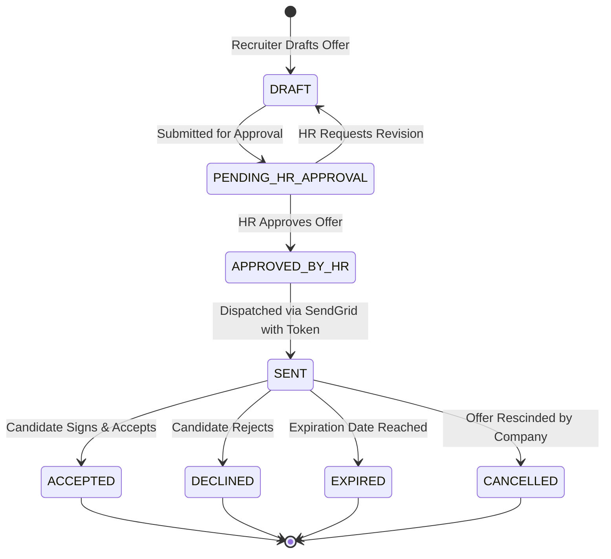

#### 3.3.2 Interview Slot State Machine (`InterviewSlot.status`)
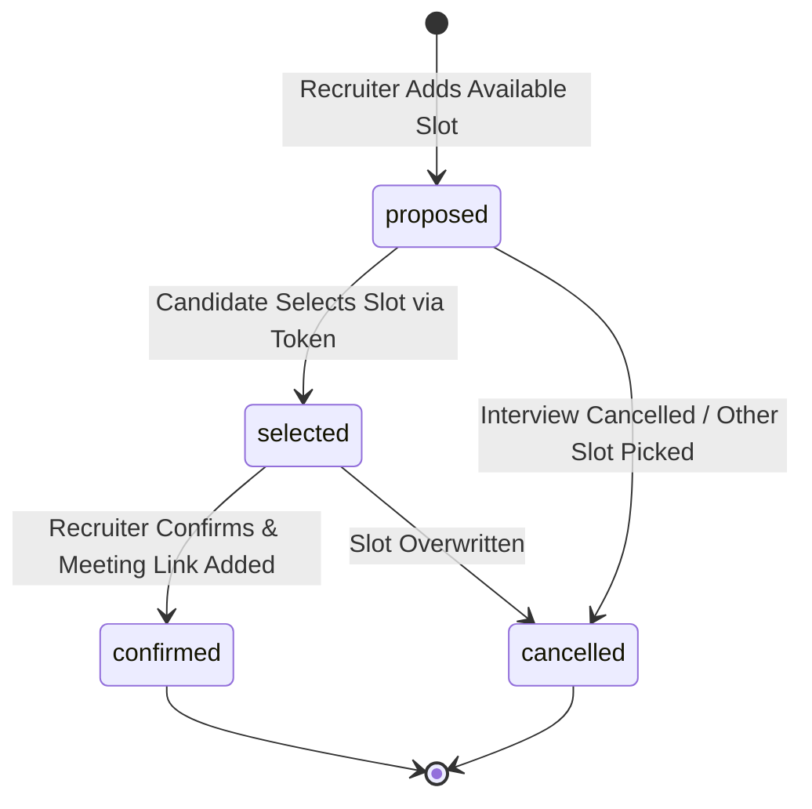

#### 3.3.3 Candidate 6-Month Blacklist State Machine (`CandidateBlacklist`)
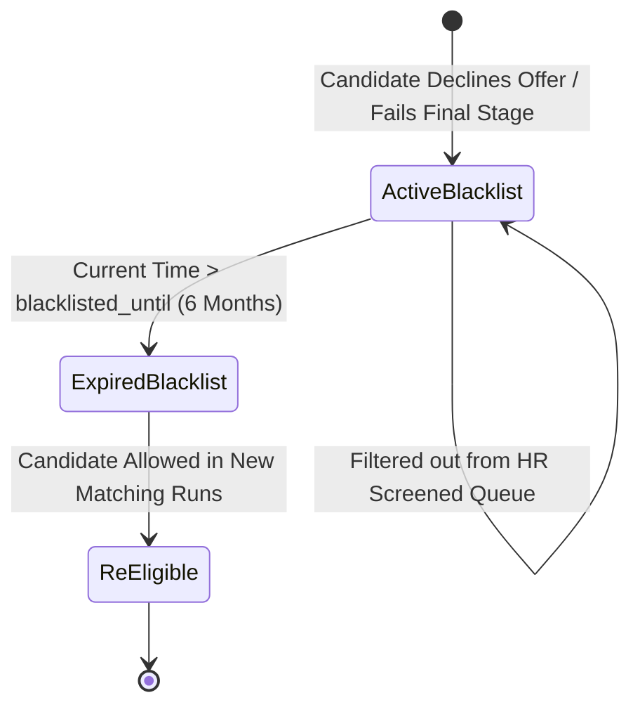

---

## 4. Business Rules & Governance Policies

The following business rules are strictly encoded in the application logic:

1. **Requisition Ownership & Skill Weighting**:
   - Only **HR** and **Admin** users can create or edit Job Requisitions ([jobs.py](file:///c:/Users/shiva/OneDrive/Desktop/SkillAlign/backend/app/routers/jobs.py)).
   - Every job must specify between 1 and 20 skills, each with a required integer weight from **1** (low) to **5** (critical) and requirement type (`MUST_HAVE` or `NICE_TO_HAVE`).
2. **Matching Engine Determinism**:
   - Matching is 100% deterministic and reproducible. Running matching multiple times on the same candidate and job yields the exact same floating-point score ([matching_service.py](file:///c:/Users/shiva/OneDrive/Desktop/SkillAlign/backend/app/services/matching_service.py)).
   - Candidates without a single matching skill receive an overall score of strictly **0.00**.
3. **Resume Evidence Multiplier**:
   - Skills self-declared by candidates receive standard proficiency factors (`Beginner` = 0.40, `Intermediate` = 0.70, `Expert` = 1.00).
   - Skills detected in the candidate's resume with extracted contextual evidence snippets receive a **1.15x multiplier bonus** (capped at 1.00).
4. **Recruiter Claiming & Conflict Prevention**:
   - Recruiters can claim unassigned candidates for active jobs ([recruiter.py](file:///c:/Users/shiva/OneDrive/Desktop/SkillAlign/backend/app/routers/recruiter.py)).
   - Claiming assigns `recruiter_id` on the `MatchResult` and creates a record in `candidate_recruiter_assignments` with `status = 'active'`.
5. **Interview Slot Selection**:
   - When proposing interview slots, recruiters must provide between 1 and 5 non-conflicting time windows.
   - Candidates can select a slot via a cryptographically random public token (`interview.selection_token`) without requiring prior system login.
6. **Hiring Manager Evaluation Integrity**:
   - An interview cannot be marked `INTERVIEW_COMPLETED` without recording the completion timestamp.
   - Go/No-Go feedback requires numeric ratings (1-5) across Communication, Technical Competency, and Problem Solving, accompanied by qualitative notes.
7. **Offer Approval Dual-Control**:
   - Recruiters draft offers, but cannot dispatch them directly without explicit HR Manager approval (`Offer.status == 'APPROVED_BY_HR'`).
8. **Automated 6-Month Cooling-Off (Blacklisting)**:
   - If a candidate declines a formal offer (`OFFER_REJECTED` / `DECLINED`), the system automatically creates a `CandidateBlacklist` record with `blacklisted_until = now() + 180 days`.
   - Blacklisted candidates are automatically suppressed and flagged in recruiter match queries until the expiration date.

---

## 5. System Data Flow Diagrams (DFDs)

### 5.1 Level-1 DFD: Candidate Resume Ingestion & Profile Synchronization

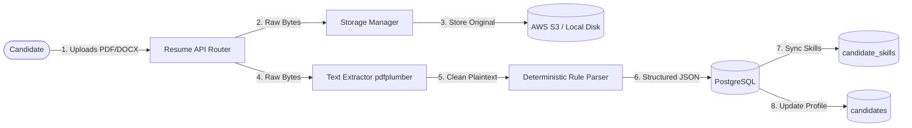

### 5.2 Level-1 DFD: Multi-Factor Candidate-Job Matching Flow

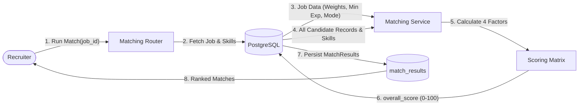

### 5.3 Level-1 DFD: Offer Drafting, Approval & PDF Generation Flow

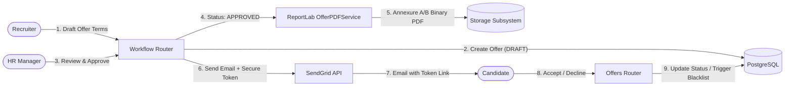

---

*Proceed to [Volume 03: Functional Specification Document & Use Cases](file:///c:/Users/shiva/OneDrive/Desktop/SkillAlign/docs/03_FUNCTIONAL_SPECIFICATION_DOCUMENT.md) for detailed feature requirements and testable use cases.*
