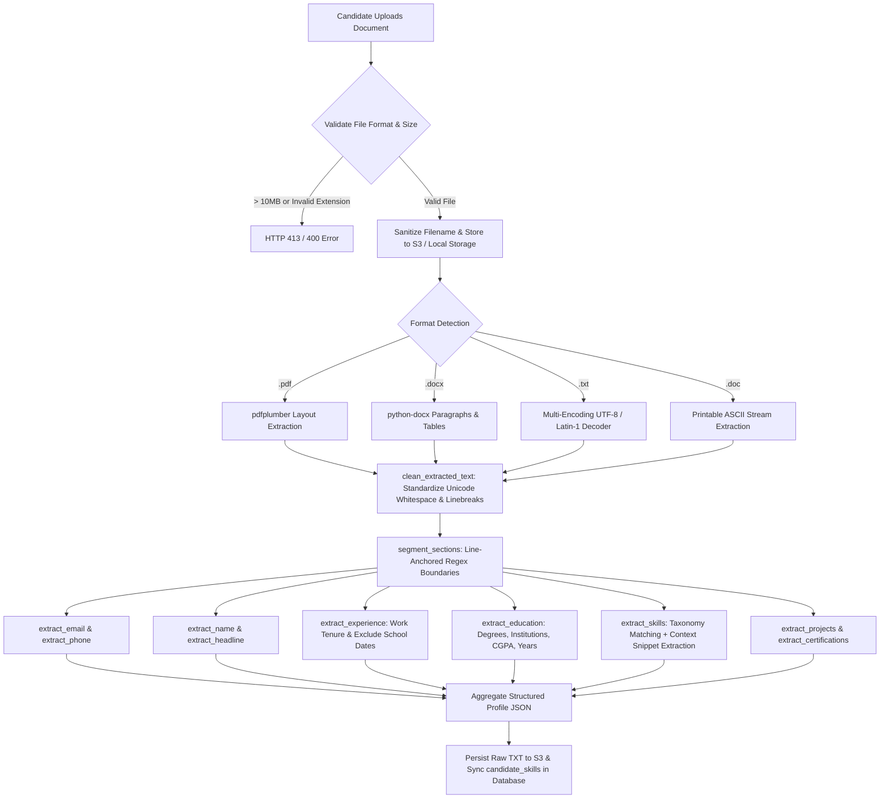

# Volume 04: Matching Engine & Resume Processing Pipeline

This volume provides a comprehensive mathematical, algorithmic, and architectural specification of SkillAlign's **Multi-Factor Matching Engine**, the **Deterministic Resume Processing Pipeline**, and the **Google Gemini AI Integration**.

---

## 1. Multi-Factor Matching Engine

SkillAlign implements a transparent, explainable, and multi-criteria algorithmic scoring model in [matching_service.py](file:///c:/Users/shiva/OneDrive/Desktop/SkillAlign/backend/app/services/matching_service.py). Rather than relying on black-box heuristics or LLM hallucinations, candidate fit is calculated mathematically across 4 distinct dimensions.

```
┌────────────────────────────────────────────────────────────────────────┐
│               SkillAlign Candidate Fit Score Breakdown                 │
├────────────────────────────┬─────────────────────────────┬─────────────┤
│ Dimension                  │ Evaluation Mechanism        │ Max Weight  │
├────────────────────────────┼─────────────────────────────┼─────────────┤
│ 1. Skill & Proficiency     │ Weighted Coverage + Bonus   │   60 pts    │
│ 2. Experience Relevance    │ Tenure vs Min Requisition   │   20 pts    │
│ 3. Education Qualification │ Verified Degree Presence    │   10 pts    │
│ 4. Work Mode Compatibility │ Remote / Hybrid / Onsite    │   10 pts    │
├────────────────────────────┴─────────────────────────────┼─────────────┤
│ Total Maximum Score                                      │  100 pts    │
└──────────────────────────────────────────────────────────┴─────────────┘
```

### 1.1 Mathematical Formulation

The Overall Fit Score $S_{\text{overall}}$ is defined as:

$$S_{\text{overall}} = \min\left(100.0, \; S_{\text{skill}} + E_{\text{exp}} + D_{\text{edu}} + W_{\text{mode}}\right)$$

#### Strict Zero-Match Constraint
If a candidate has zero matching skills ($\text{matched\_skills} = \emptyset$), the algorithm strictly enforces:

$$S_{\text{overall}} = 0.00$$

---

### 1.2 Dimension 1: Skill & Proficiency Component ($S_{\text{skill}}$, up to 60 Points)

Let $J_{\text{skills}}$ be the set of required skills for a job requisition, where each skill $s \in J_{\text{skills}}$ has an integer weight $W_s \in \{1, 2, 3, 4, 5\}$.

The total job skill weight $W_{\text{total}}$ is:

$$W_{\text{total}} = \sum_{s \in J_{\text{skills}}} W_s$$

For each skill $s \in J_{\text{skills}}$, let $f(s)$ be the candidate's proficiency score factor:

$$f(s) = \begin{cases} 
0.00 & \text{if candidate does not possess skill } s \\
0.85 & \text{if detected from resume with evidence text and proficiency is None} \\
0.80 & \text{if detected from resume without evidence and proficiency is None} \\
\min\left(1.00, \; \text{round}(\text{Base}(p) \times 1.15, 2)\right) & \text{if skill has verified resume evidence and declared level } p \\
\text{Base}(p) & \text{if skill is manually declared without resume evidence}
\end{cases}$$

Where the Base Proficiency Map $\text{Base}(p)$ is:

$$\text{Base}(p) = \begin{cases}
0.40 & \text{if } p = \text{"Beginner"} \\
0.70 & \text{if } p = \text{"Intermediate"} \\
1.00 & \text{if } p = \text{"Expert"}
\end{cases}$$

#### Evidence Multiplier Bonus Matrix:
| Declared Proficiency ($p$) | Unverified Factor ($\text{Base}$) | Verified with Resume Evidence ($\times 1.15$) |
| :--- | :--- | :--- |
| **Beginner** | 0.40 | **0.46** |
| **Intermediate** | 0.70 | **0.81** |
| **Expert** | 1.00 | **1.00** *(Capped at 1.00)* |
| **Resume-Detected (No Level)**| N/A | **0.85** (with snippet) / **0.80** (standard) |

The weighted skill score sum is:

$$\text{WeightedSum} = \sum_{s \in J_{\text{skills}}} \left( f(s) \times W_s \right)$$

The Skill Component $S_{\text{skill}}$ is then calculated as:

$$S_{\text{skill}} = \left( \frac{\text{WeightedSum}}{W_{\text{total}}} \right) \times 60.0$$

---

### 1.3 Dimension 2: Experience Relevance Component ($E_{\text{exp}}$, up to 20 Points)

Let $C_{\text{exp}}$ be the candidate's total experience in years, and $J_{\text{exp}}$ be the job requisition's minimum required experience in years:

$$E_{\text{exp}} = \begin{cases}
20.0 & \text{if } J_{\text{exp}} \le 0 \text{ or } C_{\text{exp}} \ge J_{\text{exp}} \\
12.0 & \text{if } C_{\text{exp}} \ge 0.70 \times J_{\text{exp}} \\
6.0  & \text{if } C_{\text{exp}} > 0 \\
0.0  & \text{if } C_{\text{exp}} = 0
\end{cases}$$

---

### 1.4 Dimension 3: Education Qualification Component ($D_{\text{edu}}$, up to 10 Points)

Evaluates whether the candidate holds a recognized tertiary degree:

$$D_{\text{edu}} = \begin{cases}
10.0 & \text{if candidate.education\_degree is present and non-empty} \\
0.0  & \text{otherwise}
\end{cases}$$

---

### 1.5 Dimension 4: Work Mode Compatibility Component ($W_{\text{mode}}$, up to 10 Points)

Let $C_{\text{mode}}$ be the candidate's preferred work mode and $J_{\text{mode}}$ be the job's work mode (`Remote`, `Hybrid`, `Onsite`):

$$W_{\text{mode}} = \begin{cases}
10.0 & \text{if } C_{\text{mode}} = \emptyset \text{ or } J_{\text{mode}} = \emptyset \text{ or } C_{\text{mode}} = \text{"hybrid"} \text{ or } J_{\text{mode}} = \text{"hybrid"} \text{ or } C_{\text{mode}} = J_{\text{mode}} \\
4.0  & \text{otherwise (e.g. Remote preferred vs Onsite required)}
\end{cases}$$

---

## 2. Worked Numerical Calculation Examples

### Example 1: Senior Python Backend Developer Requisition
**Job Requisition Parameters**:
* **Title**: Senior Backend Developer | **Min Experience ($J_{\text{exp}}$)**: 4.0 Years | **Work Mode ($J_{\text{mode}}$)**: Hybrid
* **Job Skills ($J_{\text{skills}}$)**:
  1. Python (Weight = 5)
  2. FastAPI (Weight = 4)
  3. PostgreSQL (Weight = 3)
  4. Docker (Weight = 2)
* **Total Job Weight ($W_{\text{total}}$)**: $5 + 4 + 3 + 2 = 14.0$

**Candidate A Profile**:
* **Experience ($C_{\text{exp}}$)**: 5.0 Years | **Degree**: B.Tech in Computer Science | **Work Mode ($C_{\text{mode}}$)**: Remote
* **Candidate Skills**:
  1. *Python*: Expert (Declared) + Resume Evidence Found $\to f(\text{Python}) = 1.00$
  2. *FastAPI*: Intermediate (Declared) + Resume Evidence Found $\to f(\text{FastAPI}) = \min(1.00, \text{round}(0.70 \times 1.15, 2)) = 0.81$
  3. *PostgreSQL*: Resume-detected with context snippet $\to f(\text{PostgreSQL}) = 0.85$
  4. *Docker*: Not matched $\to f(\text{Docker}) = 0.00$

**Step-by-Step Scoring**:
1. **Skill Component**:
   $$\text{WeightedSum} = (1.00 \times 5) + (0.81 \times 4) + (0.85 \times 3) + (0.00 \times 2) = 5.00 + 3.24 + 2.55 + 0.00 = 10.79$$
   $$S_{\text{skill}} = \left( \frac{10.79}{14.00} \right) \times 60.0 = 0.7707 \times 60.0 = 46.24 \text{ pts}$$
2. **Experience Component**:
   $$C_{\text{exp}} = 5.0 \ge J_{\text{exp}} = 4.0 \implies E_{\text{exp}} = 20.00 \text{ pts}$$
3. **Education Component**:
   $$\text{B.Tech degree present} \implies D_{\text{edu}} = 10.00 \text{ pts}$$
4. **Work Mode Component**:
   $$J_{\text{mode}} = \text{"hybrid"} \implies W_{\text{mode}} = 10.00 \text{ pts}$$
5. **Overall Fit Score**:
   $$S_{\text{overall}} = 46.24 + 20.00 + 10.00 + 10.00 = \mathbf{86.24\%}$$

---

### Example 2: Candidate B (Zero Skill Match)
* **Candidate B Profile**: Sells Graphic Design skills (Photoshop, Illustrator), Experience = 3.0 yrs, Degree = B.A., Mode = Remote.
* **Calculation**:
  - Matched skills against Python/FastAPI/PostgreSQL/Docker = 0.
  - `has_any_skill_match == False`.
  - **Overall Fit Score**: $\mathbf{0.00\%}$ *(Filtered out completely)*.

---

## 3. Algorithmic Complexity & Performance Analysis

### 3.1 Time Complexity
Let:
- $N$ = Number of Candidates in Database
- $S_J$ = Number of Required Skills in Job Requisition ($\le 20$)
- $S_C$ = Average Number of Skills per Candidate ($\le 30$)

For a single job matching execution:
1. Candidate skill map construction: $O(S_C)$ hash-map indexing per candidate.
2. Iterating job skills and scoring: $O(S_J \times 1)$ via $O(1)$ dictionary lookup.
3. Overall Candidate Evaluation: $O(N \cdot (S_C + S_J))$.
4. Sorting $N$ match results: $O(N \log N)$.

**Total Time Complexity**:

$$T(N) = O(N \cdot (S_C + S_J) + N \log N)$$

Since $S_C \le 30$ and $S_J \le 20$ are small constants, matching executes in **$O(N \log N)$ linearithmic time**.

### 3.2 Space Complexity
* Constructing candidate skill lookup tables: $O(S_C)$ auxiliary memory.
* Storing match breakdown objects in memory: $O(N \cdot S_J)$.
* **Total Space Complexity**: $O(N \cdot S_J)$ auxiliary space.

### 3.3 Scalability Benchmarks & Bottlenecks
| Candidate Count ($N$) | Execution Time (Single-Threaded) | Bottleneck | Optimization Strategy |
| :--- | :--- | :--- | :--- |
| **100 Candidates** | $\approx 15 \text{ ms}$ | Negligible | In-memory execution. |
| **10,000 Candidates** | $\approx 450 \text{ ms}$ | Database ORM object loading | Use SQLAlchemy `joinedload()` and selective column queries. |
| **100,000 Candidates** | $\approx 4.2 \text{ seconds}$ | Sequential CPU execution | Offload to Celery worker with Redis chunking. |
| **1,000,000 Candidates** | $\approx 35 \text{ seconds}$ | Full table scan | Inverted skill index in PostgreSQL (`GIN` index on skill tags) to pre-filter zero matches. |

---

## 4. Deterministic Resume Processing Pipeline

SkillAlign avoids non-deterministic LLMs for primary data extraction, utilizing a 100% deterministic, explainable pipeline across [resume_service.py](file:///c:/Users/shiva/OneDrive/Desktop/SkillAlign/backend/app/services/resume_service.py), [resume_text_extractor.py](file:///c:/Users/shiva/OneDrive/Desktop/SkillAlign/backend/app/services/resume_text_extractor.py), and [resume_txt_parser.py](file:///c:/Users/shiva/OneDrive/Desktop/SkillAlign/backend/app/services/resume_txt_parser.py).



### 4.1 Section Segmentation Engine
The parser uses line-anchored regular expressions to segment documents into 8 isolated sections:
* `header`: Contact block, candidate name, social links.
* `summary`: Executive career summary or professional objective.
* `skills`: Dedicated technical skills, tools, and competency matrices.
* `experience`: Employment history, company names, job titles, achievements.
* `projects`: Academic, technical, or personal projects.
* `education`: Universities, degrees, specializations, grades.
* `certifications`: Industry certifications (AWS, Azure, CKA, PMP).
* `additional`: Date of birth, career interests, geographic location.

### 4.2 Contextual Evidence Snippet Extraction
When a skill from the taxonomy catalog is detected, `_get_evidence_snippet(raw_text, skill_name)` locates the surrounding sentence in the resume text:
```python
pattern = re.compile(r'^[•\-\*]?\s*([^\n]*?\b' + re.escape(skill_name) + r'\b[^\n]*)', re.MULTILINE | re.IGNORECASE)
```
This evidence sentence (e.g., *"Architected high-throughput microservices using FastAPI and PostgreSQL handling 50k RPM"*) is persisted in `candidate_skills.evidence_text` and presented to recruiters to verify skill credibility.

---

## 5. AI / LLM Architecture (Google Gemini Service)

SkillAlign integrates Google Gemini API ([gemini_service.py](file:///c:/Users/shiva/OneDrive/Desktop/SkillAlign/backend/app/services/gemini_service.py)) as an **optional, on-demand copilot** for recruiters and hiring managers.

### 5.1 Architecture & Request Flow
```mermaid
flowchart LR
    RecruiterUI[Recruiter Clicks 'AI Fit Analysis'] --> FastAPIRoute[GET /api/matching/{id}/ai-analysis]
    FastAPIRoute --> GemSvc[gemini_service.analyze_candidate_job_fit]
    GemSvc --> CheckKey{GEMINI_API_KEY Configured?}
    
    CheckKey -- "No / Key Blank" --> Fallback[_build_fallback_analysis]
    CheckKey -- "Yes" --> CallAPI[Call Google Gemini REST Endpoint]
    
    CallAPI --> Models[Try: gemini-3.5-flash-lite → gemini-2.5-flash → gemini-3.5-flash]
    Models -- "Success JSON" --> ParseJSON[_clean_and_parse_json]
    Models -- "Network Error / Rate Limit" --> Fallback
    
    ParseJSON --> Out[Return Semantic Fit Score, AI Summary & Skill Gaps]
    Fallback --> Out
```

### 5.2 Prompt Engineering Specification
* **Endpoint**: `https://generativelanguage.googleapis.com/v1beta/models/{model}:generateContent?key={key}`
* **Model Hierarchy**: `gemini-3.5-flash-lite` $\to$ `gemini-2.5-flash` $\to$ `gemini-2.5-flash-lite` $\to$ `gemini-3.5-flash`.
* **Temperature**: `0.2` (Low temperature to ensure deterministic, factual analysis).
* **Response Format**: Native JSON Schema (`responseMimeType: "application/json"`).
* **Expected Output JSON**:
```json
{
  "semantic_fit_score": 88,
  "ai_summary": "Candidate exhibits strong full-stack foundations with verified production experience in Python and PostgreSQL.",
  "key_strengths": [
    "5+ years hands-on microservices development",
    "Direct experience in AWS cloud deployments",
    "Clean resume alignment with requisition requirements"
  ],
  "skill_gaps": [
    "Verify hands-on depth in Docker container orchestration during technical interview"
  ]
}
```

---

*Proceed to [Volume 05: Database Design, Schema & ER Diagrams](file:///c:/Users/shiva/OneDrive/Desktop/SkillAlign/docs/05_DATABASE_DESIGN_AND_ERD.md) for complete entity relational specifications.*
