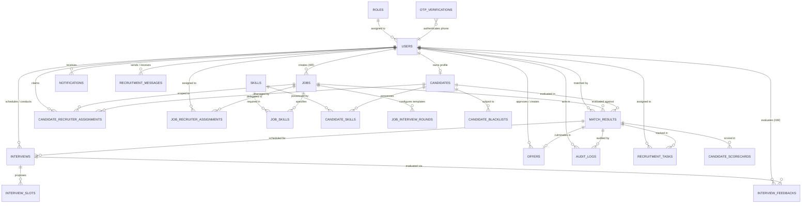

# Volume 05: Database Design, Schema & ER Diagrams

This volume documents the complete relational database architecture of SkillAlign, encompassing all 23 SQLAlchemy models, column data types, primary and foreign key constraints, indexes, cascade behaviors, and a comprehensive Mermaid Entity-Relationship Diagram (ERD).

---

## 1. Database Architecture & Design Principles

The database is built on **PostgreSQL 15+** utilizing **SQLAlchemy 2.0** declarative ORM. The relational model adheres strictly to **Third Normal Form (3NF)** and **Boyce-Codd Normal Form (BCNF)** to eliminate redundant data and ensure referential integrity.

### Key Architectural Decisions:
1. **Surrogate Primary Keys**: All core tables use auto-incrementing integer or UUID primary keys (`id`).
2. **Referential Integrity & Cascading Rules**:
   - Master entity deletion (e.g. deleting a `Job` or `Candidate`) cascades deletions to dependent junction tables (`job_skills`, `candidate_skills`, `match_results`, `interviews`, `offers`) using `ondelete="CASCADE"`.
   - Actor references (e.g. `recruiter_id`, `hiring_manager_id`, `actor_id`) use `ondelete="SET NULL"` to preserve audit logs and historical records if a user account is deleted.
3. **Check Constraints**: Enforce domain-level value integrity at the database engine level (e.g., `overall_score >= 0 AND overall_score <= 100`, `weight >= 1 AND weight <= 5`).
4. **Composite Unique Constraints**: Prevent duplicate mappings (e.g., `uq_match_result` on `(job_id, candidate_id)`, `uq_job_skill` on `(job_id, skill_id)`).

---

## 2. Comprehensive Entity-Relationship Diagram (ERD)

---

## 3. Database Table Inventory & Data Dictionary

### 3.1 `roles` Table
* **File**: [role.py](file:///c:/Users/shiva/OneDrive/Desktop/SkillAlign/backend/app/models/role.py) | **Purpose**: Stores system user roles.

| Column | Type | PK | FK | Nullable | Default | Description |
| :--- | :--- | :---: | :---: | :---: | :--- | :--- |
| `id` | `INTEGER` | ✓ | — | No | Autoincrement | Unique Role ID |
| `name` | `VARCHAR(50)` | — | — | No | — | Role Name (`Admin`, `HR`, `Recruiter`, `Candidate`) [UNIQUE] |
| `description` | `VARCHAR(255)`| — | — | Yes | `NULL` | Role Description |

---

### 3.2 `users` Table
* **File**: [user.py](file:///c:/Users/shiva/OneDrive/Desktop/SkillAlign/backend/app/models/user.py) | **Purpose**: Central authentication and user identity table.

| Column | Type | PK | FK | Nullable | Default | Description |
| :--- | :--- | :---: | :---: | :---: | :--- | :--- |
| `id` | `INTEGER` | ✓ | — | No | Autoincrement | Unique User ID |
| `email` | `VARCHAR(255)`| — | — | No | — | User Email Address [UNIQUE, INDEX] |
| `hashed_password`| `VARCHAR(255)`| — | — | No | — | Bcrypt / Argon2 Password Hash |
| `name` | `VARCHAR(100)`| — | — | No | — | Full Name of User |
| `phone` | `VARCHAR(20)` | — | — | Yes | `NULL` | E.164 Normalized Phone Number |
| `role_id` | `INTEGER` | — | `roles.id` | No | — | Assigned Role ID [INDEX] |
| `is_active` | `BOOLEAN` | — | — | No | `TRUE` | Account Active Status |
| `reset_password_token` | `VARCHAR(255)`| — | — | Yes | `NULL` | SHA-256 Hashed Password Reset Token |
| `reset_password_token_expires_at` | `TIMESTAMPTZ` | — | — | Yes | `NULL` | Password Reset Token Expiration Time |
| `created_at` | `TIMESTAMPTZ` | — | — | No | `now()` | Record Creation Timestamp |
| `updated_at` | `TIMESTAMPTZ` | — | — | No | `now()` | Last Update Timestamp |

---

### 3.3 `skills` Table
* **File**: [skill.py](file:///c:/Users/shiva/OneDrive/Desktop/SkillAlign/backend/app/models/skill.py) | **Purpose**: Global master taxonomy of technical and functional skills.

| Column | Type | PK | FK | Nullable | Default | Description |
| :--- | :--- | :---: | :---: | :---: | :--- | :--- |
| `id` | `INTEGER` | ✓ | — | No | Autoincrement | Unique Skill ID |
| `name` | `VARCHAR(100)`| — | — | No | — | Standard Skill Name (`Python`, `FastAPI`, `Docker`) [UNIQUE, INDEX] |
| `category` | `VARCHAR(100)`| — | — | Yes | `'General'` | Skill Domain Category (`Backend Frameworks`, `Cloud & DevOps`) |
| `description` | `TEXT` | — | — | Yes | `NULL` | Skill Description |
| `created_at` | `TIMESTAMPTZ` | — | — | No | `now()` | Timestamp |

---

### 3.4 `jobs` Table
* **File**: [job.py](file:///c:/Users/shiva/OneDrive/Desktop/SkillAlign/backend/app/models/job.py) | **Purpose**: Requisitions created by HR Managers.

| Column | Type | PK | FK | Nullable | Default | Description |
| :--- | :--- | :---: | :---: | :---: | :--- | :--- |
| `id` | `INTEGER` | ✓ | — | No | Autoincrement | Unique Job ID |
| `title` | `VARCHAR(150)`| — | — | No | — | Job Requisition Title [INDEX] |
| `description` | `TEXT` | — | — | Yes | `NULL` | Detailed Job Description |
| `department` | `VARCHAR(100)`| — | — | Yes | `NULL` | Department Name |
| `client_name` | `VARCHAR(150)`| — | — | Yes | `NULL` | Client or Enterprise Name |
| `location` | `VARCHAR(100)`| — | — | Yes | `NULL` | Office Location / City |
| `work_mode` | `VARCHAR(50)` | — | — | Yes | `'hybrid'` | Work Arrangement (`remote`, `hybrid`, `onsite`) |
| `min_experience_years` | `NUMERIC(4,1)` | — | — | Yes | `0.0` | Minimum Required Experience Tenure |
| `status` | `VARCHAR(50)` | — | — | No | `'active'` | Job Status (`active`, `closed`, `draft`) [INDEX] |
| `created_by` | `INTEGER` | — | `users.id` | No | — | HR Manager User ID [INDEX, SET NULL on delete] |
| `created_at` | `TIMESTAMPTZ` | — | — | No | `now()` | Requisition Creation Time |
| `updated_at` | `TIMESTAMPTZ` | — | — | No | `now()` | Last Updated Time |

---

### 3.5 `job_skills` Table
* **File**: [job_skill.py](file:///c:/Users/shiva/OneDrive/Desktop/SkillAlign/backend/app/models/job_skill.py) | **Purpose**: Junction table linking jobs with required skills and weights.

| Column | Type | PK | FK | Nullable | Default | Description |
| :--- | :--- | :---: | :---: | :---: | :--- | :--- |
| `id` | `INTEGER` | ✓ | — | No | Autoincrement | Primary Key |
| `job_id` | `INTEGER` | — | `jobs.id` | No | — | Parent Job ID [INDEX, CASCADE on delete] |
| `skill_id` | `INTEGER` | — | `skills.id` | No | — | Required Skill ID [INDEX, CASCADE on delete] |
| `weight` | `INTEGER` | — | — | No | `3` | Importance Weight: 1 (Low) to 5 (Critical) [CHECK: 1-5] |
| `requirement_type` | `VARCHAR(20)` | — | — | No | `'MUST_HAVE'` | Requirement Level (`MUST_HAVE`, `NICE_TO_HAVE`) |
| `min_years_experience` | `NUMERIC(4,1)` | — | — | Yes | `0.0` | Skill-Specific Minimum Tenure |

*Constraints*: `UniqueConstraint("job_id", "skill_id", name="uq_job_skill")`.

---

### 3.6 `candidates` Table
* **File**: [candidate.py](file:///c:/Users/shiva/OneDrive/Desktop/SkillAlign/backend/app/models/candidate.py) | **Purpose**: Candidate profile, extracted metadata, and resume references.

| Column | Type | PK | FK | Nullable | Default | Description |
| :--- | :--- | :---: | :---: | :---: | :--- | :--- |
| `id` | `INTEGER` | ✓ | — | No | Autoincrement | Candidate ID |
| `user_id` | `INTEGER` | — | `users.id` | No | — | Linked User Account ID [UNIQUE, INDEX, CASCADE] |
| `full_name` | `VARCHAR(150)`| — | — | No | — | Candidate Full Name [INDEX] |
| `phone` | `VARCHAR(20)` | — | — | Yes | `NULL` | Phone Number |
| `headline` | `VARCHAR(200)`| — | — | Yes | `NULL` | Professional Headline / Target Title |
| `city` | `VARCHAR(100)`| — | — | Yes | `NULL` | Candidate City |
| `address` | `TEXT` | — | — | Yes | `NULL` | Full Location String |
| `preferred_work_mode` | `VARCHAR(50)` | — | — | Yes | `'hybrid'` | Preferred Work Arrangement |
| `total_experience_years`| `NUMERIC(4,1)` | — | — | Yes | `0.0` | Calculated Work Tenure |
| `education_degree` | `VARCHAR(150)`| — | — | Yes | `NULL` | Highest Degree Extracted |
| `education_institution` | `VARCHAR(200)`| — | — | Yes | `NULL` | University / College Name |
| `resume_s3_key` | `VARCHAR(500)`| — | — | Yes | `NULL` | Storage Path to Original Resume File |
| `resume_extracted_text_s3_key`| `VARCHAR(500)`| — | — | Yes | `NULL` | Storage Path to Extracted Plaintext TXT |
| `resume_filename` | `VARCHAR(255)`| — | — | Yes | `NULL` | Original Uploaded Filename |
| `resume_raw_text` | `TEXT` | — | — | Yes | `NULL` | Full Plaintext Resume Extracted |
| `extracted_data` | `TEXT` | — | — | Yes | `NULL` | JSON String of Structured Parsed Sections |
| `resume_uploaded_at` | `TIMESTAMPTZ` | — | — | Yes | `NULL` | Upload Timestamp |
| `resume_parsed_at` | `TIMESTAMPTZ` | — | — | Yes | `NULL` | Parsing Completion Timestamp |

---

### 3.7 `candidate_skills` Table
* **File**: [candidate_skill.py](file:///c:/Users/shiva/OneDrive/Desktop/SkillAlign/backend/app/models/candidate_skill.py) | **Purpose**: Candidate skills with proficiency, tenure, source, and verified evidence text.

| Column | Type | PK | FK | Nullable | Default | Description |
| :--- | :--- | :---: | :---: | :---: | :--- | :--- |
| `id` | `INTEGER` | ✓ | — | No | Autoincrement | Primary Key |
| `candidate_id` | `INTEGER` | — | `candidates.id` | No | — | Candidate ID [INDEX, CASCADE on delete] |
| `skill_id` | `INTEGER` | — | `skills.id` | No | — | Master Skill ID [INDEX, CASCADE on delete] |
| `proficiency_level` | `VARCHAR(50)` | — | — | Yes | `NULL` | Level (`Beginner`, `Intermediate`, `Expert`, or `NULL`) |
| `years_experience` | `NUMERIC(4,1)` | — | — | Yes | `0.0` | Skill Experience Years |
| `source` | `VARCHAR(20)` | — | — | No | `'manual'` | Skill Origin (`resume`, `manual`, `assessment`) |
| `evidence_text` | `TEXT` | — | — | Yes | `NULL` | Contextual Sentence Extracted from Resume |

*Constraints*: `UniqueConstraint("candidate_id", "skill_id", name="uq_candidate_skill")`.

---

### 3.8 `match_results` Table
* **File**: [match_result.py](file:///c:/Users/shiva/OneDrive/Desktop/SkillAlign/backend/app/models/match_result.py) | **Purpose**: Stores outcome of candidate-job matching and tracks the 21-state recruitment pipeline.

| Column | Type | PK | FK | Nullable | Default | Description |
| :--- | :--- | :---: | :---: | :---: | :--- | :--- |
| `id` | `INTEGER` | ✓ | — | No | Autoincrement | Primary Key |
| `job_id` | `INTEGER` | — | `jobs.id` | No | — | Job ID [INDEX, CASCADE on delete] |
| `candidate_id` | `INTEGER` | — | `candidates.id` | No | — | Candidate ID [INDEX, CASCADE on delete] |
| `recruiter_id` | `INTEGER` | — | `users.id` | Yes | `NULL` | Assigned Sourcing Recruiter [INDEX, SET NULL] |
| `matched_by` | `INTEGER` | — | `users.id` | Yes | `NULL` | User who triggered match execution [INDEX] |
| `overall_score` | `NUMERIC(5,2)` | — | — | No | `0.00` | Match Score (0.00 to 100.00) [CHECK: 0-100] |
| `status` | `VARCHAR(50)` | — | — | No | `'matched'` | Legacy Status String [INDEX] |
| `pipeline_state` | `VARCHAR(60)` | — | — | No | `'CANDIDATE_MATCHED'` | 21-State Enterprise State Machine String [INDEX] |
| `hiring_manager_id`| `INTEGER` | — | `users.id` | Yes | `NULL` | Reviewing Hiring Manager [INDEX, SET NULL] |
| `shortlist_note` | `TEXT` | — | — | Yes | `NULL` | Recruiter Submission Note to HM |
| `submitted_to_hm_at`| `TIMESTAMPTZ`| — | — | Yes | `NULL` | Timestamp Submitted to HM |
| `hm_reviewed_at` | `TIMESTAMPTZ` | — | — | Yes | `NULL` | Timestamp HM Reviewed Candidate |
| `hm_rejection_reason`| `TEXT` | — | — | Yes | `NULL` | Reason Provided if HM Declined |
| `matched_at` | `TIMESTAMPTZ` | — | — | No | `now()` | Matching Run Time |
| `updated_at` | `TIMESTAMPTZ` | — | — | No | `now()` | State Update Time |

*Constraints*: `UniqueConstraint("job_id", "candidate_id", name="uq_match_result")`.

---

### 3.9 `interviews` & `interview_slots` Tables
* **Files**: [interview.py](file:///c:/Users/shiva/OneDrive/Desktop/SkillAlign/backend/app/models/interview.py), [interview_slot.py](file:///c:/Users/shiva/OneDrive/Desktop/SkillAlign/backend/app/models/interview_slot.py)

**`interviews` Table**:
| Column | Type | PK | FK | Nullable | Default | Description |
| :--- | :--- | :---: | :---: | :---: | :--- | :--- |
| `id` | `INTEGER` | ✓ | — | No | Autoincrement | Interview ID |
| `match_result_id`| `INTEGER` | — | `match_results.id` | No | — | Application ID [INDEX, CASCADE] |
| `round_number` | `INTEGER` | — | — | No | `1` | Interview Round Number (1, 2, 3) |
| `round_name` | `VARCHAR(100)`| — | — | Yes | `'Technical Screening'` | Name of Interview Stage |
| `interview_date` | `TIMESTAMPTZ` | — | — | Yes | `NULL` | Confirmed Interview Date & Time |
| `duration_minutes`| `INTEGER` | — | — | No | `45` | Duration in Minutes |
| `mode` | `VARCHAR(50)` | — | — | No | `'video'` | Mode (`video`, `in_person`, `phone`) |
| `meeting_link` | `VARCHAR(500)`| — | — | Yes | `NULL` | Zoom / Google Meet URL |
| `status` | `VARCHAR(50)` | — | — | No | `'scheduled'` | Status (`scheduled`, `completed`, `cancelled`) |
| `selection_token`| `VARCHAR(255)`| — | — | Yes | `NULL` | Cryptographic Token for Public Slot Selection [INDEX] |
| `selection_token_expires_at` | `TIMESTAMPTZ` | — | — | Yes | `NULL` | Token Expiry Timestamp |
| `scheduled_by` | `INTEGER` | — | `users.id` | No | — | Recruiter / HR Scheduler ID [SET NULL] |

**`interview_slots` Table**:
| Column | Type | PK | FK | Nullable | Default | Description |
| :--- | :--- | :---: | :---: | :---: | :--- | :--- |
| `id` | `INTEGER` | ✓ | — | No | Autoincrement | Slot ID |
| `interview_id` | `INTEGER` | — | `interviews.id` | No | — | Parent Interview ID [INDEX, CASCADE] |
| `start_time` | `TIMESTAMPTZ` | — | — | No | — | Slot Window Start |
| `end_time` | `TIMESTAMPTZ` | — | — | No | — | Slot Window End |
| `status` | `VARCHAR(30)` | — | — | No | `'proposed'` | Slot Status (`proposed`, `selected`, `confirmed`, `cancelled`) |

---

### 3.10 `interview_feedbacks` Table
* **File**: [interview_feedback.py](file:///c:/Users/shiva/OneDrive/Desktop/SkillAlign/backend/app/models/interview_feedback.py) | **Purpose**: Structured HM interview evaluation scorecards.

| Column | Type | PK | FK | Nullable | Default | Description |
| :--- | :--- | :---: | :---: | :---: | :--- | :--- |
| `id` | `INTEGER` | ✓ | — | No | Autoincrement | Feedback ID |
| `interview_id` | `INTEGER` | — | `interviews.id` | No | — | Interview ID [INDEX, CASCADE] |
| `interviewer_id` | `INTEGER` | — | `users.id` | No | — | Reviewing HM User ID [INDEX, SET NULL] |
| `technical_score`| `INTEGER` | — | — | No | — | Technical Rating: 1 to 5 [CHECK: 1-5] |
| `communication_score`| `INTEGER` | — | — | No | — | Communication Rating: 1 to 5 [CHECK: 1-5] |
| `problem_solving_score`| `INTEGER` | — | — | No | — | Problem Solving Rating: 1 to 5 [CHECK: 1-5] |
| `recommendation` | `VARCHAR(30)` | — | — | No | — | Recommendation (`GO`, `NO_GO`, `STRONG_GO`, `NEUTRAL`) |
| `notes` | `TEXT` | — | — | Yes | `NULL` | Qualitative Feedback & Notes |
| `created_at` | `TIMESTAMPTZ` | — | — | No | `now()` | Timestamp |

---

### 3.11 `offers` Table
* **File**: [offer.py](file:///c:/Users/shiva/OneDrive/Desktop/SkillAlign/backend/app/models/offer.py) | **Purpose**: Corporate employment offer terms, compensation breakdown, and digital acceptance tracking.

| Column | Type | PK | FK | Nullable | Default | Description |
| :--- | :--- | :---: | :---: | :---: | :--- | :--- |
| `id` | `INTEGER` | ✓ | — | No | Autoincrement | Offer ID |
| `match_result_id`| `INTEGER` | — | `match_results.id` | No | — | Linked Application ID [UNIQUE, INDEX, CASCADE] |
| `base_salary` | `NUMERIC(12,2)`| — | — | No | — | Base Annual Salary ($/₹) |
| `performance_bonus`| `NUMERIC(12,2)`| — | — | Yes | `0.00` | Annual Performance Bonus |
| `signing_bonus` | `NUMERIC(12,2)`| — | — | Yes | `0.00` | One-Time Signing Bonus |
| `relocation_allowance`| `NUMERIC(12,2)`| — | — | Yes | `0.00` | Relocation Stipend |
| `equity` | `VARCHAR(100)`| — | — | Yes | `NULL` | Stock Options / RSU Details |
| `currency` | `VARCHAR(10)` | — | — | No | `'USD'` | Currency Code (`USD`, `INR`, `EUR`, `GBP`) |
| `joining_date` | `DATE` | — | — | No | — | Candidate Proposed Start Date |
| `expiry_date` | `DATE` | — | — | No | — | Offer Acceptance Expiry Date |
| `work_location` | `VARCHAR(150)`| — | — | Yes | `NULL` | Designated Office Location |
| `terms_and_conditions`| `TEXT` | — | — | Yes | `NULL` | Custom Legal Terms for Annexure B |
| `status` | `VARCHAR(30)` | — | — | No | `'DRAFT'` | Offer Status (`DRAFT`, `PENDING_HR_APPROVAL`, `APPROVED_BY_HR`, `SENT`, `ACCEPTED`, `DECLINED`, `EXPIRED`, `CANCELLED`) |
| `response_token` | `VARCHAR(255)`| — | — | Yes | `NULL` | Cryptographic Token for Public Candidate Response [INDEX] |
| `pdf_s3_key` | `VARCHAR(500)`| — | — | Yes | `NULL` | Storage Path to Compiled ReportLab PDF |
| `created_by` | `INTEGER` | — | `users.id` | No | — | Recruiter Drafter User ID [SET NULL] |
| `approved_by` | `INTEGER` | — | `users.id` | Yes | `NULL` | HR Approver User ID [SET NULL] |
| `approved_at` | `TIMESTAMPTZ` | — | — | Yes | `NULL` | HR Approval Timestamp |
| `sent_at` | `TIMESTAMPTZ` | — | — | Yes | `NULL` | Timestamp Dispatched to Candidate |
| `responded_at` | `TIMESTAMPTZ` | — | — | Yes | `NULL` | Timestamp Candidate Responded |
| `rejection_reason`| `TEXT` | — | — | Yes | `NULL` | Reason if Candidate Declined Offer |

---

### 3.12 `candidate_blacklists` Table
* **File**: [candidate_blacklist.py](file:///c:/Users/shiva/OneDrive/Desktop/SkillAlign/backend/app/models/candidate_blacklist.py) | **Purpose**: Enforces 6-month cooling-off periods for declined offers or failed final rounds.

| Column | Type | PK | FK | Nullable | Default | Description |
| :--- | :--- | :---: | :---: | :---: | :--- | :--- |
| `id` | `INTEGER` | ✓ | — | No | Autoincrement | Blacklist ID |
| `candidate_id` | `INTEGER` | — | `candidates.id` | No | — | Candidate ID [INDEX, CASCADE] |
| `reason` | `TEXT` | — | — | No | — | Reason for Blacklist Cooling-Off |
| `blacklisted_at` | `TIMESTAMPTZ` | — | — | No | `now()` | Creation Timestamp |
| `blacklisted_until`| `TIMESTAMPTZ` | — | — | No | — | Cooling-Off Expiration ($now() + 180 \text{ days}$) [INDEX] |
| `is_active` | `BOOLEAN` | — | — | No | `TRUE` | Active Status Flag [INDEX] |

---

### 3.13 Auxiliary Management & Audit Tables
* **`audit_logs`** ([audit_log.py](file:///c:/Users/shiva/OneDrive/Desktop/SkillAlign/backend/app/models/audit_log.py)): Immutable log of all workflow actions (`actor_id`, `action`, `from_state`, `to_state`, `details`, `timestamp`).
* **`notifications`** ([notification.py](file:///c:/Users/shiva/OneDrive/Desktop/SkillAlign/backend/app/models/notification.py)): In-app and email notification queue (`user_id`, `subject`, `body`, `is_read`, `notification_type`, `action_url`).
* **`recruitment_tasks`** ([recruitment_task.py](file:///c:/Users/shiva/OneDrive/Desktop/SkillAlign/backend/app/models/recruitment_task.py)): Recruiter Action Center operational tasks (`title`, `action_type`, `priority`, `status`, `due_date`).
* **`recruitment_messages`** ([recruitment_message.py](file:///c:/Users/shiva/OneDrive/Desktop/SkillAlign/backend/app/models/recruitment_message.py)): Direct recruiter-candidate messaging thread (`sender_id`, `recipient_id`, `subject`, `body`).
* **`candidate_recruiter_assignments`** ([candidate_recruiter_assignment.py](file:///c:/Users/shiva/OneDrive/Desktop/SkillAlign/backend/app/models/candidate_recruiter_assignment.py)): Tracks candidate claiming ownership (`job_id`, `candidate_id`, `recruiter_id`, `status = 'active'`).
* **`job_recruiter_assignments`** ([job_recruiter_assignment.py](file:///c:/Users/shiva/OneDrive/Desktop/SkillAlign/backend/app/models/job_recruiter_assignment.py)): Maps recruiters assigned to source for specific job requisitions.
* **`job_interview_rounds`** ([job_interview_round.py](file:///c:/Users/shiva/OneDrive/Desktop/SkillAlign/backend/app/models/job_interview_round.py)): Configurable interview round templates per job.
* **`otp_verifications`** ([otp_verification.py](file:///c:/Users/shiva/OneDrive/Desktop/SkillAlign/backend/app/models/otp_verification.py)): Temporary 6-digit SMS OTP tokens (`phone`, `otp_code`, `attempts`, `expires_at`).

---

*Proceed to [Volume 06: API Inventory, Integration & Traceability](file:///c:/Users/shiva/OneDrive/Desktop/SkillAlign/docs/06_API_INVENTORY_AND_INTEGRATION_GUIDE.md) for complete REST endpoint contracts and frontend integration maps.*
