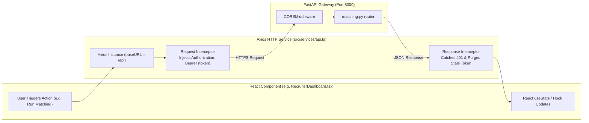

# Volume 06: API Inventory, Integration & Traceability

This volume provides a complete engineering inventory of all FastAPI REST endpoints in SkillAlign, detailed request/response schemas, frontend Axios integration architecture, the complete API-to-Database Traceability Matrix, and file-level code mappings.

---

## 1. Master API Inventory

The SkillAlign backend exposes **54 distinct REST endpoints** across 15 modular routers registered in [main.py](file:///c:/Users/shiva/OneDrive/Desktop/SkillAlign/backend/app/main.py).

| HTTP Method | Route | Purpose | Auth Required | Permitted Roles |
| :--- | :--- | :--- | :--- | :--- |
| **Authentication (`/api/auth`)** | | | | |
| `POST` | `/api/auth/register` | Candidate self-registration | Public | All |
| `POST` | `/api/auth/login` | Email/Password login (returns JWT) | Public | All |
| `GET` | `/api/auth/me` | Fetch authenticated user profile & role | Bearer JWT | All Roles |
| `PUT` | `/api/auth/me` | Update authenticated user profile | Bearer JWT | All Roles |
| `POST` | `/api/auth/send-otp` | Request 6-digit SMS OTP | Public | All (Rate limited) |
| `POST` | `/api/auth/verify-otp` | Verify OTP and login / create candidate | Public | All (Rate limited) |
| `POST` | `/api/auth/resend-otp` | Resend SMS OTP with cooldown | Public | All (Rate limited) |
| `POST` | `/api/auth/forgot-password` | Generate reset token & send email | Public | All (Rate limited) |
| `POST` | `/api/auth/reset-password` | Verify token hash & update password | Public | All (Rate limited) |
| **Users & Admin (`/api/users`, `/api/admin`)** | | | | |
| `GET` | `/api/users` | List system users with filtering | Bearer JWT | Admin |
| `POST` | `/api/users` | Create administrative/staff user | Bearer JWT | Admin |
| `GET` | `/api/users/roles` | Enumerate available roles | Bearer JWT | Admin, HR, Recruiter |
| `GET` | `/api/admin/stats` | Global system health & statistics | Bearer JWT | Admin |
| `GET` | `/api/admin/audit-logs` | Retrieve platform audit timeline | Bearer JWT | Admin |
| `PUT` | `/api/admin/users/{id}/status` | Activate / Deactivate user account | Bearer JWT | Admin |
| **Skill Taxonomy (`/api/skills`)** | | | | |
| `GET` | `/api/skills` | List all taxonomy skills & categories | Public / Auth | All Roles |
| `POST` | `/api/skills` | Add new skill to global catalog | Bearer JWT | Admin, HR |
| **Job Requisitions (`/api/jobs`)** | | | | |
| `GET` | `/api/jobs` | List active job requisitions | Bearer JWT | Admin, HR, Recruiter |
| `POST` | `/api/jobs` | Create new requisition with skills & weights| Bearer JWT | HR, Admin |
| `GET` | `/api/jobs/{id}` | Fetch requisition details with skills | Bearer JWT | Admin, HR, Recruiter |
| `PUT` | `/api/jobs/{id}` | Update requisition details & requirements | Bearer JWT | HR, Admin |
| `DELETE`| `/api/jobs/{id}` | Delete job requisition | Bearer JWT | HR, Admin |
| `GET` | `/api/jobs/{id}/skills` | List required skills for job | Bearer JWT | Admin, HR, Recruiter |
| `POST` | `/api/jobs/{id}/skills` | Add required skill with weight (1-5) | Bearer JWT | HR, Admin |
| `DELETE`| `/api/jobs/{id}/skills/{skill_id}` | Remove required skill from job | Bearer JWT | HR, Admin |
| **Candidate Management (`/api/candidates`)** | | | | |
| `GET` | `/api/candidates/me` | Fetch authenticated candidate profile | Bearer JWT | Candidate |
| `PUT` | `/api/candidates/me` | Update candidate profile & preferences | Bearer JWT | Candidate |
| `GET` | `/api/candidates` | List candidates with filters | Bearer JWT | Admin, HR, Recruiter |
| `GET` | `/api/candidates/{id}` | Get candidate details & verified skills | Bearer JWT | Admin, HR, Recruiter |
| `POST` | `/api/candidates/me/skills` | Add self-declared candidate skill | Bearer JWT | Candidate |
| `DELETE`| `/api/candidates/me/skills/{skill_id}`| Delete candidate skill | Bearer JWT | Candidate |
| **Resume Processing (`/api/candidates/me/resume`)** | | | | |
| `POST` | `/api/candidates/me/resume` | Upload & process resume (PDF/DOCX) | Bearer JWT | Candidate |
| `GET` | `/api/candidates/me/resume/preview` | Preview parsed sections & text | Bearer JWT | Candidate |
| `GET` | `/api/candidates/me/resume/status` | Poll async Celery processing status | Bearer JWT | Candidate |
| `POST` | `/api/candidates/me/resume/reparse` | Force re-parsing of stored resume | Bearer JWT | Candidate, Admin |
| `GET` | `/api/candidates/{id}/resume/download` | Download candidate resume file | Bearer JWT | Admin, HR, Recruiter |
| **Matching Engine (`/api/matching`, `/api/match-results`)** | | | | |
| `POST` | `/api/matching/run/{job_id}` | Execute multi-factor matching engine | Bearer JWT | Recruiter, HR, Admin |
| `GET` | `/api/matching/job/{job_id}` | Retrieve ranked match results for job | Bearer JWT | Recruiter, HR, Admin |
| `GET` | `/api/matching/screened` | Get HR-screened candidate list | Bearer JWT | HR, Admin |
| `GET` | `/api/matching/shortlist/{job_id}` | Get filtered recruiter shortlist | Bearer JWT | Recruiter, HR, Admin |
| `GET` | `/api/matching/{match_id}/ai-analysis` | Generate Gemini AI fit analysis | Bearer JWT | Recruiter, HR, Admin |
| `POST` | `/api/matching/{match_id}/scorecards` | Submit candidate scorecard | Bearer JWT | HR, Recruiter, Admin |
| `GET` | `/api/match-results/{id}` | Inspect single match result detail | Bearer JWT | Recruiter, HR, Admin |
| **Enterprise Workflow (`/api/workflow`)** | | | | |
| `POST` | `/api/workflow/shortlist` | Shortlist candidate for job | Bearer JWT | Recruiter, HR, Admin |
| `POST` | `/api/workflow/submit-to-hm` | Submit candidate shortlist to HM | Bearer JWT | Recruiter, HR, Admin |
| `POST` | `/api/workflow/hm-review` | HM opens and reviews candidate | Bearer JWT | HR, Admin |
| `POST` | `/api/workflow/hm-reject` | HM rejects candidate with reason | Bearer JWT | HR, Admin |
| `POST` | `/api/workflow/request-interview` | HM requests interview round | Bearer JWT | HR, Admin |
| `POST` | `/api/workflow/send-slots` | Recruiter proposes interview slots | Bearer JWT | Recruiter, HR, Admin |
| `POST` | `/api/workflow/select-slot` | Candidate selects preferred slot | Public Token / Auth| All |
| `POST` | `/api/workflow/confirm-interview` | Recruiter confirms slot & adds URL | Bearer JWT | Recruiter, HR, Admin |
| `POST` | `/api/workflow/complete-interview`| Mark interview completed | Bearer JWT | Recruiter, HR, Admin |
| `POST` | `/api/workflow/hm-feedback` | HM submits Go/No-Go evaluation | Bearer JWT | HR, Admin |
| `POST` | `/api/workflow/compensation` | Advance to compensation discussion | Bearer JWT | Recruiter, HR, Admin |
| `POST` | `/api/workflow/create-offer` | Recruiter drafts formal offer terms | Bearer JWT | Recruiter, HR, Admin |
| `POST` | `/api/workflow/send-offer` | HR approves & dispatches offer | Bearer JWT | HR, Admin |
| `GET` | `/api/workflow/action-center` | Recruiter operational action items | Bearer JWT | Recruiter, Admin |
| `GET` | `/api/workflow/hm-dashboard` | Hiring Manager pending review items| Bearer JWT | HR, Admin |
| `GET` | `/api/workflow/{match_id}/timeline` | Fetch full audit log timeline | Bearer JWT | All Roles (Scoped) |
| **Offer Management (`/api/offers`)** | | | | |
| `GET` | `/api/offers/{id}` | Get full offer details & breakdown | Bearer JWT | Recruiter, HR, Candidate |
| `GET` | `/api/offers/{id}/pdf` | Download compiled ReportLab PDF | Bearer JWT / Token| All Parties |
| `POST` | `/api/offers/respond` | Candidate accepts / declines offer | Public Token / Auth| Candidate |
| `GET` | `/api/offers/stats` | Pipeline offer metrics & counts | Bearer JWT | HR, Admin |

---

## 2. Frontend-Backend Integration Architecture

The frontend communicates with the backend via a centralized, type-safe Axios client configured in [api.ts](file:///c:/Users/shiva/OneDrive/Desktop/SkillAlign/frontend/src/services/api.ts).



### 2.1 Request & Response Interceptors

```typescript
// Token injection interceptor
api.interceptors.request.use((config) => {
  const token = localStorage.getItem("token");
  if (token) {
    config.headers.Authorization = `Bearer ${token}`;
  }
  return config;
});

// Automatic 401 handling interceptor
api.interceptors.response.use(
  (response) => response,
  (error) => {
    if (error.response?.status === 401) {
      localStorage.removeItem("token");
      localStorage.removeItem("user");
      if (window.location.pathname !== "/login") {
        window.location.href = "/login";
      }
    }
    return Promise.reject(error);
  }
);
```

---

## 3. API-to-Database Traceability Matrix

This matrix allows engineers to trace any functional UI action through the API, Service, and underlying Database tables:

| Feature / UI Flow | Frontend Trigger File | API Route & Method | Backend Service | Database Tables Modified / Queried |
| :--- | :--- | :--- | :--- | :--- |
| **Candidate Registration** | `RegisterPage.tsx` | `POST /api/auth/register` | `auth_service.register_candidate` | `users`, `candidates`, `roles` |
| **Resume Upload & Parse** | `CandidateProfilePage.tsx` | `POST /api/candidates/me/resume` | `resume_service.store_resume_and_queue` | `candidates`, `candidate_skills`, `skills` |
| **Job Requisition Creation** | `HRCreateJobPage.tsx` | `POST /api/jobs` | `job_service.create_job` | `jobs`, `job_skills`, `skills` |
| **Execute Matching Engine** | `JobDetailPage.tsx` | `POST /api/matching/run/{id}` | `matching_service.run_job_matching` | `match_results`, `jobs`, `candidates` |
| **Claim Candidate** | `RecruiterCandidatesPage.tsx` | `POST /api/recruiter/claims` | `candidate_assignment_service` | `candidate_recruiter_assignments`, `match_results` |
| **Submit Shortlist to HM** | `ShortlistSubmissionPage.tsx` | `POST /api/workflow/submit-to-hm` | `workflow_service.submit_to_hiring_manager` | `match_results`, `audit_logs`, `notifications` |
| **HM Interview Request** | `HMCandidateReviewPage.tsx` | `POST /api/workflow/request-interview` | `workflow_service.request_interview` | `match_results`, `interviews`, `audit_logs` |
| **Propose Interview Slots** | `RequestInterviewModal.tsx` | `POST /api/workflow/send-slots` | `workflow_service.send_interview_slots` | `interviews`, `interview_slots`, `notifications` |
| **Candidate Slot Selection** | `SlotSelectionPage.tsx` | `POST /api/workflow/select-slot` | `workflow_service.select_interview_slot` | `interview_slots`, `match_results`, `audit_logs` |
| **Submit HM Feedback** | `HMFeedbackPage.tsx` | `POST /api/workflow/hm-feedback` | `workflow_service.submit_hm_feedback` | `interview_feedbacks`, `match_results`, `audit_logs` |
| **Draft Offer Terms** | `RecruiterOfferPage.tsx` | `POST /api/workflow/create-offer` | `workflow_service.create_offer` | `offers`, `match_results`, `audit_logs` |
| **HR Approve Offer** | `HMOfferReviewPage.tsx` | `POST /api/workflow/send-offer` | `workflow_service.send_offer_to_candidate` | `offers`, `match_results`, `audit_logs` |
| **Compile Offer PDF** | `CandidateOfferPage.tsx` | `GET /api/offers/{id}/pdf` | `offer_pdf_service.OfferPDFService` | `offers`, `candidates`, `jobs`, `users` |
| **Candidate Offer Response** | `CandidateOfferPage.tsx` | `POST /api/offers/respond` | `workflow_service.respond_to_offer` | `offers`, `match_results`, `candidate_blacklists` |

---

## 4. File-Level Code Mapping Table

| Domain Subsystem | Backend Router | Backend Service | SQLAlchemy Model | Frontend Component / Page |
| :--- | :--- | :--- | :--- | :--- |
| **Authentication & IAM** | [auth.py](file:///c:/Users/shiva/OneDrive/Desktop/SkillAlign/backend/app/routers/auth.py) | [auth_service.py](file:///c:/Users/shiva/OneDrive/Desktop/SkillAlign/backend/app/services/auth_service.py) | [user.py](file:///c:/Users/shiva/OneDrive/Desktop/SkillAlign/backend/app/models/user.py), [role.py](file:///c:/Users/shiva/OneDrive/Desktop/SkillAlign/backend/app/models/role.py) | [LoginPage.tsx](file:///c:/Users/shiva/OneDrive/Desktop/SkillAlign/frontend/src/pages/auth/LoginPage.tsx), [RegisterPage.tsx](file:///c:/Users/shiva/OneDrive/Desktop/SkillAlign/frontend/src/pages/auth/RegisterPage.tsx) |
| **Matching Algorithm** | [matching.py](file:///c:/Users/shiva/OneDrive/Desktop/SkillAlign/backend/app/routers/matching.py) | [matching_service.py](file:///c:/Users/shiva/OneDrive/Desktop/SkillAlign/backend/app/services/matching_service.py) | [match_result.py](file:///c:/Users/shiva/OneDrive/Desktop/SkillAlign/backend/app/models/match_result.py) | [JobDetailPage.tsx](file:///c:/Users/shiva/OneDrive/Desktop/SkillAlign/frontend/src/pages/recruiter/JobDetailPage.tsx) |
| **Resume Extraction** | [resume.py](file:///c:/Users/shiva/OneDrive/Desktop/SkillAlign/backend/app/routers/resume.py) | [resume_text_extractor.py](file:///c:/Users/shiva/OneDrive/Desktop/SkillAlign/backend/app/services/resume_text_extractor.py) | [candidate.py](file:///c:/Users/shiva/OneDrive/Desktop/SkillAlign/backend/app/models/candidate.py) | [CandidateProfilePage.tsx](file:///c:/Users/shiva/OneDrive/Desktop/SkillAlign/frontend/src/pages/candidate/CandidateProfilePage.tsx) |
| **Deterministic Parsing**| [resume.py](file:///c:/Users/shiva/OneDrive/Desktop/SkillAlign/backend/app/routers/resume.py) | [resume_txt_parser.py](file:///c:/Users/shiva/OneDrive/Desktop/SkillAlign/backend/app/services/resume_txt_parser.py) | [candidate_skill.py](file:///c:/Users/shiva/OneDrive/Desktop/SkillAlign/backend/app/models/candidate_skill.py) | [CandidateSkillsPage.tsx](file:///c:/Users/shiva/OneDrive/Desktop/SkillAlign/frontend/src/pages/candidate/CandidateSkillsPage.tsx) |
| **Recruitment Workflow** | [workflow.py](file:///c:/Users/shiva/OneDrive/Desktop/SkillAlign/backend/app/routers/workflow.py) | [workflow_service.py](file:///c:/Users/shiva/OneDrive/Desktop/SkillAlign/backend/app/services/workflow_service.py) | [match_result.py](file:///c:/Users/shiva/OneDrive/Desktop/SkillAlign/backend/app/models/match_result.py), [audit_log.py](file:///c:/Users/shiva/OneDrive/Desktop/SkillAlign/backend/app/models/audit_log.py) | [ShortlistSubmissionPage.tsx](file:///c:/Users/shiva/OneDrive/Desktop/SkillAlign/frontend/src/pages/recruiter/ShortlistSubmissionPage.tsx), [HMCandidateReviewPage.tsx](file:///c:/Users/shiva/OneDrive/Desktop/SkillAlign/frontend/src/pages/hr/HMCandidateReviewPage.tsx) |
| **Interview Coordination**| [interviews.py](file:///c:/Users/shiva/OneDrive/Desktop/SkillAlign/backend/app/routers/interviews.py) | [workflow_service.py](file:///c:/Users/shiva/OneDrive/Desktop/SkillAlign/backend/app/services/workflow_service.py) | [interview.py](file:///c:/Users/shiva/OneDrive/Desktop/SkillAlign/backend/app/models/interview.py), [interview_slot.py](file:///c:/Users/shiva/OneDrive/Desktop/SkillAlign/backend/app/models/interview_slot.py) | [SlotSelectionPage.tsx](file:///c:/Users/shiva/OneDrive/Desktop/SkillAlign/frontend/src/pages/candidate/SlotSelectionPage.tsx), [CandidateSlotPickerModal.tsx](file:///c:/Users/shiva/OneDrive/Desktop/SkillAlign/frontend/src/components/candidate/CandidateSlotPickerModal.tsx) |
| **Offer & PDF Engine** | [workflow.py](file:///c:/Users/shiva/OneDrive/Desktop/SkillAlign/backend/app/routers/workflow.py) | [offer_pdf_service.py](file:///c:/Users/shiva/OneDrive/Desktop/SkillAlign/backend/app/services/offer_pdf_service.py) | [offer.py](file:///c:/Users/shiva/OneDrive/Desktop/SkillAlign/backend/app/models/offer.py) | [RecruiterOfferPage.tsx](file:///c:/Users/shiva/OneDrive/Desktop/SkillAlign/frontend/src/pages/recruiter/RecruiterOfferPage.tsx), [CandidateOfferPage.tsx](file:///c:/Users/shiva/OneDrive/Desktop/SkillAlign/frontend/src/pages/candidate/CandidateOfferPage.tsx) |
| **Admin Console** | [admin.py](file:///c:/Users/shiva/OneDrive/Desktop/SkillAlign/backend/app/routers/admin.py) | [user_service.py](file:///c:/Users/shiva/OneDrive/Desktop/SkillAlign/backend/app/services/user_service.py) | [user.py](file:///c:/Users/shiva/OneDrive/Desktop/SkillAlign/backend/app/models/user.py), [audit_log.py](file:///c:/Users/shiva/OneDrive/Desktop/SkillAlign/backend/app/models/audit_log.py) | [AdminDashboard.tsx](file:///c:/Users/shiva/OneDrive/Desktop/SkillAlign/frontend/src/pages/admin/AdminDashboard.tsx), [UsersPage.tsx](file:///c:/Users/shiva/OneDrive/Desktop/SkillAlign/frontend/src/pages/admin/UsersPage.tsx) |

---

*Proceed to [Volume 07: Security Architecture, RBAC & Sequence Diagrams](file:///c:/Users/shiva/OneDrive/Desktop/SkillAlign/docs/07_SECURITY_ERROR_HANDLING_AND_RBAC.md) for security proofs, rate limiting, and lifecycle sequence diagrams.*
