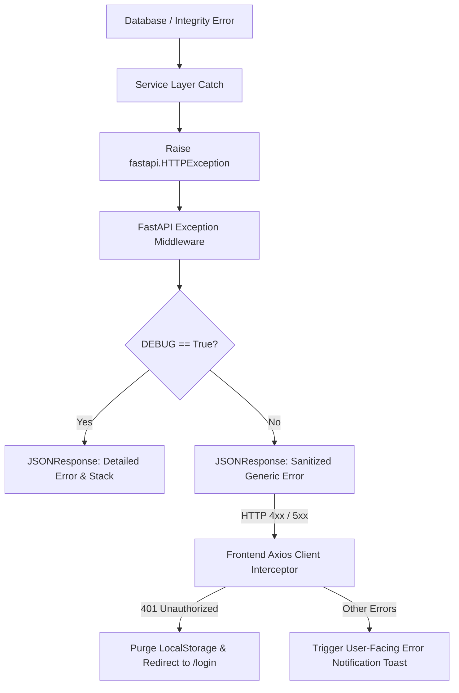
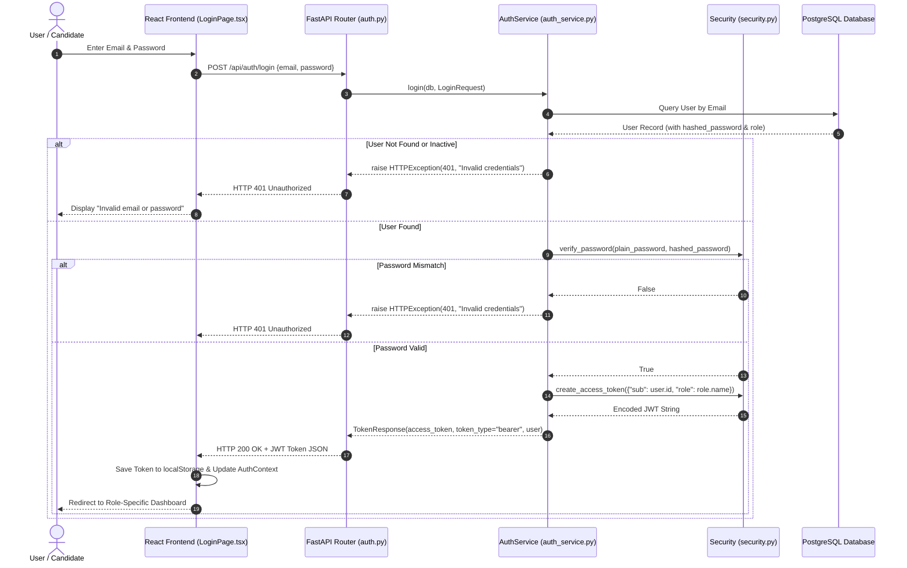
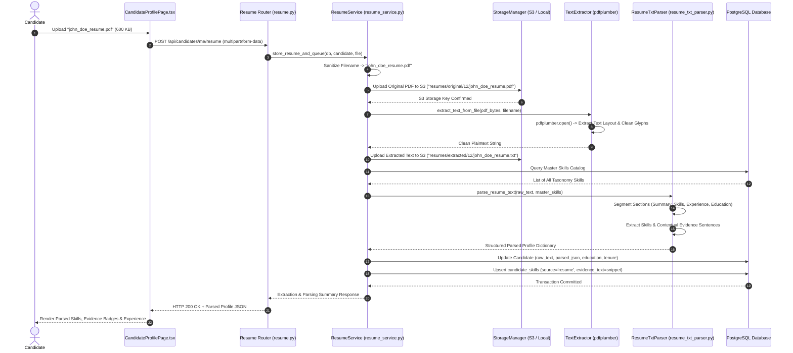
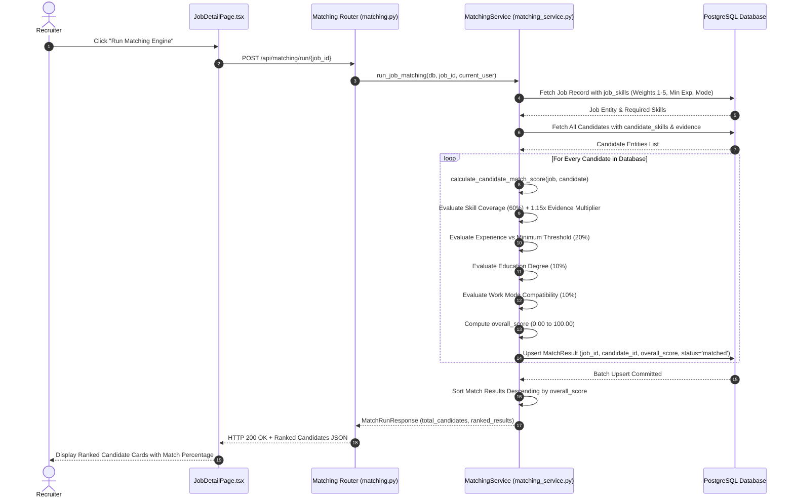
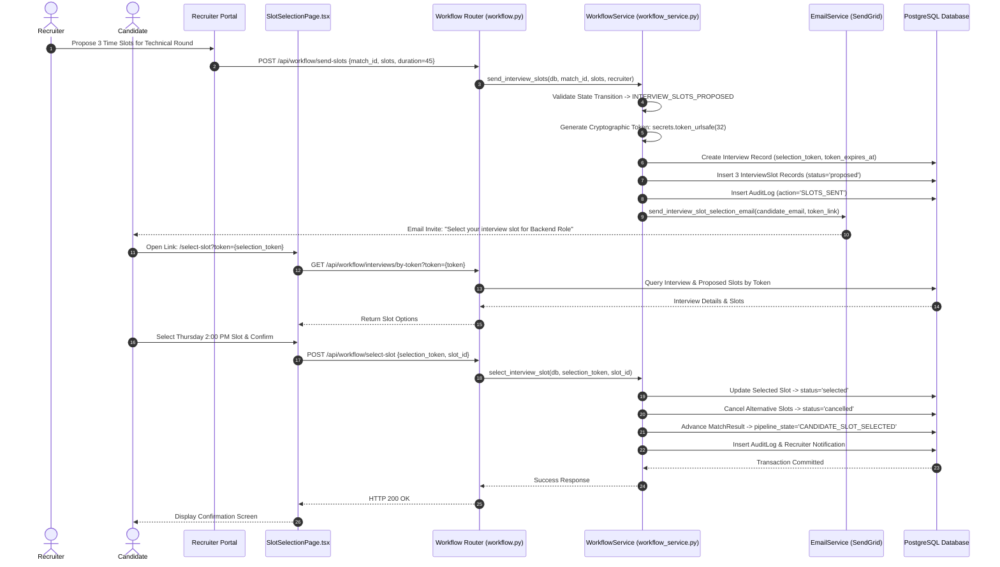
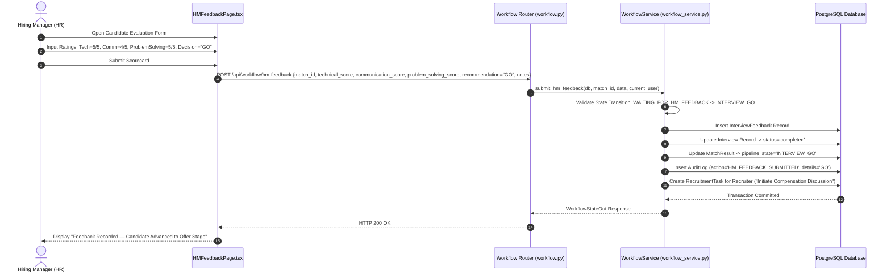
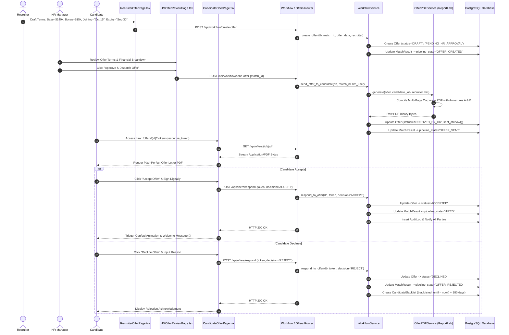

# Volume 07: Security Architecture, RBAC & Sequence Diagrams

This volume details the security architecture, Role-Based Access Control (RBAC) enforcement, rate limiting, error propagation mechanisms, and 8 comprehensive Mermaid sequence diagrams representing the core operational flows of SkillAlign.

---

## 1. Role-Based Access Control (RBAC) Matrix

SkillAlign enforces role permissions at both the API Gateway layer ([dependencies.py](file:///c:/Users/shiva/OneDrive/Desktop/SkillAlign/backend/app/core/dependencies.py)) and within domain service handlers ([workflow_service.py](file:///c:/Users/shiva/OneDrive/Desktop/SkillAlign/backend/app/services/workflow_service.py)).

| System Capability / Operation | Admin | HR / Hiring Manager | Recruiter | Candidate |
| :--- | :---: | :---: | :---: | :---: |
| **Candidate Self-Registration** | ✗ | ✗ | ✗ | **✓** |
| **Manage Users & Role Assignment** | **✓** | ✗ | ✗ | ✗ |
| **Curate Global Skill Taxonomy** | **✓** | **✓** (Add only) | ✗ | ✗ |
| **Create & Edit Job Requisitions** | **✓** | **✓** | ✗ | ✗ |
| **Trigger Matching Engine** | **✓** | **✓** | **✓** | ✗ |
| **Claim Candidate Ownership** | **✓** | ✗ | **✓** | ✗ |
| **Screen / Shortlist Candidates** | **✓** | ✗ | **✓** | ✗ |
| **Review Shortlist (HM Decision)**| **✓** | **✓** | ✗ | ✗ |
| **Request Interview Round** | **✓** | **✓** | ✗ | ✗ |
| **Propose Interview Slots** | **✓** | **✓** | **✓** | ✗ |
| **Select Preferred Interview Slot** | **✓** | ✗ | ✗ | **✓** (via Token) |
| **Conduct Interview & Submit Scorecard**| **✓** | **✓** | ✗ | ✗ |
| **Draft Offer Financial Terms** | **✓** | ✗ | **✓** | ✗ |
| **Approve Formal Offer Letter** | **✓** | **✓** | ✗ | ✗ |
| **Accept / Decline Offer** | ✗ | ✗ | ✗ | **✓** (via Token) |
| **View Full Platform Audit Timeline**| **✓** | Limited (Job scoped)| Limited (Assigned)| Limited (Self) |

---

## 2. Security Architecture Deep Dive

```
┌────────────────────────────────────────────────────────────────────────┐
│                     Layered Security Defenses                          │
├────────────────────────────┬───────────────────────────────────────────┤
│ 1. Transport Security      │ HTTPS Strict Transport + CORS Whitelist   │
│ 2. Edge & Rate Limiting    │ SlowAPI Memory Limiter (5/min on Auth)    │
│ 3. Cryptographic Storage   │ Bcrypt Password Hashing (Salt + 72-Byte)  │
│ 4. Identity & Token Claims │ HS256 JWT Signed Claims + Expire UTC      │
│ 5. Public Action Security  │ High-Entropy SHA-256 Tokens (32 Bytes)    │
│ 6. Input & SQL Injection   │ Pydantic v2 DTOs + SQLAlchemy Params      │
│ 7. File Upload Sanitation  │ Extension/MIME Whitelist + Path Stripping │
└────────────────────────────┴───────────────────────────────────────────┘
```

### 2.1 Password Hashing & Token Cryptography
* **Password Hashing**: Implemented in [security.py](file:///c:/Users/shiva/OneDrive/Desktop/SkillAlign/backend/app/core/security.py) using `bcrypt.hashpw()` with standard salt generation. Truncates input strings to 72 bytes to strictly conform to bcrypt specifications.
* **JWT Access Tokens**: Encoded via `python-jose` using HMAC-SHA256 (`HS256`) signed with `JWT_SECRET_KEY`. Payloads include subject (`sub`), role name (`role`), user email (`email`), and UTC expiry (`exp`).
* **Password Reset & Public Action Tokens**: Generated using `secrets.token_urlsafe(32)` providing 256 bits of cryptographic entropy. Reset tokens stored in PostgreSQL as SHA-256 hashes (`hash_reset_token()`) preventing database leak exploitation.

### 2.2 SlowAPI Rate Limiting
Configured on sensitive public endpoints in [auth.py](file:///c:/Users/shiva/OneDrive/Desktop/SkillAlign/backend/app/routers/auth.py):
* `POST /api/auth/send-otp`: `5/minute` per client IP.
* `POST /api/auth/verify-otp`: `10/minute` per client IP.
* `POST /api/auth/forgot-password`: `5/minute` per client IP.
* `POST /api/auth/reset-password`: `5/minute` per client IP.

### 2.3 File Upload Sanitation & Storage Security
* **Allowed Extensions**: Whitelist enforced (`.pdf`, `.docx`, `.doc`, `.txt`).
* **MIME Validation**: Checks `UploadFile.content_type` against application MIME headers.
* **Directory Traversal Defense**: Filenames sanitized using `re.sub(r"[^a-zA-Z0-9._-]", "_", os.path.basename(filename))`.
* **Isolated Object Storage**: Resumes stored under segmented paths: `resumes/original/{candidate_id}/{safe_filename}`.

---

## 3. Error Handling Architecture

SkillAlign implements a standardized, non-leaking exception propagation model:



---

## 4. End-to-End Sequence Diagrams

### 4.1 Sequence Diagram: User Authentication & JWT Issuance



---

### 4.2 Sequence Diagram: Resume Upload, Text Extraction & Deterministic Parsing



---

### 4.3 Sequence Diagram: Multi-Factor Candidate Matching Execution



---

### 4.4 Sequence Diagram: Interview Slot Coordination & Candidate Selection



---

### 4.5 Sequence Diagram: Hiring Manager Evaluation & Go/No-Go Decision



---

### 4.6 Sequence Diagram: Offer Drafting, Approval, ReportLab PDF & Acceptance



---

*Proceed to [Volume 08: Codebase Structure, Deployment & Engineering Decisions](file:///c:/Users/shiva/OneDrive/Desktop/SkillAlign/docs/08_FRONTEND_AND_BACKEND_CODEBASE_STRUCTURE.md) for codebase organization and architectural decision records.*
