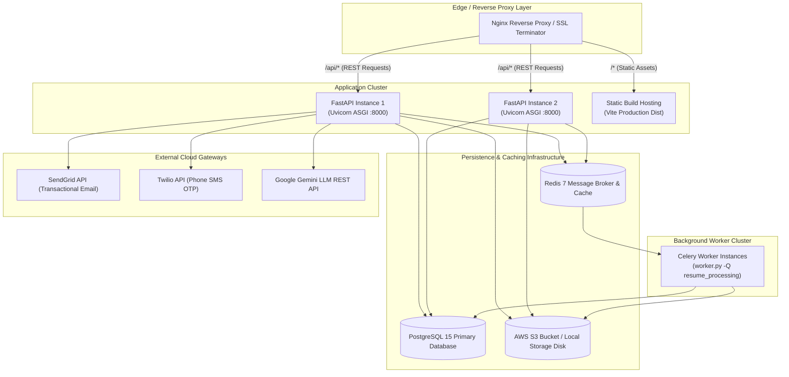
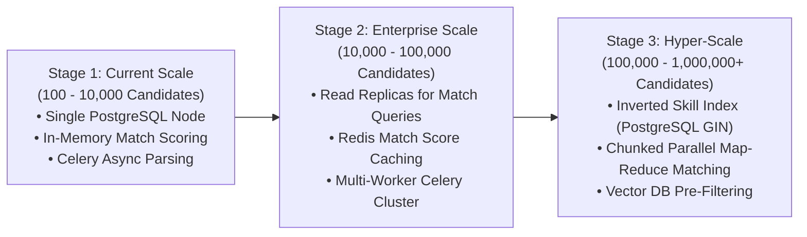

# Volume 08: Codebase Structure, Deployment & Engineering Decisions

This volume details the exact directory structure and module responsibilities of both the backend and frontend codebases, infrastructure and deployment topologies, Architectural Decision Records (ADRs), scalability roadmap ($100 \to 1,000,000$ candidates), and the test suite audit.

---

## 1. Frontend Codebase Structure

The frontend is structured as a modern **React 18 + TypeScript + Vite** Single Page Application adhering to clean component separation.

```
frontend/
├── index.html                     # HTML5 entrypoint with Google Fonts (Inter / Outfit)
├── package.json                   # Dependencies: React 18, React Router v6, Axios, Lucide React
├── tailwind.config.js             # Tailwind CSS utility configuration & color tokens
├── tsconfig.json                  # TypeScript compiler settings & path aliases
├── vite.config.ts                 # Vite build & dev-server proxy configuration
└── src/
    ├── App.tsx                    # Root React Application component
    ├── main.tsx                   # DOM mounting point with AuthProvider & BrowserRouter
    ├── index.css                  # Custom design system tokens, animations, glassmorphism
    ├── routes/
    │   └── AppRoutes.tsx          # 25+ application routes with Role ProtectedRoute guards
    ├── context/
    │   └── AuthContext.tsx        # Authentication provider (user, token, login, logout)
    ├── services/
    │   └── api.ts                 # Central Axios client with Bearer token & 401 interceptors
    ├── types/
    │   └── index.ts               # Full TypeScript interface definitions matching backend DTOs
    ├── components/
    │   ├── common/                # ProtectedRoute, StatCard, Badge, LoadingSpinner
    │   ├── layout/                # DashboardLayout, Sidebar, Navbar, NotificationDropdown
    │   ├── ui/                    # Reusable Button, Modal, Input, Table, Card primitives
    │   ├── candidate/             # CandidateSlotPickerModal, SkillBadge, ResumeUploadCard
    │   ├── job/                   # JobRequirementForm, SkillWeightSlider
    │   ├── pipeline/              # Visual 21-state progress tracker
    │   └── workflow/              # RequestInterviewModal, HMFeedbackModal, OfferModal
    └── pages/
        ├── LandingPage.tsx        # Public marketing & feature overview page
        ├── auth/                  # LoginPage, RegisterPage, ForgotPasswordPage, ResetPasswordPage
        ├── admin/                 # AdminDashboard, UsersPage, SkillsPage, AdminUserDetailPage
        ├── hr/                    # HRDashboard, HRDecisionDashboard, HRCreateJobPage,
        │                          # HRJobMatchesPage, HMCandidateReviewPage, HMFeedbackPage,
        │                          # HiringPipelinePage, HMOfferReviewPage, HRShortlistsPage
        ├── recruiter/             # RecruiterDashboard, ActionCenterPage, JobDetailPage,
        │                          # RecruiterCandidatesPage, RecruiterCandidateDetailPage,
        │                          # ShortlistSubmissionPage, RecruiterOfferPage, ShortlistsPage
        └── candidate/             # CandidateDashboard, CandidateProfilePage, CandidateSkillsPage,
                                   # CandidateHiringPage, SlotSelectionPage, CandidateOfferPage,
                                   # ApplicationTimelinePage
```

---

## 2. Backend Codebase Structure

The backend follows a domain-driven, layered service architecture implemented in **FastAPI** and **SQLAlchemy 2.0**.

```
backend/
├── main.py                        # FastAPI entrypoint, middleware, and router aggregator
├── celery_app.py                  # Celery async worker & Redis connection initializer
├── worker.py                      # Standalone CLI entrypoint for background Celery worker
├── alembic.ini                    # Alembic migration environment configuration
├── requirements.txt               # Pinned Python package dependencies
├── alembic/                       # Database version migration scripts
├── tests/                         # Pytest automated test suite (11 test modules)
│   ├── conftest.py                # Pytest fixtures, test database setup, and mock users
│   ├── test_auth.py               # Candidate registration & JWT authentication tests
│   ├── test_otp_auth.py           # SMS OTP generation, verification & rate limiting tests
│   ├── test_deterministic_matching.py # Multi-factor mathematical scoring validation
│   ├── test_resume_extraction.py  # pdfplumber / docx text extraction tests
│   ├── test_resume_parsing.py     # Rule-based section segmenter & taxonomy parsing tests
│   ├── test_candidate_authorization_security.py # RBAC security boundary tests
│   └── test_multi_recruiter_and_evidence.py     # Candidate claiming & evidence tests
├── scripts/                       # Database inspection & mock data seeding scripts
└── app/
    ├── core/                      # System configuration, security, and rate limiting
    │   ├── config.py              # Pydantic BaseSettings loading from .env
    │   ├── security.py            # Bcrypt hashing, HS256 JWT encoding, reset token hasher
    │   ├── dependencies.py        # Route security guards (require_admin, require_hr, etc.)
    │   └── rate_limit.py          # SlowAPI memory-backed rate limiter
    ├── database/                  # Database engine and session lifecycle
    │   ├── base.py                # SQLAlchemy Declarative Base
    │   └── session.py             # SessionLocal generator (get_db dependency)
    ├── models/                    # 23 SQLAlchemy declarative relational models
    │   ├── role.py, user.py, skill.py, job.py, job_skill.py
    │   ├── candidate.py, candidate_skill.py, match_result.py, candidate_scorecard.py
    │   ├── interview.py, interview_slot.py, interview_feedback.py, job_interview_round.py
    │   ├── offer.py, candidate_blacklist.py, audit_log.py, notification.py
    │   └── recruitment_task.py, recruitment_message.py, candidate_recruiter_assignment.py
    ├── schemas/                   # Pydantic v2 validation DTOs (Request / Response)
    │   ├── auth.py, user.py, job.py, candidate.py, skill.py, matching.py
    │   ├── interview.py, workflow.py, task.py, audit_log.py, notification.py
    ├── services/                  # Pure domain business logic & third-party integrations
    │   ├── auth_service.py        # User authentication, OTP verification, password resets
    │   ├── matching_service.py    # 4-factor matching algorithm & fit scoring
    │   ├── resume_service.py      # Resume upload coordinator & S3 storage dispatcher
    │   ├── resume_text_extractor.py # Deterministic pdfplumber / docx text extraction
    │   ├── resume_txt_parser.py   # Rule-based regex parser & evidence extraction
    │   ├── workflow_service.py    # 21-state recruitment state machine & audit logger
    │   ├── offer_pdf_service.py   # ReportLab multi-page corporate PDF generator
    │   ├── gemini_service.py      # Google Gemini REST client with fallback
    │   ├── email_service.py       # SendGrid transactional email dispatcher
    │   ├── sms_service.py         # Twilio SMS OTP gateway
    │   └── storage/               # StorageManager (Local disk + AWS S3 Boto3)
    ├── tasks/                     # Celery background asynchronous task handlers
    │   ├── resume_tasks.py        # Background resume extraction, parsing & skill sync
    │   └── matching_tasks.py      # Batch job candidate matching tasks
    └── routers/                   # 15 FastAPI endpoint routing modules
        ├── auth.py, users.py, admin.py, skills.py, jobs.py, candidates.py
        ├── resume.py, matching.py, match_results.py, interviews.py, notifications.py
        ├── recruiter.py, communication.py, tasks.py, workflow.py
```

---

## 3. Infrastructure & Deployment Architecture



---

## 4. Architectural Decision Records (ADRs)

| # | Architectural Decision | Technical Rationale & Benefit | Trade-Offs & Mitigations |
| :---: | :--- | :--- | :--- |
| **ADR-01** | **FastAPI over Django / Flask** | High async I/O throughput via Starlette/Uvicorn, native OpenAPI Swagger generation, and strict type safety with Pydantic v2. | Less built-in admin UI compared to Django; mitigated by custom React Admin Console. |
| **ADR-02** | **PostgreSQL + SQLAlchemy 2.0 over MongoDB** | Strict ACID transactional guarantees, foreign key cascade integrity, complex relational joins between 23 models, and check constraints. | Schema changes require Alembic migrations; mitigated by automated migration pipelines. |
| **ADR-03** | **Deterministic Parsing over Pure LLM Parsing** | 100% reproducible, explainable, zero API cost, sub-100ms execution time, and zero risk of hallucinating unpossessed skills. | Complex regex maintenance; mitigated by comprehensive Pytest regression suites. |
| **ADR-04** | **React + TypeScript + Vite over SSR / Plain JS** | Strict compile-time type validation against backend DTOs, sub-second HMR dev cycle, and rich SPA component interactivity. | Initial client bundle download; mitigated by Vite code-splitting and asset compression. |
| **ADR-05** | **ReportLab for Server-Side PDF Compilation** | Direct programmatic canvas drawing, zero headless Chrome browser overhead, pixel-perfect A4 geometry, and dynamic two-pass page numbering. | Python canvas scripting is more verbose than HTML-to-PDF tools; mitigated by modular `OfferPDFService`. |
| **ADR-06** | **Celery + Redis with Sync Fallback** | Decouples CPU-heavy document parsing from the API request-response loop, while allowing seamless single-process execution in development. | Redis operational dependency in production; mitigated by graceful in-process fallback execution. |
| **ADR-07** | **4-Factor Weighted Algorithmic Matching** | Balances hard skills (60%), experience (20%), education (10%), and work mode (10%) with verified resume evidence multipliers. | Requires recruiters to assign skill weights; mitigated by standard weight defaults (Weight = 3). |
| **ADR-08** | **21-State Explicit State Machine** | Prevents illegal state skips (e.g. issuing offer before completing interview), maintains immutable audit logs, and enforces dual-control. | Strict server-side transition checks; mitigated by clear HTTP 422 error details. |
| **ADR-09** | **Direct Bcrypt Hashing over Plain SHA-256** | Salted key stretching ($2^{12}$ rounds) protects against offline GPU dictionary and rainbow table attacks. | Truncates passwords $>72$ bytes; mitigated by standard pre-validation in Pydantic. |
| **ADR-10** | **Cryptographic Public Tokens for Candidate Actions** | Eliminates candidate login friction during time-sensitive operations (slot selection and offer response) via 256-bit entropy tokens. | Tokens must have expiration timestamps; enforced via `selection_token_expires_at`. |
| **ADR-11** | **Dual Storage Manager (Local Disk + S3)** | Allows local zero-cloud development and testing while seamlessly scaling to cloud object storage in staging and production. | Minor abstraction overhead; encapsulated in `StorageManager` strategy pattern. |
| **ADR-12** | **SlowAPI Rate Limiting on Auth Endpoints** | Prevents credential stuffing, OTP SMS flooding, and denial-of-service on public endpoints. | Memory-backed limiter in single-instance mode; scalable to Redis backend in multi-node clusters. |

---

## 5. Performance & Scalability Roadmap



---

## 6. Testing Strategy & Automated Test Suite Audit

The codebase includes an extensive **Pytest** test suite located in [backend/tests/](file:///c:/Users/shiva/OneDrive/Desktop/SkillAlign/backend/tests/):

| Test Module | Focus Area & Test Coverage | Key Scenarios Verified |
| :--- | :--- | :--- |
| `test_auth.py` | User Registration & JWT Login | Valid registration, duplicate email rejection, invalid password rejection, JWT token claim verification. |
| `test_otp_auth.py` | Phone SMS OTP Workflow | OTP dispatch, rate limiting (5/min), incorrect OTP retry count, valid OTP login, auto-candidate creation. |
| `test_deterministic_matching.py` | 4-Factor Matching Formula | Exact numerical score validation, evidence multiplier calculation, zero-match filtering, experience weighting. |
| `test_resume_extraction.py` | Multi-Format Document Extraction | `pdfplumber` PDF parsing, `python-docx` table extraction, multi-encoding TXT decoding, corrupted file handling. |
| `test_resume_parsing.py` | Rule-Based Section Segmenter | Line-anchored section extraction, skill taxonomy matching, education CGPA parsing, work tenure calculation. |
| `test_candidate_authorization_security.py` | RBAC Security & API Boundaries | Role permission enforcement, token tampering detection, candidate cross-profile isolation. |
| `test_multi_recruiter_and_evidence.py` | Recruiter Claims & Concurrency | Candidate claiming locks, evidence snippet display, recruiter re-assignment conflict handling. |
| `test_admin_user_deletion.py` | Cascading Integrity & Audit Logs | User deactivation, foreign key `SET NULL` verification, audit log persistence upon entity removal. |

---

*Proceed to [Volume 09: Engineering Demo Script, Postman Flow & Q&A Defense](file:///c:/Users/shiva/OneDrive/Desktop/SkillAlign/docs/09_ENGINEERING_DEMO_SCRIPT_AND_QA.md) for the complete 15-minute presentation script and technical defense.*
